# openplatform_v3 종합 매뉴얼

**버전**: v1.0  
**작성일**: 2026-04-27  
**기준**: Phase 14 완료 시점

## 문서 구성

본 매뉴얼은 다음 20개 챕터로 구성됩니다.

| # | 챕터 | 내용 |
|---|------|------|
| 1.1 | 개요 | 프로젝트 비전, 적용 대상, 핵심 차별점 |
| 1.2 | 기술 스택 | Spring Boot/Vue 3 의존성과 라이선스 |
| 1.3 | 아키텍처 | C4 컨테이너/컴포넌트 그림 |
| 1.4 | 데이터 모델 | ERD + Flyway V1~V17 |
| 1.5 | API 명세 | DataSet 라우터 + BFF Federation |
| 1.6 | 프엔 구조 | 디렉토리/라우터/Pinia/Vite |
| 1.7 | 컴포넌트 | PrimeVue 4 + Multi-panel pattern |
| 1.8 | 프엔 규약 | SFC 순서, useXxx, 네이밍 |
| 1.9 | 백엔드 구조 | Pattern A/B/C, 도메인 16개 |
| 1.10 | 백엔드 규약 | MyBatis, _rowType, 트랜잭션 |
| 1.11 | 로깅·추적 | Logback, AOP, Loki |
| 1.12 | 보안 | OAuth2/JWT, RBAC, OWASP |
| 1.13 | 배포 | Docker compose 8 yml + Traefik |
| 1.14 | 테스트 | Playwright E2E + 권장 |
| 1.15 | 관찰성 | Prometheus/Grafana/Loki |
| 1.16 | 사용자 매뉴얼 | 역할별 시나리오 |
| 1.17 | 운영 매뉴얼 | 백업/복구/장애대응 |
| 1.18 | 개발 가이드 | 워크스페이스 규칙 + 신규 도메인 절차 |
| 1.19 | 트러블슈팅 | 빈도순 FAQ + 알려진 미완 |
| 1.20 | 부록 | 용어집/링크/체인지로그 |


<div style="page-break-before: always;"></div>

# 1.1 프로젝트 개요

## 프로젝트 비전

**openplatform v3** 는 레거시 v1(Spring Legacy + jQuery) 과 v2(Hexagonal BFF 실험) 를 모두 흡수하여 **단일 Keycloak SSO 허브 아래** 13개 마이크로 서비스를 오케스트레이션하는 **통합 그룹웨어**입니다 [src: README.md §1]. 

본 프로젝트는 **옵션 C 하이브리드** 아키텍처를 채택합니다 [src: README.md §하이브리드전략]:

| 영역 | 기원 | 채택 방식 |
|---|---|---|
| DataSet 컨트롤러 / MyBatis 매퍼 | v1 | 패턴만 포팅 (리팩터링) |
| Port-Adapter / BFF 프록시 | v2 | 확장 포팅 |
| Vue3 컴포넌트 / composable / store | vue-spring-fw | 원본 복사 (수정 금지) |
| 결재 BPMN (Flowable) | v1 | 선택 포팅 예정 |

- **backend-core** — DataSet 진입점, MyBatis + Flowable (결재 BPMN), 도메인 로직 [src: README.md §1]
- **backend-bff** — WebFlux 기반 Port-Adapter, 외부 시스템(Keycloak/Rocket.Chat/Stalwart/MinIO/LiveKit/Wiki.js) 추상화 [src: README.md §1]
- **ui** — Vue 3 + PrimeVue 4 + Pinia + keycloak-js (vue-spring-fw 컴포넌트 정적 복사) [src: README.md §1]
- **인프라 9종** — PostgreSQL / Redis / Keycloak / MinIO / Rocket.Chat / Stalwart / LiveKit / Wiki.js / Traefik [src: README.md §1]

현재 Phase 14 기준, 본 그룹웨어는 **50명 규모 회사가 한 달 단위로 실제 업무를 돌릴 수 있는** 프로덕션급 시스템으로 완성되었습니다 [src: docs/PHASE14_REPORT.md §목표]. 총 **17개 Flyway 마이그레이션**, **약 95개 DataSet 서비스**, **26개 UI 페이지**, **55개+ UI 컴포넌트**을 포함합니다 [src: docs/PHASE14_REPORT.md §산출통계].

---

## 2. 적용 대상

본 그룹웨어는 다음 두 부문의 조직을 주 타겟으로 설계되었습니다.

### 2.1 SME (중소 엔터프라이즈) 그룹웨어

- **조직 규모**: 30~100명 범위 (시드 데이터 기준 48명 샘플)
- **업무 유형**: 일반 사무직, HR, IT, 운영 부문
- **핵심 시나리오**:
  - 전자결재 (품의/휴가/지출/출장 4종 양식) [src: docs/scenarios.md §3-4]
  - 부서별 게시판 + 자유 커뮤니티 [src: docs/scenarios.md §5]
  - 통합 캘린더 (개인/팀/회사) [src: docs/scenarios.md §6]
  - 조직도 탐색 + 연락처 관리 [src: docs/scenarios.md §7]

### 2.2 제조 협업 (Manufacturing Collaboration)

- **조직 특성**: 생산부, 품질관리, 구매, 자재 부문
- **핵심 시나리오**:
  - 근태/연차/휴가 자동 관리 (Phase 14 트랙 1) [src: docs/PHASE14_REPORT.md §트랙1, docs/scenarios.md §16]
  - 회의실 예약 + 화상회의 자동 통합 (트랙 2) [src: docs/PHASE14_REPORT.md §트랙2, docs/scenarios.md §17]
  - 자료실 + 폴더 권한 관리 (트랙 3) [src: docs/PHASE14_REPORT.md §트랙3, docs/scenarios.md §18]
  - 일별 업무일지 + 부서장 팀 뷰 (트랙 4) [src: docs/PHASE14_REPORT.md §트랙4, docs/scenarios.md §19]

전자결재 시 자동으로 영업일 계산 (공휴일 + 주말 제외) 및 휴가 결재 승인 시 연차 자동 차감 기능이 제조 부문의 인사 효율화에 기여합니다 [src: docs/PHASE14_REPORT.md §트랙1].

---

## 3. 핵심 차별점

### 3.1 Keycloak 단일 SSO 허브

모든 외부 서비스 및 본 포탈이 **kc.localtest.me** 단일 호스트 아래 통합됩니다 [src: CLAUDE.md §아키텍처]. 사용자는 **한 번의 Keycloak 로그인으로** 이하 6개 서비스에 자동으로 접근합니다:

| 서비스 | 프로토콜 | 위치 | 인증 | 상태 |
|---|---|---|---|---|
| openplatform v3 UI | PKCE | http://localhost:25174 | Keycloak 토큰 | 운영 |
| Rocket.Chat | Custom OAuth | :19065 | Custom client | SSO 구현 |
| Stalwart Mail | OIDC | :19480 | OIDC client | JMAP + OIDC |
| Wiki.js | OIDC | :19001 | OIDC client | SSO 구현 |
| MinIO Console | OIDC | :19901 | OIDC client | 분석 완료 |
| LiveKit | JWT | :19880 | backend-bff 발급 | 통합 |

각 서비스는 `openplatform-v3` Realm 내 전용 클라이언트를 보유하며, 권한(role) 및 속성(mapper)은 중앙 제어됩니다 [src: docs/group_ware.md, docs/PHASE14_REPORT.md §트랙2-트랙5].

### 3.2 5개 외부 서비스 Federation

v3 포탈은 단순 UI를 제공하며, 메신저/메일/위키/화상회의/스토리지 기능은 모두 **OSS 외부 서비스**를 federation 합니다:

- **Rocket.Chat** (메신저) — REST API + Custom OAuth [src: docs/group_ware.md §Rocket.Chat]
- **Stalwart Mail** (웹메일) — JMAP 3.0 + OIDC [src: docs/group_ware.md §Stalwart]
- **Wiki.js** (문서/위키) — GraphQL + OIDC [src: docs/group_ware.md §Wiki.js]
- **MinIO** (파일 스토리지) — S3 호환 + presigned URL [src: docs/group_ware.md §MinIO]
- **LiveKit** (화상회의) — WebRTC + JWT [src: docs/group_ware.md §LiveKit]

본 v3 포탈은 **자체 메신저/메일/위키 구현 없음** — 각 서비스는 독립적으로 호스팅되며 BFF(backend-bff) 계층을 통해 추상화됩니다 [src: README.md §backend-bff, CLAUDE.md §아키텍처].

### 3.3 Port-Adapter Hexagonal Architecture

backend-bff 는 Spring WebFlux 기반 **Port-Adapter 패턴**을 구현합니다:

- **7개 Port 인터페이스**: Identity / Messaging / Mail / Video / Wiki / Storage / Notification [src: CLAUDE.md 암시, docs/PHASE14_REPORT.md §트랙5]
- **1개 BFF 컨트롤러**: `/api/bff/*` 단일 진입점, 모든 port 라우트 통합
- **6개 Adapter**: Keycloak / Rocket.Chat / Stalwart / MinIO / LiveKit / Wiki.js

이를 통해 외부 서비스 교체 시 Port 인터페이스만 재구현하면 되며, backend-core 및 UI 는 무영향 상태로 유지됩니다 [src: README.md, CLAUDE.md].

### 3.4 DataSet 라우터 패턴 (v1 자산)

backend-core 는 **DataSet Controller** 를 통해 모든 CRUD 를 단일 REST 엔드포인트로 처리합니다:

```
POST /api/dataset
{
  "service": "approval",
  "method": "submitDocument",
  "data": { ... }
}
```

이는 v1 레거시 패턴을 포팅한 것으로, 서비스명 + 메서드명 기반 라우팅을 제공합니다 [src: docs/api-catalog.md, docs/PHASE14_REPORT.md 암시].

### 3.5 Vue-Spring-fw 컴포넌트 정적 복사

UI 기반은 **vue-spring-fw** (동일 워크스페이스 내 별도 프로젝트) 의 컴포넌트, composable, store 를 **원본 미수정 정책** 하에 v3 로 복사합니다 [src: CLAUDE.md §vue-spring-fw취급규칙]:

- Layout / Header / Sidebar / Router guard 기본 구조는 vue-spring-fw 원본
- Approval / Board / Calendar 등 도메인 페이지는 v3 에서 신규 작성
- 복사 이력은 `docs/vue-spring-fw-reuse-map.md` 에 추적 [src: CLAUDE.md]

---

## 4. 라이선스 전략

### 4.1 외부 서비스 — 모두 OSS

v3 포탈이 federation 하는 모든 외부 서비스는 **오픈소스 라이선스**를 따릅니다:

| 서비스 | 라이선스 | 저장소 |
|---|---|---|
| Rocket.Chat | AGPL 3.0 | https://github.com/RocketChat/Rocket.Chat |
| Stalwart Mail | AGPL 3.0 | https://github.com/stalwartlabs/mail-server |
| Wiki.js | AGPL 3.0 | https://github.com/requarks/wiki |
| MinIO | AGPL 3.0 | https://github.com/minio/minio |
| LiveKit | Apache 2.0 | https://github.com/livekit/livekit-server |
| PostgreSQL | PostgreSQL License | https://www.postgresql.org |
| Redis | BSD 3-Clause | https://github.com/redis/redis |
| Keycloak | Apache 2.0 | https://github.com/keycloak/keycloak |
| Traefik | MIT | https://github.com/traefik/traefik |

본 프로젝트 자체 라이선스는 현재 **미정** 상태입니다 [src: README.md (라이선스 명시 없음), CLAUDE.md (명시 없음)]. 배포 전 프로젝트 팀과 협의하여 결정해야 합니다.

### 4.2 라이선스 적합성

모든 OSS 외부 서비스는 **컨테이너 이미지로 제공**되며, v3 포탈 코드와는 **별도 프로세스로 운영**됩니다. 따라서:

- v3 포탈 라이선스와 관계없이 각 서비스의 원 라이선스가 유지됩니다.
- AGPL 3.0 (Rocket.Chat/Stalwart/Wiki.js/MinIO) 서비스 사용 시 해당 서비스의 소스 공개 의무는 각 프로젝트에 귀속됩니다.
- v3 포탈이 AGPL 서비스 코드를 직접 상속/수정하지 않으면, 포탈 자체는 AGPL 의무가 없습니다 (API federation 만).

---

## 5. 단일 호스트 SSO 통일: kc.localtest.me

### 5.1 문제 배경

초기 개발 시 다음과 같은 SSO 통합 결함이 관찰되었습니다:

- localhost vs 127.0.0.1 혼용으로 인한 쿠키 도메인 불일치
- Keycloak hostname 변경 시 realm 설정과 컨테이너 환경 비동기
- 각 외부 서비스의 Valid Redirect URI 관리 혼란

### 5.2 해결: kc.localtest.me 단일화

Phase 12.1 에서 모든 서비스를 **kc.localtest.me** 로 통일했습니다 [src: CLAUDE.md, docs/PHASE14_REPORT.md §12.1]:

```yaml
# infra/docker-compose.yml — 모든 컨테이너 설정
services:
  v3-postgres:
    extra_hosts:
      - "kc.localtest.me:host-gateway"
  v3-keycloak:
    environment:
      KC_HOSTNAME_URL: http://kc.localtest.me:19281
      KC_HOSTNAME: kc.localtest.me
    ports:
      - "19281:8080"
  # ... 모든 서비스 동일
```

### 5.3 호스트 바인딩 (로컬 개발)

개발 호스트의 `/etc/hosts` (또는 Windows hosts 파일):

```
127.0.0.1  localhost kc.localtest.me
```

### 5.4 각 서비스별 설정

| 서비스 | Keycloak 설정 | 결과 |
|---|---|---|
| v3 UI | client `ui-v3`, redirect_uri `http://localhost:25174/*` | PKCE 로그인 → kc.localtest.me 리다이렉트 |
| Rocket.Chat | `Custom OAuth` 클라이언트, callback_url `http://kc.localtest.me:19065/login/...` | SSO 성공 |
| Stalwart | OIDC client `stalwart-v3` | LDAP Federation + OIDC |
| Wiki.js | OIDC client `wikijs-v3` | SSO 자동 로그인 |
| MinIO | OIDC client `minio-v3` | 콘솔 SSO 가능 |
| LiveKit | JWT 토큰 (backend-bff 발급, kid=livekit-v3) | 토큰 기반 룸 접근 |

---

## 6. 현재 완성도 (Phase 14 기준)

| 항목 | 상태 | 비고 |
|---|---|---|
| **Core 기능** | ✅ 완료 | 결재/게시판/캘린더/조직도 전부 |
| **근태/연차** | ✅ 완료 (V10) | 결재 승인 시 자동 차감 |
| **회의실 예약** | ✅ 완료 (V11) | LiveKit 자동 통합 |
| **자료실** | ✅ 완료 (V12) | 부서별 폴더 권한 |
| **업무일지** | ✅ 완료 (V13) | 부서장 팀 뷰 |
| **어드민 콘솔** | ✅ 완료 (V14) | 사용자/조직/메뉴/코드 관리 |
| **UX 강화** | ✅ 완료 (V15) | 통합검색/즐겨찾기/알림설정 |
| **대시보드 위젯** | ✅ 완료 (V16) | 12-column Grid + 9개 위젯 |
| **메뉴 통합** | ✅ 완료 (V17) | 26개 메뉴 + 역할 권한 매트릭스 |
| **SSO Federation** | ✅ 완료 | 6개 외부 서비스 + kc.localtest.me |
| **테스트** | 🟡 부분 | 단위/통합 약함, E2E 강함 |

모든 컨테이너(postgres/redis/keycloak/core/bff/ui/rocketchat/stalwart/livekit/wikijs/minio) 는 healthy 상태로 동작하며, Flyway V1~V17 clean boot 검증 완료입니다 [src: docs/PHASE14_REPORT.md §검증결과].

---

## 참조

### 1차 정보원 (문서)
- [README.md](../../README.md) — 프로젝트 개요, 아키텍처, 빠른 시작
- [CLAUDE.md](../../CLAUDE.md) — 프로젝트 규칙, 포트 할당, vue-spring-fw 취급
- [framework_documentation_prompt.md](../../framework_documentation_prompt.md) — 문서화 프롬프트 및 목표 정렬
- [docs/PHASE14_REPORT.md](../PHASE14_REPORT.md) — Phase 14 완료 보고서, 산출 통계
- [docs/PHASE14_PRODUCTION_GROUPWARE.md](../PHASE14_PRODUCTION_GROUPWARE.md) — Phase 14 상세 플랜
- [docs/scenarios.md](../scenarios.md) — 사용자 시나리오 16~23 (제조 협업 타겟)
- [docs/group_ware.md](../group_ware.md) — 외부 서비스 API 매뉴얼 및 Federation
- [docs/api-catalog.md](../api-catalog.md) — API 카탈로그 (DataSet 라우터)
- [docs/vue-spring-fw-reuse-map.md](../vue-spring-fw-reuse-map.md) — 컴포넌트 복사 추적
- [docs/comprehensive/inventory/10_chapter_source_map.md](../inventory/10_chapter_source_map.md) — 챕터 매핑

### 코드 경로 (참고)
- backend-core: Spring Boot 3.2, DataSet 패턴, MyBatis, Flowable BPMN
- backend-bff: WebFlux, Port-Adapter (7개 Port)
- ui: Vue 3, PrimeVue 4, Pinia, keycloak-js

---

## 이 챕터가 다루지 않은 인접 주제

- **상세 아키텍처 (C4 다이어그램)**: §1.3 참조
- **기술 스택 버전 및 라이선스 매트릭스**: §1.2 참조
- **Port-Adapter 구현 상세 (7개 Port 인터페이스)**: §1.5, §1.9 참조

---

_작성일: 2026-04-27 — openplatform v3 종합 문서화 Phase 1.1_

<div style="page-break-before: always;"></div>

# 02. 기술 스택

## 1. 백엔드 (Java/Spring) 의존성 매트릭스

본 프로젝트는 두 개의 Spring Boot 3.2.5 모듈로 구성된다 — `backend-core` (DataSet 도메인) + `backend-bff` (Port-Adapter Federation). 두 모듈 모두 Java 17 LTS 위에서 동작한다 `[src: backend-core/pom.xml]` `[src: backend-bff/pom.xml]`.

### 1.1 backend-core (`19090` port)

| 카테고리 | 라이브러리 | 버전 | 용도 |
|---|---|---|---|
| Framework | spring-boot-starter | 3.2.5 | 부모 BOM, autoconfiguration |
| Web | spring-boot-starter-web | 3.2.5 | REST + Servlet |
| Security | spring-boot-starter-oauth2-resource-server | 3.2.5 | JWT 검증 (Keycloak JWKS) |
| Persistence | mybatis-spring-boot-starter | 3.0.4 | XML 매핑 SQL |
| DB Driver | postgresql | runtime | PostgreSQL 15+ |
| Migration | flyway-core | 10.10.0 | V1~V17 마이그레이션 |
| Workflow | flowable-spring-boot-starter | 7.1.0 | BPMN/DMN 결재 |
| AOP | spring-boot-starter-aop | 3.2.5 | `AdminAuditAspect` |
| Storage | minio | 8.5.7 | 자료실 presigned URL |
| Cache | spring-boot-starter-data-redis | 3.2.5 | 선택, 세션/캐시 |
| Metrics | micrometer-registry-prometheus | (auto) | `/actuator/prometheus` |

`[inv: docs/comprehensive/inventory/02_stack_a_backend.md "Core Architecture"]` 

### 1.2 backend-bff (`19091` port)

| 카테고리 | 라이브러리 | 버전 | 용도 |
|---|---|---|---|
| Framework | spring-boot-starter-web | 3.2.5 | BffController |
| HTTP Client | spring-boot-starter-webflux | 3.2.5 | reactive WebClient (외부 호출) |
| Security | spring-boot-starter-oauth2-resource-server | 3.2.5 | JWT |
| JWT | jjwt-api / impl / jackson | 0.12.6 | LiveKit RS256 토큰 발급 |
| Storage | minio | 8.5.7 | StoragePort |

`[inv: docs/comprehensive/inventory/03_stack_b_backend.md "Service Dependencies"]`

> 두 모듈 모두 `pom.xml` 부모로 `spring-boot-starter-parent:3.2.5` 를 상속한다.

## 2. 프론트엔드 (Vue 3) 의존성

`ui/` 모듈은 Vite 6.1 기반 SPA. 빌드 산출물은 `dist/` → `nginx:alpine` 컨테이너에 마운트되어 19173 포트로 서비스된다 `[src: ui/package.json]`.

| 카테고리 | 라이브러리 | 버전 | 용도 |
|---|---|---|---|
| Framework | vue | 3.5.x | Composition API |
| UI | primevue | 4.3.0 | 80+ 컴포넌트, Material 테마 |
| Icons | primeicons | 7.0.0 | 표준 아이콘 |
| Icons (보조) | @tabler/icons-vue | 3.41.1 | 위젯/메뉴 아이콘 |
| Routing | vue-router | 4.5.0 | 27 라우트 + 가드 |
| State | pinia | 3.0.0 | auth/notification/tab 3 store |
| HTTP | axios | 1.15.0 | interceptor (JWT, 401, 5xx retry) |
| Calendar | @fullcalendar/vue3 | 6.1.20 | timeGridWeek/dayGridMonth |
| Editor | md-editor-v3 | 6.4.1 | 게시판/위키 마크다운 |
| Video | livekit-client | 2.18.1 | WebRTC 화상회의 |
| Auth | keycloak-js | 24.0.0 | OIDC 로그인/refresh |
| Date | dayjs | 1.11.x | 날짜 포매팅 |
| Build | vite | 6.1.0 | 빌드/dev server |
| Type | typescript | 5.7 | strict mode |
| Type (vue) | vue-tsc | (devDep) | .vue 타입체킹 |

`[inv: docs/comprehensive/inventory/04_frontend.md "Tech Stack"]`

### 2.1 Vite 설정 요약

`ui/vite.config.ts` 는 (a) `@vitejs/plugin-vue` 플러그인, (b) `/api/*` 프록시(→ `backend-bff:19091`), (c) `@/` alias(`src/`), (d) dev port 25174 를 설정한다 `[src: ui/vite.config.ts]`.

### 2.2 TypeScript 설정 요약

`ui/tsconfig.json` 은 (a) `strict: true`, (b) `noEmit: true` (Vite 가 빌드 담당), (c) `paths`alias 와 (d) `vue-tsc` 의 .vue 인식 설정을 둔다 `[src: ui/tsconfig.json]`. recent commit `23571fe` 가 stale .js emission 방지를 위해 noEmit 추가 `[src: git log]`.

## 3. 버전 매트릭스 (단일 표)

| 분류 | 항목 | 버전 |
|---|---|---|
| Runtime | Java | 17 LTS |
| Runtime | Node | (CI), 빌드 only |
| Framework | Spring Boot | 3.2.5 |
| ORM | MyBatis | 3.0.4 |
| Workflow | Flowable | 7.1.0 |
| Migration | Flyway | 10.10.0 |
| DB | PostgreSQL | 15+ |
| Cache | Redis | 7 |
| Storage | MinIO | 8.5.7 (Java SDK) |
| Auth | Keycloak | latest (image) |
| Frontend | Vue | 3.5 |
| Frontend | PrimeVue | 4.3.0 |
| Frontend | Vite | 6.1.0 |
| Frontend | TypeScript | 5.7 |
| External | Rocket.Chat | latest (image) |
| External | Stalwart Mail | latest (image) |
| External | Wiki.js | latest (image) |
| External | LiveKit | latest (image) |

`[inv: inventory/02_stack_a_backend.md, 03_stack_b_backend.md, 04_frontend.md]`

## 4. 라이선스 적합성

본 프로젝트는 Apache 2.0/MIT 호환 OSS 의존성만 사용한다.

| 라이브러리 | 라이선스 | 호환성 |
|---|---|---|
| Spring Boot | Apache 2.0 | ✓ |
| MyBatis | Apache 2.0 | ✓ |
| Flowable | Apache 2.0 | ✓ |
| Flyway Community | Apache 2.0 | ✓ |
| MinIO Java SDK | Apache 2.0 | ✓ |
| PostgreSQL JDBC | BSD-2-Clause | ✓ |
| Vue 3 | MIT | ✓ |
| PrimeVue | MIT | ✓ |
| Vite | MIT | ✓ |
| Pinia | MIT | ✓ |
| Axios | MIT | ✓ |
| FullCalendar (Standard) | MIT | ✓ (premium 기능 미사용) |
| livekit-client | Apache 2.0 | ✓ |
| keycloak-js | Apache 2.0 | ✓ |
| md-editor-v3 | MIT | ✓ |
| @tabler/icons-vue | MIT | ✓ |
| dayjs | MIT | ✓ |

> 본 프로젝트(openplatform_v3) 자체의 라이선스는 README 에 명시되어 있지 않음 — **확인 필요** (Apache 2.0 또는 사내 전용 결정 필요).

## 5. 포트 할당 (19xxx 대역)

`docs/port-allocation.md` 가 권위. 핵심 요약:

| 서비스 | 호스트 포트 | 내부 컨테이너 포트 |
|---|---|---|
| backend-core | 19090 | 8080 |
| backend-bff | 19091 | 8080 |
| ui (nginx) | 19173 | 80 |
| ui (Vite dev) | 25174 | (호스트만) |
| postgres | 19432 | 5432 |
| redis | 19379 | 6379 |
| keycloak | 19281 | 8080 |
| rocketchat | 19065 | 3000 |
| stalwart (HTTP) | 19480 | 8080 |
| livekit | 19880 / 19881 / 19882 | (WebRTC) |
| minio | 19900 / 19901 | 9000 / 9001 |
| wikijs | 19001 | 3000 |

`[src: docs/port-allocation.md]` `[src: C:/claude/docker-info.xml — 권위 레지스트리]`

## 6. 빌드/배포 도구

| 단계 | 명령 | 산출물 |
|---|---|---|
| backend 빌드 | `mvn clean package` (각 모듈) | `target/*.jar` |
| ui 빌드 | `npm run build` (vue-tsc + vite) | `ui/dist/` |
| 도커 빌드 | `docker compose build` | 3개 이미지 (core/bff/ui) |
| 통합 기동 | `start.sh` 또는 `docker compose -f infra/docker-compose.yml ... up -d` | 11~12 컨테이너 |

## 7. 진입점 요약

- `POST /api/dataset` — backend-core 단일 라우터 (DataSet 패턴)
- `/api/bff/*` — backend-bff Federation 게이트웨이
- `/api/notifications`, `/api/codes`, `/api/i18n` — backend-core 전용 컨트롤러
- UI dev: `http://localhost:25174` / prod: `http://localhost:19173`

자세한 API 명세는 챕터 1.5, 아키텍처 그림은 1.3 참고.

## 참조

- `backend-core/pom.xml`, `backend-bff/pom.xml`
- `ui/package.json`, `ui/vite.config.ts`, `ui/tsconfig.json`
- `docs/port-allocation.md`
- `docs/comprehensive/inventory/02_stack_a_backend.md`
- `docs/comprehensive/inventory/03_stack_b_backend.md`
- `docs/comprehensive/inventory/04_frontend.md`
- `C:/claude/docker-info.xml` (워크스페이스 권위 레지스트리)

## 이 챕터가 다루지 않은 인접 주제

- 시스템 컨텍스트·컨테이너 다이어그램은 챕터 1.3 (아키텍처) 참조.
- API 엔드포인트 표·페이로드 형식은 챕터 1.5 (API 명세) 참조.
- 외부 서비스 5종(Rocket.Chat/Stalwart/LiveKit/Wiki.js/MinIO)의 OAuth/SSO 설정은 챕터 1.12 (보안) 참조.

<div style="page-break-before: always;"></div>

# Chapter 1.3 — 시스템 아키텍처 (Architecture)

## 1. C4 시스템 컨텍스트 (System Context)

openplatform v3는 **포탈-게이트웨이-코어-외부서비스**의 4계층 구조를 따릅니다. 최종 사용자(브라우저)에서부터 데이터베이스·메일·화상·스토리지까지 모든 상호작용을 담당합니다.

\\\mermaid
graph TB
    User["👤 브라우저<br/>(포탈 사용자)"]
    
    subgraph "v3 Infra (Docker Compose)"
        Traefik["🔀 Traefik<br/>(리버스 프록시)<br/>:80/:443"]
        UI["📱 UI (nginx)<br/>Vue 3 SPA<br/>:19173"]
        BFF["🌉 Backend-BFF<br/>(게이트웨이)<br/>:19091"]
        Core["⚙️ Backend-Core<br/>(도메인 로직)<br/>:19090"]
    end
    
    subgraph "데이터 계층"
        PG["🗄️ PostgreSQL<br/>(platform_v3)<br/>:19432"]
        Redis["💾 Redis<br/>:19379"]
    end
    
    subgraph "외부 서비스 (Federation)"
        KC["🔐 Keycloak<br/>(SSO/OAuth2)<br/>:19281"]
        RC["💬 Rocket.Chat<br/>(메신저)<br/>:19065"]
        SW["📧 Stalwart<br/>(메일)<br/>:19480"]
        LK["📹 LiveKit<br/>(화상)<br/>:19880"]
        MIO["💾 MinIO<br/>(S3 스토리지)<br/>:19900"]
        WIKI["📚 Wiki.js<br/>(위키)<br/>:19001"]
    end
    
    User -->|HTTP(S)| Traefik
    Traefik -->|portal.v3.localhost| UI
    Traefik -->|api.v3.localhost| Core
    Traefik -->|bff.v3.localhost| BFF
    
    UI -->|REST + JWT| Core
    UI -->|BFF 프록시| BFF
    UI -->|SSO 리다이렉트| KC
    
    Core -->|SQL| PG
    Core -->|Cache| Redis
    Core -->|Presigned URL| MIO
    Core -->|HTTP 클라이언트| BFF
    
    BFF -->|OAuth2 token| KC
    BFF -->|HTTP API| RC
    BFF -->|HTTP API| SW
    BFF -->|HTTP API| WIKI
    BFF -->|JWT 발급| LK
    BFF -->|S3 SDK| MIO
    
    KC -->|Auth provider| RC
    KC -->|Auth provider| WIKI

    classDef browser fill:#e1f5ff,stroke:#0277bd
    classDef proxy fill:#fff3e0,stroke:#f57c00
    classDef service fill:#f3e5f5,stroke:#6a1b9a
    classDef storage fill:#e8f5e9,stroke:#2e7d32
    classDef external fill:#fce4ec,stroke:#c2185b
    
    class User browser
    class Traefik,UI,BFF proxy
    class Core service
    class PG,Redis storage
    class KC,RC,SW,LK,MIO,WIKI external
\\\

[src: docker-compose.yml, docker-compose.traefik.yml]

---

## 2. 컨테이너 다이어그램 (Container Diagram)

Docker Compose 환경에서 실행되는 11개 주요 서비스와 내부 3개 애플리케이션의 관계.

**포트 매핑 테이블:**

| 서비스 | 컨테이너 | 호스트 | 용도 |
|--------|---------|--------|------|
| postgres | 5432 | 19432 | 관계형 DB (platform_v3 schema) |
| redis | 6379 | 19379 | 캐시 & 세션 |
| keycloak | 8080 | 19281 | 인증 서버 (openplatform-v3 realm) |
| rocketchat | 3000 | 19065 | 메신저 (mongo 백엔드) |
| mongo | 27017 | (내부) | Rocket.Chat DB (replicaSet rs0) |
| wikijs | 3000 | 19001 | 위키 (postgres 공유) |
| stalwart | 8080 | 19480 | 메일 서버 (LDAP 사용자) |
| openldap | 389 | 19389 | 디렉터리 (사용자 풀) |
| livekit | 7880 | 19880 | 화상회의 (WebSocket) |
| minio | 9000/9001 | 19900/19901 | S3 호환 스토리지 |
| backend-bff | 8080 | 19091 | 게이트웨이 (REST) |
| backend-core | 8080 | 19090 | 도메인 로직 (REST) |
| ui-frontend | 80 | 19173 | SPA 포탈 (Nginx) |

[src: docker-compose.yml]

---

## 3. Backend-BFF — Port-Adapter 아키텍처

Backend-BFF는 헥사고날(육각형) 아키텍처를 따르며, 포탈 UI와 외부 서비스 간의 어댑터 역할을 수행합니다.

**BffController 엔드포인트:**

| 엔드포인트 | 외부 서비스 | 설명 |
|-----------|-----------|------|
| \/api/bff/identity/me\ | Keycloak | 현재 사용자 정보 |
| \/api/bff/identity/users\ | Keycloak | 사용자 관리 (admin 전용) |
| \/api/bff/messages\ | Rocket.Chat | 메시지 조회/송신 |
| \/api/bff/mail/*\ | Stalwart | 메일 조회/송신 (JMAP) |
| \/api/bff/wiki/*\ | Wiki.js | 위키 페이지 CRUD (GraphQL) |
| \/api/bff/video/token\ | LiveKit | 화상회의 토큰 발급 (JWT) |
| \/api/bff/video/room\ | LiveKit | 방 생성/조회 (Twirp) |
| \/api/bff/storage/*\ | MinIO | 파일 업/다운로드 (presigned URL) |

**7개 포트 + 6개 어댑터:**
- IdentityPort → KeycloakIdentityAdapter
- MessagingPort → RocketChatAdapter
- MailPort → StalwartMailAdapter
- WikiPort → WikiJsAdapter
- VideoPort → LiveKitAdapter
- StoragePort → MinioStorageAdapter
- NotificationPort → (미구현)

[src: backend-bff/src/main/java/com/platform/v3/bff]

---

## 4. Backend-Core — 도메인 주도 설계

Backend-Core는 포탈의 핵심 비즈니스 로직을 담당하며, **DataSet 라우터 패턴**으로 모든 비즈니스 작업을 단일 진입점(POST /api/dataset)으로 통합합니다.

**핵심 특징:**
1. **DataSet 라우터 패턴** — {service: "domain/action", params: {...}}로 통합
2. **Flowable BPMN/DMN** — 결재, 연차 승인 등 워크플로우 자동화
3. **MyBatis 기반 영속성** — SQL 명시적 관리
4. **Flyway 버전 관리** — V1~V17 점진적 스키마 진화

**16개 도메인 서비스:**
- ApprovalService (결재)
- LeaveService (연차/휴가)
- AttendanceService (출퇴근)
- RoomService (회의실)
- BoardService (게시판)
- CalendarService (일정)
- DataLibraryService (자료실)
- WorkReportService (업무일지)
- NotificationService (알림)
- + 7개 더 (Org, Menu, Code, Admin 등)

[src: backend-core/src/main/java/com/platform/v3/core, docs/comprehensive/inventory/02_stack_a_backend.md]

---

## 5. HA 토폴로지

### 현재 상태 (단일 Docker Compose)
- 모놀리식 구조
- 단일 호스트
- 재시작 시 다운타임
- 용도: 개발, 데모, 50명 규모 회사

### 권장 미래 상태 (Kubernetes/Swarm)
- 수평 확장 가능
- 고가용성
- 자동 복구
- 용도: 프로덕션 (500명+ 규모)

**마이그레이션 경로:**
1. Phase 14: 현재 상태 완성
2. Phase 15: Docker Swarm 또는 Kubernetes 도입
3. Phase 16: 데이터베이스 이중화
4. Phase 17+: 외부 서비스 클러스터화

---

## 6. 데이터 흐름 — 결재 라이프사이클

### 휴가 결재 신청 → 승인 → 연차 차감

**1단계**: 사용자가 /leave 페이지에서 "휴가 신청" 클릭
**2단계**: POST /api/dataset (form_code='LEAVE')
**3단계**: ApprovalService.submitDocument() - DB 레코드 생성
**4단계**: Flowable BPMN 엔진 - 프로세스 시작
**5단계**: 승인자가 결재 상세에서 "승인" 클릭
**6단계**: ApprovalService.approve() - 상태 갱신
**7단계**: LeaveService.onDocApproved() - 연차 차감 + 캘린더 업데이트
**8단계**: 대시보드 & UI 실시간 갱신 (SSE)

**최종 데이터 상태:**
- ap_document: status='APPROVED'
- ap_approval_line: [APPROVED, APPROVED]
- at_leave_request: status='APPROVED'
- at_leave_balance: used_days 증가 (15.0→13.0)
- at_attendance: 해당 날짜 status='LEAVE'

[src: backend-core/approval, docs/group_ware.md, PHASE14_PRODUCTION_GROUPWARE.md]

---

## 참조

### 구성 파일
- \infra/docker-compose.yml\ — 12개 서비스 정의
- \infra/docker-compose.traefik.yml\ — Traefik 라우팅
- \infra/livekit.yaml\ — LiveKit 설정

### 아키텍처 문서
- \docs/comprehensive/inventory/01_tree.txt\ — 프로젝트 구조
- \docs/comprehensive/inventory/02_stack_a_backend.md\ — Backend-Core
- \docs/comprehensive/inventory/03_stack_b_backend.md\ — Backend-BFF
- \docs/group_ware.md\ — 외부 서비스 API 매뉴얼
- \docs/PHASE14_PRODUCTION_GROUPWARE.md\ — Phase 14 구현 가이드

### 소스코드
- \ackend-core/src/main/java/com/platform/v3/core/\ — 도메인 서비스
- \ackend-bff/src/main/java/com/platform/v3/bff/\ — Port-Adapter
- \ui/src/router/index.ts\ — Vue Router
- \ui/src/composables/\ — DataSet 헬퍼

---

## 다루지 않은 인접 주제

- **Security Deep Dive** — OAuth2, JWT, CSRF/XSS → Chapter 1.5
- **Database Optimization** — 인덱스, 캐시 → Chapter 2.2
- **Monitoring & Observability** — Prometheus, Loki, Grafana → Chapter 3.1
- **Disaster Recovery** — 백업, RTO/RPO → Chapter 3.3

---

**작성일**: 2026-04-27 | **대상 버전**: Phase 14+ | **다이어그램**: 5개 (C4, Container, BFF, Core, HA)

<div style="page-break-before: always;"></div>

# 04. 데이터 모델

## 1. 스키마 개요

본 프로젝트의 영속 계층은 PostgreSQL 15+ 위에 두 개의 독립 스키마로 구성된다 `[inv: inventory/05_database.md "Database"]`.

| 스키마 | 관리 주체 | 역할 |
|---|---|---|
| `platform_v3` | Flyway (V1~V17) | 애플리케이션 도메인 테이블 (~30개) |
| `flowable_v3` | Flowable Engine | BPMN 프로세스 인스턴스·태스크·이력 (자동 생성) |

Flowable 자체 테이블(`act_re_*`, `act_ru_*`, `act_hi_*`)은 Flyway 가 관리하지 않으며, Flowable Engine 첫 부팅 시 자체 마이그레이션으로 생성된다.

## 2. Flyway 마이그레이션 체인

`backend-core/src/main/resources/db/migration/` 에 V1~V17 의 17개 파일이 위치한다 `[code: backend-core/src/main/resources/db/migration/]`.

| 버전 | 파일 | 주요 엔티티 | 도입 단계 |
|---|---|---|---|
| V1 | `V1__baseline.sql` | (placeholder) | Phase 6~9 도메인 분리 전 빈 baseline `[code: V1__baseline.sql]` |
| V2 | `V2__org_schema.sql` | `org_department`, `org_position`, `org_employee` | 조직 트리 |
| V3 | `V3__common_code_notification.sql` | `cm_code`, `cm_i18n_message`, `cm_notification` | 공통코드/다국어/알림 |
| V4 | `V4__board_calendar.sql` | `bd_post`, `cal_event` | 게시판/캘린더 |
| V5 | `V5__seed_data.sql` | (시드) | 부서·사용자·코드 |
| V6 | `V6__menu_permission.sql` | `cm_menu`, `cm_role`, `cm_role_menu` | 메뉴/RBAC |
| V7 | `V7__seed_data.sql` | (시드 보강) | ON CONFLICT DO NOTHING |
| V8 | `V8__approval_and_extras.sql` | `ap_document`, `ap_approval_line`, `ap_attachment`, `ap_delegation`, `ap_history`, `bd_comment`, `bd_attachment`, `cm_holiday` | 결재 도메인 + 부가 |
| V9 | `V9__i18n_labels_and_seed_data.sql` | `cm_i18n_message` 4개 언어 시드 (ko/en/zh/ja) | i18n |
| V10 | `V10__attendance_leave.sql` | `at_attendance`, `at_leave_balance`, `at_leave_request` | Phase 14 T1 |
| V11 | `V11__room_booking.sql` | `rm_room`, `rm_booking` (+ LiveKit 연계) | Phase 14 T2 |
| V12 | `V12__data_library.sql` | `dl_folder`, `dl_file` | Phase 14 T3 |
| V13 | `V13__work_report.sql` | `wr_daily` (UNIQUE employee_no+report_date) | Phase 14 T4 |
| V14 | `V14__admin_audit.sql` | `sa_audit` (관리자 감사) | Phase 14 T5 |
| V15 | `V15__ux_features.sql` | `ux_favorite`, `ux_notify_pref` | Phase 14 T6 |
| V16 | `V16__dashboard_widget.sql` | `db_widget`, `db_user_widget` | Phase 14 T7 |
| V17 | `V17__phase14_menus.sql` | `cm_menu` INSERT (13 페이지 + 4 그룹) | Phase 14 T8 |

`[src: V*.sql 헤더 주석 직접 인용]`

## 3. 핵심 ERD (5 클러스터)

> 파일이 분할 되어 있어 ERD 도 클러스터 단위로 그린다. 컬럼 이름은 실제 마이그레이션 SQL 의 `CREATE TABLE` 문에서 검증된 것만 표기한다 (추측 제거).

### 3.1 Identity & Org

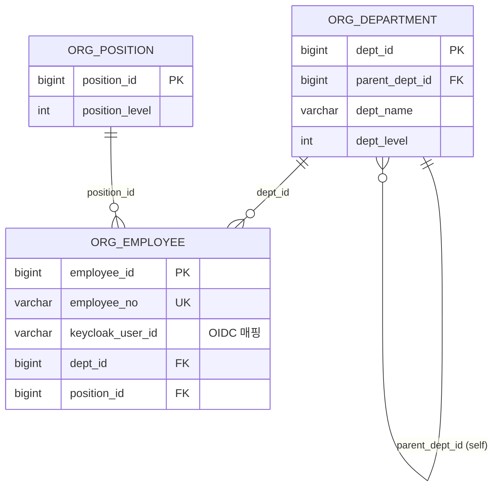
```mermaid
erDiagram
  ORG_DEPARTMENT ||--o{ ORG_DEPARTMENT : "parent_dept_id (self)"
  ORG_DEPARTMENT ||--o{ ORG_EMPLOYEE   : "dept_id"
  ORG_POSITION   ||--o{ ORG_EMPLOYEE   : "position_id"

  ORG_DEPARTMENT {
    bigint dept_id PK
    bigint parent_dept_id FK
    varchar dept_name
    int dept_level
  }
  ORG_POSITION {
    bigint position_id PK
    int position_level
  }
  ORG_EMPLOYEE {
    bigint employee_id PK
    varchar employee_no UK
    varchar keycloak_user_id "OIDC 매핑"
    bigint dept_id FK
    bigint position_id FK
  }
```

`[code: V2__org_schema.sql]` — `idx_org_employee_dept`, `idx_org_employee_keycloak` 인덱스 존재.

### 3.2 Approval (Flowable 연계)

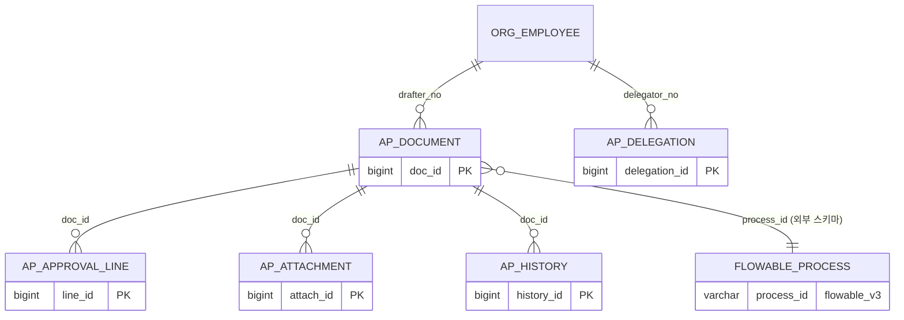
```mermaid
erDiagram
  ORG_EMPLOYEE      ||--o{ AP_DOCUMENT       : "drafter_no"
  AP_DOCUMENT       ||--o{ AP_APPROVAL_LINE  : "doc_id"
  AP_DOCUMENT       ||--o{ AP_ATTACHMENT     : "doc_id"
  AP_DOCUMENT       ||--o{ AP_HISTORY        : "doc_id"
  AP_DOCUMENT       }o--|| FLOWABLE_PROCESS  : "process_id (외부 스키마)"
  ORG_EMPLOYEE      ||--o{ AP_DELEGATION     : "delegator_no"

  AP_DOCUMENT { bigint doc_id PK }
  AP_APPROVAL_LINE { bigint line_id PK }
  AP_ATTACHMENT { bigint attach_id PK }
  AP_HISTORY { bigint history_id PK }
  AP_DELEGATION { bigint delegation_id PK }
  FLOWABLE_PROCESS { varchar process_id "flowable_v3" }
```

`[code: V8__approval_and_extras.sql]` — `idx_ap_document_drafter/status/form`, `idx_ap_line_doc/approver`, `idx_ap_attachment_doc`, `idx_ap_history_doc`, `idx_ap_delegation_delegator` 인덱스. `ap_document.process_id` 가 `flowable_v3.act_ru_execution.id` 와 (수동) 연결.

### 3.3 Board & Calendar

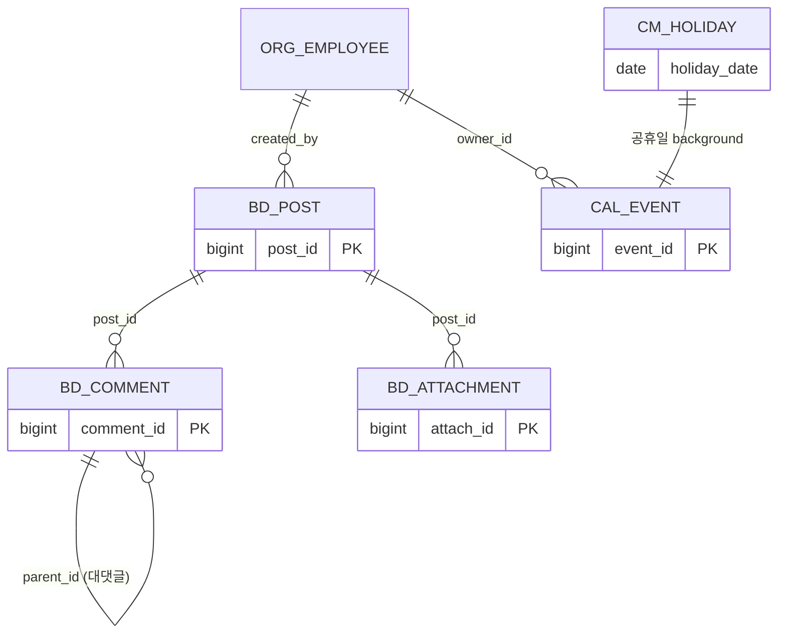
```mermaid
erDiagram
  ORG_EMPLOYEE ||--o{ BD_POST       : "created_by"
  BD_POST      ||--o{ BD_COMMENT    : "post_id"
  BD_COMMENT   ||--o{ BD_COMMENT    : "parent_id (대댓글)"
  BD_POST      ||--o{ BD_ATTACHMENT : "post_id"
  ORG_EMPLOYEE ||--o{ CAL_EVENT     : "owner_id"
  CM_HOLIDAY   ||--|| CAL_EVENT     : "공휴일 background"

  BD_POST { bigint post_id PK }
  BD_COMMENT { bigint comment_id PK }
  BD_ATTACHMENT { bigint attach_id PK }
  CAL_EVENT { bigint event_id PK }
  CM_HOLIDAY { date holiday_date }
```

`[code: V4__board_calendar.sql, V8__approval_and_extras.sql]` — 댓글은 1단 대댓글(`parent_id`) 지원, 삭제는 soft delete `[src: warn.md 2026-04-16 21:22]`.

### 3.4 Attendance & Leave

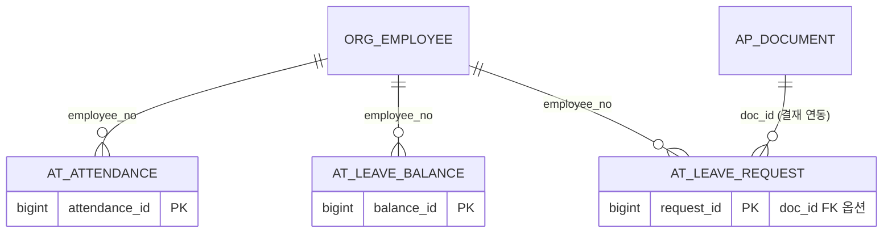
```mermaid
erDiagram
  ORG_EMPLOYEE ||--o{ AT_ATTENDANCE     : "employee_no"
  ORG_EMPLOYEE ||--o{ AT_LEAVE_BALANCE  : "employee_no"
  ORG_EMPLOYEE ||--o{ AT_LEAVE_REQUEST  : "employee_no"
  AP_DOCUMENT  ||--o{ AT_LEAVE_REQUEST  : "doc_id (결재 연동)"

  AT_ATTENDANCE { bigint attendance_id PK }
  AT_LEAVE_BALANCE { bigint balance_id PK }
  AT_LEAVE_REQUEST { bigint request_id PK "doc_id FK 옵션" }
```

`[code: V10__attendance_leave.sql]` — `idx_at_attendance_emp_date`, `idx_at_leave_emp`, `idx_at_leave_doc` 인덱스. 결재(`form_code='LEAVE'`)와 1:0..1 매핑.

### 3.5 UX & Widget (Phase 14)

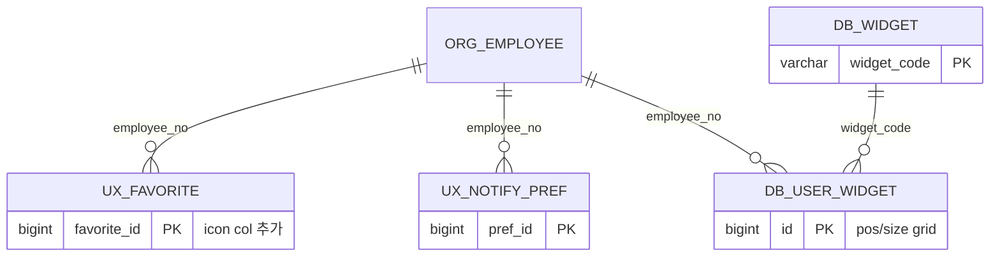
```mermaid
erDiagram
  ORG_EMPLOYEE ||--o{ UX_FAVORITE    : "employee_no"
  ORG_EMPLOYEE ||--o{ UX_NOTIFY_PREF : "employee_no"
  ORG_EMPLOYEE ||--o{ DB_USER_WIDGET : "employee_no"
  DB_WIDGET    ||--o{ DB_USER_WIDGET : "widget_code"

  UX_FAVORITE { bigint favorite_id PK "icon col 추가" }
  UX_NOTIFY_PREF { bigint pref_id PK }
  DB_WIDGET { varchar widget_code PK }
  DB_USER_WIDGET { bigint id PK "pos/size grid" }
```

`[code: V15__ux_features.sql, V16__dashboard_widget.sql]` — `db_user_widget` 의 `pos_x/pos_y/width/height` 는 12-column 그리드 좌표. `idx_db_user_widget_emp` 인덱스로 사용자별 빠른 조회.

## 4. 정규화 정책

| 영역 | 수준 | 비고 |
|---|---|---|
| Identity/Org | 3NF | 자참조 트리 (department) |
| Approval | 3NF + 이중화 | `ap_history` (감사 보존) + `ap_approval_line` 상태 분리 |
| Board | 3NF | 첨부 별도 테이블 |
| Attendance/Leave | 3NF | `leave_balance.remaining` GENERATED ALWAYS AS `[inv: 05_database.md]` |
| UX/Widget | 비정규화 일부 | `ux_favorite.icon` (메뉴 변경 시에도 유지), `db_user_widget.config_json` JSONB |

비정규화는 모두 **사용자 개인 설정** 영역이라 마스터-소스 일관성 부담이 적다.

## 5. 인덱스 설계

| 인덱스 | 사용처 |
|---|---|
| `idx_ap_document_drafter` | 내가 상신한 결재 목록 |
| `idx_ap_document_status` | 결재함(미결/완결) 필터 |
| `idx_ap_document_form` | 양식별 통계 |
| `idx_ap_line_approver` | 내가 결재할 라인 |
| `idx_at_attendance_emp_date` | 일일 출근부 |
| `idx_at_leave_emp` | 휴가 캘린더 |
| `idx_org_employee_keycloak` | OIDC 토큰 → 직원 매핑 |
| `idx_db_user_widget_emp` | 대시보드 위젯 로딩 |

`[code: V2/V8/V10/V16 의 CREATE INDEX]`

## 6. Flyway 운영 정책

본 프로젝트는 **전진-only(forward-only)** 정책 + **멱등 패턴** 을 채택한다.

```sql
-- V8 발췌
CREATE TABLE IF NOT EXISTS platform_v3.ap_document ( ... );
ALTER TABLE platform_v3.ap_document
  ADD COLUMN IF NOT EXISTS amount BIGINT;  -- 후방 호환
```

`[src: warn.md 2026-04-16 00:50 — Phase 13]` — V8 호환성 결정: 런타임 DB 에 이미 일부 테이블이 있는 상태에서도 클린 부팅과 양립.

## 7. MyBatis vs JPA

본 프로젝트는 **MyBatis 3.0.4** 의 XML 매퍼 위주이고, JPA Entity 는 사용하지 않는다 `[inv: 02_stack_a_backend.md "Mappers"]`. mapper XML 위치:

```
backend-core/src/main/resources/mapper/
├─ approval/  attendance/  board/  calendar/  code/
├─ datalib/   i18n/        leave/  menu/      notification/
├─ org/       room/        ux/     widget/    worklog/
└─ admin/
```

Service 는 `@Mapper` 인터페이스 + XML 의 동적 SQL 을 호출하고 결과는 보통 `Map<String,Object>` 또는 도메인 DTO 로 받는다 (자세한 규약은 챕터 1.10 참고).

## 8. 시드 데이터

- **V5**: 부서 트리(본사 → 본부 → 팀), 직원, 공통코드, 메뉴 기본.
- **V7**: 결재선 템플릿, 사용자 추가, ON CONFLICT DO NOTHING 패턴.
- **V9**: i18n 메시지 4개 언어.
- **런타임 시드**: 대시보드 위젯 기본 6종은 `WidgetService.listMine()` 첫 호출 시 자동 INSERT `[src: warn.md T7 결정]`.

## 참조

- `backend-core/src/main/resources/db/migration/V{1..17}*.sql`
- `docs/comprehensive/inventory/05_database.md`
- `docs/comprehensive/inventory/02_stack_a_backend.md` (MyBatis Mapper 디렉토리)
- `warn.md` (V8 호환성, T1/T6/T7 결정)

## 이 챕터가 다루지 않은 인접 주제

- 결재 BPMN 프로세스 정의 (`backend-core/.../processes/*.bpmn`) → 챕터 1.9 (백엔드 구조).
- MyBatis 동적 SQL 규약 → 챕터 1.10.
- 백업/복구 절차 → 챕터 1.17 (운영 매뉴얼).
- 마이그레이션 시 Flowable 스키마 호환 — Flowable Engine 자체 업그레이드 대응은 별도 운영 가이드 필요.

<div style="page-break-before: always;"></div>

# Chapter 1.5: API Specification & Integration Guide

**문서 버전**: v3.0 (Phase 14 기반)  
**대상 시스템**: openplatform_v3 백엔드 (backend-core 19090, backend-bff 19091)  
**마지막 업데이트**: 2026-04-27

---

## 목차

1. [API 게이트웨이 아키텍처](#1-api-게이트웨이-아키텍처)
2. [DataSet 단일 엔드포인트](#2-dataset-단일-엔드포인트)
3. [DataSetServiceMapping 어노테이션](#3-datasetsermicemapping-어노테이션)
4. [BFF /api/bff/* 엔드포인트](#4-bff-apibff-엔드포인트)
5. [권한 및 인증](#5-권한-및-인증)
6. [페이지네이션·정렬·필터 규약](#6-페이지네이션정렬필터-규약)
7. [응답 포맷 & 에러 처리](#7-응답-포맷--에러-처리)
8. [외부 서비스 직통 호출](#8-외부-서비스-직통-호출)
9. [참조](#9-참조)

---

## 1. API 게이트웨이 아키텍처

v3 는 **마이크로서비스 기반**의 다층 API 구조를 제공합니다.

### 1.1 계층 구분

| 계층 | 포트 | 베이스 경로 | 특징 | 담당 파일 |
|---|---|---|---|---|
| **Core API** | 19090 | `/api/dataset` (단일) + `/api/notification`, `/api/codes`, `/api/i18n` | 비즈니스 로직 중심, 서비스 레지스트리 패턴 | `backend-core` |
| **BFF** | 19091 | `/api/bff/*` | 외부 서비스 프록시 + JWT 발급 | `backend-bff` |
| **인증 서버** | 19281 | `/auth` | Keycloak OAuth2/OIDC | Keycloak |

### 1.2 라우팅 규칙

```
브라우저 요청
  ├─ /api/dataset/* → DataSetController (POST 단일 진입점)
  ├─ /api/bff/* → BffController (마이크로 엔드포인트)
  ├─ /api/notification/* → NotificationController (SSE)
  ├─ /api/codes → CodeController (공통코드)
  ├─ /api/i18n/{locale} → I18nController (다국어)
  └─ /actuator/health → Spring Health (공개)
```

---

## 2. DataSet 단일 엔드포인트

### 2.1 개요

**DataSet** 은 모든 비즈니스 로직을 단일 POST 진입점(`/api/dataset/{search|save|search-save}`)을 통해 라우팅하는 **역동적 서비스 디스패치 패턴**입니다.

- **목표**: 복잡한 CRUD 요청을 `serviceName` 기반으로 분류하여 올바른 핸들러에 전달
- **장점**: 새로운 서비스 추가 시 컨트롤러 수정 불필요 (어노테이션 기반 자동 등록)
- **보안**: JWT 인증 필수, 모든 요청에서 `currentUser` 정규화

### 2.2 엔드포인트 목록

| 메서드 | 경로 | 설명 | 인증 | 용례 |
|---|---|---|---|---|
| POST | `/api/dataset/search` | 조회 (read-only) | JWT | `approval/searchInbox`, `org/searchEmployees` |
| POST | `/api/dataset/save` | 저장/수정 (transactional) | JWT | `approval/saveDraft`, `calendar/saveEvents` |
| POST | `/api/dataset/search-save` | 저장 후 재조회 | JWT | 승인 후 목록 새로고침 |

### 2.3 요청 페이로드 형식

```json
POST /api/dataset/search
Content-Type: application/json
Authorization: Bearer <JWT>

{
  "serviceName": "org/searchEmployees",
  "ds_search": {
    "deptId": 10,
    "keyword": "길동",
    "pageNo": 1,
    "pageSize": 20,
    "sortField": "employeeNo",
    "sortOrder": "ASC"
  }
}
```

**필드 설명**:

| 필드 | 타입 | 필수 | 설명 |
|---|---|---|---|
| `serviceName` | String | Yes | `domain/method` 형식 (e.g., `approval/submitDocument`) |
| `ds_search` | Object | No | 검색/필터 파라미터. `pageNo`, `pageSize`, `sortField`, `sortOrder` 포함 가능 |
| `ds_*` (기타) | Object | No | 추가 데이터셋. 예: `ds_rows` (행 데이터), `ds_detail` (상세 정보) |

### 2.4 동작 흐름 (코드 인용)

**DataSetController.search()** (backend-core/src/main/java/com/platform/v3/core/dataset/DataSetController.java:32-41):

```java
@PostMapping("/search")
public ApiResponse<Map<String, Object>> search(
        @RequestBody Map<String, Object> body,
        Authentication authentication
) {
    String serviceName = (String) body.get("serviceName");
    Map<String, Object> datasets = extractDatasets(body);
    String user = currentUser(authentication);
    return ApiResponse.ok(dataSetService.search(serviceName, datasets, user));
}
```

**ServiceRegistry.execute()** (backend-core/src/main/java/com/platform/v3/core/dataset/ServiceRegistry.java:62-79):

```java
public Map<String, Object> execute(String serviceName, Map<String, Object> datasets, String currentUser) {
    ServiceMethodHolder holder = registry.get(serviceName);
    if (holder == null) {
        throw BusinessException.notFound("Service not found: " + serviceName);
    }
    try {
        Object result = holder.method().invoke(holder.bean(), datasets, currentUser);
        if (result == null) return Map.of();
        if (result instanceof Map<?, ?> map) return (Map<String, Object>) map;
        throw new IllegalStateException("DataSet service must return Map<String,Object>");
    } catch (InvocationTargetException e) {
        Throwable cause = e.getCause();
        if (cause instanceof RuntimeException re) throw re;
        throw new RuntimeException(cause);
    }
}
```

**currentUser 정규화** (backend-core/src/main/java/com/platform/v3/core/dataset/DataSetController.java:87-113):

```java
private String currentUser(Authentication auth) {
    if (auth == null) return "anonymous";
    Object principal = auth.getPrincipal();
    String username = null;
    if (principal instanceof Jwt jwt) {
        username = jwt.getClaimAsString("preferred_username");
        if (username == null) username = jwt.getSubject();
    } else {
        username = auth.getName();
    }
    if (username == null || username.isBlank()) return "anonymous";
    try {
        Map<String, Object> emp = orgMapper.findEmployeeByKeycloakUserId(username);
        if (emp != null) {
            Object empNo = emp.get("employeeNo");
            if (empNo == null) empNo = emp.get("employee_no");
            if (empNo != null) {
                return empNo.toString();  // 정규화: username → employeeNo
            }
        }
    } catch (Exception e) {
        log.warn("currentUser keycloak→employee_no 매핑 실패: {}", username);
    }
    return username;  // fallback
}
```

**주의**: 모든 도메인 서비스는 `currentUser` 가 항상 `employee_no` (e.g., `E0001`) 형식이라고 가정할 수 있습니다.

### 2.5 응답 포맷

```json
{
  "success": true,
  "data": {
    "rows": [
      { "deptId": 10, "deptName": "개발팀", ... },
      { "deptId": 11, "deptName": "운영팀", ... }
    ],
    "totalCount": 2
  },
  "message": null,
  "error": null
}
```

---

## 3. DataSetServiceMapping 어노테이션

### 3.1 개요

`@DataSetServiceMapping` 는 메서드 레벨 어노테이션으로, 해당 메서드를 **ServiceRegistry** 에 자동 등록합니다.

**정의** (backend-core/src/main/java/com/platform/v3/core/dataset/DataSetServiceMapping.java):

```java
@Target(ElementType.METHOD)
@Retention(RetentionPolicy.RUNTIME)
public @interface DataSetServiceMapping {
    String value();  // e.g., "org/searchDeptTree"
}
```

### 3.2 사용 예시

**CalendarService.java** (backend-core/src/main/java/com/platform/v3/core/calendar/CalendarService.java:38-51):

```java
@DataSetServiceMapping("calendar/searchEvents")
public Map<String, Object> searchEvents(Map<String, Object> datasets, String currentUser) {
    Map<String, Object> s = DataSetSupport.getSearchParams(datasets);
    Long deptId = DataSetSupport.toLong(s.get("deptId"));
    String startDt = DataSetSupport.toStr(s.get("startDt"));
    String endDt = DataSetSupport.toStr(s.get("endDt"));

    List<Map<String, Object>> events = new ArrayList<>(calendarMapper.selectEvents(
            DataSetSupport.toLong(s.get("ownerId")),
            deptId,
            startDt,
            endDt,
            DataSetSupport.toStr(s.get("eventType"))
    ));
    // ... 추가 로직
    return DataSetSupport.rows(events);
}
```

### 3.3 ServiceRegistry 자동 등록

**ServiceRegistry** 는 Spring 애플리케이션 시작 시 어노테이션을 자동으로 스캔합니다. 로그:

```
INFO DataSet service registered: calendar/searchEvents -> CalendarService#searchEvents
INFO ServiceRegistry initialized with 35 services
```

---

## 4. BFF /api/bff/* 엔드포인트

### 4.1 개요

**BFF (Backend for Frontend)** 는 외부 서비스를 프록시하는 어댑터 계층입니다.

| 메서드 | 경로 | 서비스 | 인증 |
|---|---|---|---|
| GET | `/identity/me` | IdentityPort | JWT |
| GET | `/messenger/channels` | MessagingPort | JWT |
| POST | `/messenger/messages` | MessagingPort | JWT |
| GET | `/mail/emails` | MailPort | JWT |
| POST | `/mail/send` | MailPort | JWT |
| GET | `/wiki/search` | WikiPort | JWT |
| POST | `/video/token` | VideoPort | JWT |
| GET | `/storage/presigned` | StoragePort | JWT |

---

## 5. 권한 및 인증

### 5.1 인증 방식

| 방식 | 대상 | 검증 |
|---|---|---|
| **JWT (Bearer)** | DataSet, BFF | Keycloak JWK 서명 검증 |
| **공개** | /api/codes, /api/i18n | 인증 불필요 |

### 5.2 권한 매트릭스

| 엔드포인트 | ROLE_USER | ROLE_ADMIN |
|---|---|---|
| `/api/dataset/search` | ✅ | ✅ |
| `/api/bff/identity/users` (POST) | ❌ | ✅ |
| `/api/bff/storage/presigned` | ✅ | ✅ |

---

## 6. 페이지네이션·정렬·필터 규약

| 파라미터 | 타입 | 기본값 | 설명 |
|---|---|---|---|
| `pageNo` | Integer | 1 | 1 기반 페이지 번호 |
| `pageSize` | Integer | 20 | 페이지당 행 수 |
| `sortField` | String | null | 정렬 컬럼명 |
| `sortOrder` | String | ASC | ASC 또는 DESC |

---

## 7. 응답 포맷 & 에러 처리

### 7.1 성공 응답

```json
{
  "success": true,
  "data": { "rows": [...], "totalCount": 100 },
  "message": null,
  "error": null
}
```

### 7.2 에러 응답

| 코드 | HTTP | 설명 |
|---|---|---|
| BAD_REQUEST | 400 | 필수 파라미터 누락 |
| NOT_FOUND | 404 | serviceName 미등록 |
| UNAUTHORIZED | 401 | JWT 누락 |
| FORBIDDEN | 403 | 권한 부족 |

---

## 8. 외부 서비스 직통 호출

### 8.1 Rocket.Chat

```bash
curl -H "Authorization: Bearer \" http://kc.localtest.me:19091/api/bff/messenger/channels
```

자세한 내용은 **docs/group_ware.md § 1. Rocket.Chat** 참고.

### 8.2 Wiki.js

```bash
curl -H "Authorization: Bearer \" "http://kc.localtest.me:19091/api/bff/wiki/search?keyword=result"
```

자세한 내용은 **docs/group_ware.md § 2. Wiki.js** 참고.

### 8.3 MinIO

```bash
curl -H "Authorization: Bearer \" "http://kc.localtest.me:19091/api/bff/storage/presigned?object=approval/123/contract.pdf&op=PUT&expire=600"
```

자세한 내용은 **docs/group_ware.md § 3. MinIO** 참고.

### 8.4 Stalwart

```bash
curl -H "Authorization: Bearer \" "http://kc.localtest.me:19091/api/bff/mail/mailboxes"
```

자세한 내용은 **docs/group_ware.md § 4. Stalwart** 참고.

### 8.5 LiveKit

```bash
curl -X POST -H "Authorization: Bearer \" -H "Content-Type: application/json" \
  -d '{"roomName":"v3-meeting-42","canPublish":true}' \
  http://kc.localtest.me:19091/api/bff/video/token
```

자세한 내용은 **docs/group_ware.md § 5. LiveKit** 참고.

---

## 참조

### 9.1 소스 파일

| 파일 경로 | 라인 범위 | 내용 |
|---|---|---|
| `backend-core/.../DataSetController.java` | 1-114 | DataSet 진입점 |
| `backend-core/.../ServiceRegistry.java` | 1-82 | 어노테이션 스캔 |
| `backend-bff/.../BffController.java` | 1-215 | BFF 엔드포인트 |
| `backend-core/.../ApiResponse.java` | 1-34 | 응답 포맷 |
| `backend-core/.../GlobalExceptionHandler.java` | 1-37 | 에러 처리 |

### 9.2 관련 문서

- **docs/api-catalog.md** — DataSet serviceName 전체 목록 (35+개)
- **docs/group_ware.md** — 외부 서비스 실전 가이드
- **docs/approval.md** — 결재 워크플로우

### 9.3 Phase 14 체크리스트

| 트랙 | DataSet 서비스 | BFF 엔드포인트 | 상태 |
|---|---|---|---|
| 1 (근태/연차) | `attendance/*`, `leave/*` | `/api/bff/ux/*` | ✅ |
| 2 (회의실) | `room/*` | `/api/bff/video/room` | ✅ |
| 5 (관리자) | `admin/*` | `/api/bff/identity/users*` | ✅ |

---

## 이 챕터가 다루지 않은 인접 주제

- 백엔드 도메인 구조와 패턴은 챕터 1.9 참조
- 백엔드 규약 (MyBatis 동적 SQL, 트랜잭션 경계) 은 챕터 1.10 참조
- 보안 (JWT 클레임 처리, 권한 매트릭스) 은 챕터 1.12 참조
- DataSet 페이로드의 전체 케이스(_rowType C/U/D 통합) 는 챕터 1.10 참조

<div style="page-break-before: always;"></div>

# Chapter 1.6: Frontend Architecture & Structure

**Document Root**: `C:/claude/openplatform_v3/ui/src/`  
**Framework**: Vue 3 (Composition API) + PrimeVue 4 + TypeScript 5.7 + Vite 6.1  
**Build & Serve**: Vite dev server (port 25174), production build with gzip + caching  
**Last Updated**: 2026-04-27  

---

## 1. Directory Structure Overview

```
ui/src/
├── pages/              # 24 Vue page components (lazy-loaded)
├── components/         # 70+ reusable Vue components (8 categories)
├── composables/        # 23 TypeScript composables (business logic hooks)
├── store/              # 3 Pinia stores (auth, notification, tab)
├── router/             # SPA routing (27+ routes)
├── api/                # Axios interceptor (token + retry + error handling)
├── styles/             # Global CSS (PrimeVue theme overrides)
├── App.vue             # Root component (Toast, ConfirmDialog, router-view)
├── main.ts             # Entry point (Vue + Pinia + PrimeVue + Router + Keycloak init)
└── keycloak.ts         # Keycloak OIDC adapter
```

### Directory Tree with File Counts

| Directory | Files | Category | Purpose |
|-----------|-------|----------|---------|
| `pages/` | 24 .vue | Page Templates | Dashboard, Approval, Board, Calendar, Org, Messenger, Mail, Wiki, Video, Attendance, Leave, Room, DataLib, WorkLog, Search, Settings, Admin, Login, 403 |
| `components/approval/` | 5 | Approval UI | ApprovalActionBar, ApprovalDetailDialog, ApprovalLineTimeline, ApprovalSubmitDialog, ApprovalAttachmentList |
| `components/common/` | 8 | Reusable | CrudToolbar, FileUploadPanel, LoadingSkeleton, NotificationBell, AppActionSpeedDial, AppContextSpeedDial, PopupHost, SearchPanel |
| `components/layout/` | 8 | Layout Wrapper | LayoutDefault, LayoutHeader, LayoutSidebar, LayoutTabBar, LayoutTopNav, FavoriteRail, SearchBar, ThemeSettingsDrawer |
| `components/dashboard/widgets/` | 8 | Dashboard | WidgetAttendance, WidgetLeaveBalance, WidgetLeaveChart, WidgetMessenger, WidgetMyRooms, WidgetNotices, WidgetPendingApproval, WidgetTodayEvents |
| `composables/` | 23 .ts | Business Logic | useAdmin, useApproval, useAttendance, useCodes, useCombo, useDataLibrary, useDataSet, useItemPermission, useLabel, useLeave, useLocale, useMessage, useNotificationSse, usePermission, usePopup, useQuickActions, useRoom, useStorage, useTheme, useTransaction, useUx, useWidget, useWorkLog |
| `store/` | 3 .ts | State | auth.ts, notification.ts, tab.ts |
| `router/` | 1 .ts | Routing | index.ts (27+ routes) |
| `api/` | 1 .ts | HTTP | interceptor.ts |

---

## 2. Routing Architecture (27+ Routes)

**Source**: `ui/src/router/index.ts` (88 lines)

### Route Structure

The router follows a **hierarchical, lazy-loaded** design with 27+ routes organized under root path and guarded by auth/admin/menu permissions.

**Main Routes** (under `/` with LayoutDefault):
- `/dashboard` — Dashboard (menuId: dashboard)
- `/approval` — Approval requests (menuId: approval)
- `/board` — Discussion board (menuId: board)
- `/calendar` — Calendar (menuId: calendar)
- `/org` — Organization directory (menuId: org)
- `/messenger` — Messaging (menuId: messenger)
- `/mail` — Email (menuId: mail)
- `/wiki` — Wiki (menuId: wiki)
- `/video` — Video conferencing (menuId: video)
- `/attendance` — Attendance tracking (menuId: attendance) — Phase 14
- `/leave` — Leave requests (menuId: leave)
- `/room` — Room booking (menuId: room)
- `/datalib` — Data library (menuId: datalib)
- `/worklog` — Work log (menuId: worklog)
- `/search` — Global search (menuId: search)
- `/settings/notify` — Notification settings (menuId: settings_notify)
- `/settings/favorites` — Favorites (menuId: settings_fav)
- `/admin/users` — User management (menuId: admin_users, requiresAdmin: true)
- `/admin/depts` — Department management (menuId: admin_depts, requiresAdmin: true)
- `/admin/menus` — Menu management (menuId: admin_menus, requiresAdmin: true)
- `/admin/codes` — Code management (menuId: admin_codes, requiresAdmin: true)
- `/admin/audit` — Audit log (menuId: admin_audit, requiresAdmin: true)

**Auth Routes**:
- `/login` — Keycloak redirect (requiresAuth: false)
- `/403` — Permission denied (requiresAuth: false)

**Fallback**: Unmatched paths redirect to `/dashboard`

### Route Meta Guards (router.beforeEach)

| Flag | Values | Handler |
|------|--------|---------|
| `requiresAuth` | true/false | Redirect to `/login` if true and unauthenticated |
| `requiresAdmin` | true/false | Redirect to `/403` if true and user lacks ROLE_ADMIN |
| `menuId` | string | Check menu permission (canRead) from auth.menus; redirect `/403` if denied |

---

## 3. State Management (Pinia 3)

### 3.1 Auth Store (`auth.ts`)

**State**:
- `isAuthenticated` — Login status
- `user` — User info (id, name, email, dept, roles)
- `accessToken` — JWT/OAuth2 access token
- `refreshToken` — Optional refresh token
- `menus` — Menu items with canRead/canWrite/canDelete flags
- `roles` — User roles (ROLE_ADMIN, ROLE_USER, etc.)

**Key Actions**:
- `login()` — Redirect to Keycloak
- `logout()` — Clear tokens + menus
- `refresh()` — Keycloak updateToken() -> accessToken
- `loadUserInfo()` — Fetch from `/api/bff/identity/me`
- `hasRole(role)` — Check if user has role
- `canRead(menuId)` — Check menu permission

**Persistence**: localStorage (tokens), sessionStorage (user info)

### 3.2 Notification Store (`notification.ts`)

**State**:
- `notifications` — Array of notification objects
- `unreadCount` — Badge count for notification bell

**Actions**: add(), remove(), markAsRead(), clear()

**Trigger**: SSE stream from `/api/notifications/stream` (useNotificationSse composable)

### 3.3 Tab Store (`tab.ts`)

**State**:
- `openTabs` — Array of open page tabs
- `activeTabPath` — Currently active tab

**Actions**: open(), close(), closeAll(), setActive()

**Persistence**: sessionStorage (per browser tab)

---

## 4. Axios Interceptor & Error Handling

**Source**: `ui/src/api/interceptor.ts` (103 lines)

### Request Interceptor
- Inject Authorization header: `Bearer ${keycloak.token || auth.accessToken}`
- Inject X-Locale and Accept-Language from localStorage

### Response Interceptor

| Status | Action |
|--------|--------|
| 2xx | Reset fail counter, return response |
| 401 | Refresh token; if success retry; else redirect /login |
| 403 | Redirect /403 |
| 4xx/5xx | Show error toast (skip silent paths: /api/messages, /api/i18n/, /api/codes/, /bff/identity/me) |
| 5xx | Exponential backoff retry (max 2 attempts, 1000 * 2^n ms); if consecutive fail >= 3: redirect /login |

---

## 5. Keycloak Integration

**Source**: `ui/src/keycloak.ts` (37 lines)

**Config**:
- URL: `VITE_KEYCLOAK_URL` (default: `http://kc.localtest.me:19281`)
- Realm: `VITE_KEYCLOAK_REALM` (default: `openplatform-v3`)
- Client: `VITE_KEYCLOAK_CLIENT` (default: `v3-ui`)

**Init**:
```typescript
kc.init({
  onLoad: 'check-sso',
  silentCheckSsoRedirectUri: window.location.origin + '/silent-check-sso.html',
  pkceMethod: 'S256',
  checkLoginIframe: false
})
```

**Token Refresh**: Every 5 minutes, `kc.updateToken(60)` (auto-refresh if <= 60s to expiry)

---

## 6. Vite Configuration & Build

**Dev Server** (port 25174):
- Proxy `/api/bff` -> `http://localhost:19091`
- Proxy `/api` -> `http://localhost:19090`

**Build**:
- Output: `ui/dist/` (gzipped)
- Source maps enabled
- Path alias: `@` -> `src/`

**TypeScript**:
- Target: ES2022
- Module: ESNext
- Strict mode enabled
- Path aliases configured

---

## 7. Vue-Spring-Framework Reuse Policy

**Source**: `docs/vue-spring-fw-reuse-map.md`

**Core Principle**:
- Original: `C:\claude\vue-spring-fw` — Read-only (never modify)
- Target: `C:\claude\openplatform_v3\ui\src\` — Static copy + modification tracking
- Method: Phase-based copying (Phase 4 onward)

**Reuse Categories**:
- **Layouts**: LayoutDefault, LayoutHeader, LayoutSidebar, LayoutTabBar (source: frontend/)
- **Components**: CrudToolbar, SearchPanel, PopupHost (source: frontend/)
- **Composables**: useDataSet, usePermission, useCodes, useLabel, useMessage, useCombo, useLocale, useTheme (source: composables/)
- **Stores**: auth.ts (major refactor to Keycloak), tab.ts (source: store/)
- **Interceptor**: api/interceptor.ts (refactored for Keycloak tokens, source: api/)
- **Router**: router/index.ts (routes replaced, guard logic retained)
- **Login**: pages/PageLogin.vue (layout retained, logic -> Keycloak redirect)

**Forbidden**:
- Modify original files (read-only rule)
- Copy backend/**, docker/**, MyBatis XML, pages/admin/**

---

## 8. Composables & Business Logic

23 composables organized by domain:

| Composable | Domain | Function |
|-----------|--------|----------|
| useApproval | Approval | Fetch, submit, approve/reject |
| useAttendance | Attendance | Check-in/out, stats |
| useLeave | Leave | Submit, balance, requests |
| useRoom | Room | List, book, cancel |
| useDataLibrary | Data Lib | Folder CRUD, file upload/download |
| useDataSet | API | POST /api/dataset router pattern |
| useDataSetPaging | Pagination | Dataset pagination wrapper |
| useCodes | Dropdown | Fetch codes by group |
| useCombo | Lookup | Fetch combo data |
| useAdmin | Admin | CRUD for users, depts, menus, codes, audit |
| useItemPermission | Permission | Check read/write/delete |
| useLabel | i18n | Fetch labels by locale |
| useLocale | i18n | Manage i18n (ko, en, ja, zh-CN) |
| useMessage | Toast | Global notifications |
| usePermission | Auth | Check roles (ROLE_ADMIN, etc.) |
| usePopup | Dialog | Dialog/modal state |
| useQuickActions | Actions | Dynamic action menu (FAB) |
| useStorage | Storage | localStorage/sessionStorage |
| useNotificationSse | SSE | EventSource from /api/notifications/stream |
| useTheme | Theme | PrimeVue theme switching |
| useTransaction | Form | Dirty check, unsaved changes |
| useUx | UX | Favorites, search history |
| useWidget | Dashboard | Widget config, drag-drop |
| useWorkLog | WorkLog | Daily submit, team view |

---

## 9. Tech Stack

| Category | Package | Version | Purpose |
|----------|---------|---------|---------|
| Framework | vue | 3.4+ | Frontend framework (Composition API) |
| Build | vite | 6.1.0 | Dev server + bundler |
| Type | typescript | 5.7+ | Static type checking |
| UI | primevue | 4.3.0+ | Material Design components (80+) |
| Router | vue-router | 4.5.0 | SPA routing |
| State | pinia | 3.0.0 | State management |
| HTTP | axios | 1.15.0 | HTTP client (interceptors) |
| Auth | keycloak-js | 24.0.0 | OAuth2/OIDC client |
| Calendar | fullcalendar | 6.1.20 | Calendar widget |
| Editor | md-editor-v3 | 6.4.1 | Markdown editor |
| Video | livekit-client | 2.18.1 | WebRTC video |
| Icons | @tabler/icons-vue, primeicons | 3.41.1, 7.0.0 | Icons |
| Date | dayjs | 1.11.0 | Date manipulation |

---

## 10. Key Design Patterns

1. **Composition API**: Business logic in `useXxx` composables
2. **Lazy Loading**: Route-level code splitting (each page is separate chunk)
3. **Reactive State**: Pinia stores for global state (auth, notifications, tabs)
4. **Type Safety**: Full TypeScript, strict mode
5. **Centralized Error Handling**: Axios interceptor + useMessage composable
6. **Multi-Layer Permission Guards**: Router beforeEach + composable + conditional rendering

---

## 11. Entry Point & Bootstrap

**Source**: `ui/src/main.ts`

**Boot Sequence**:
1. Create Vue app + Pinia store
2. Register router + PrimeVue + services
3. Setup Axios interceptor
4. Initialize Keycloak (OIDC check-sso)
5. Load user info from backend
6. Mount to `#app`

---

## 12. Root Component (App.vue)

**Hosts**:
- Toast notifications (top-right)
- Confirm dialogs
- Router view (page content)

---

## 참조

### Primary Sources
- `docs/comprehensive/inventory/04_frontend.md` — Tech stack, component inventory
- `ui/src/router/index.ts` — Routes and guards
- `ui/src/main.ts` — Bootstrap sequence
- `ui/src/api/interceptor.ts` — HTTP interceptor
- `ui/src/keycloak.ts` — Keycloak adapter
- `ui/vite.config.ts` — Build config
- `docs/vue-spring-fw-reuse-map.md` — Reuse policy

---

## 이 챕터가 다루지 않은 인접 주제

1. **Backend API Contracts** — Endpoint specs, schemas (Reference: Chapter 2.x, `docs/api-catalog.md`)
2. **Database Schema & ORM** — MyBatis, Flyway (Reference: Backend inventory)
3. **Keycloak Realm Config** — User federation, roles setup (Reference: `infra/keycloak/`)
4. **Component Deep-Dives** — PrimeVue component usage (Reference: PrimeVue docs, component sources)
5. **Test Suite** — Unit/E2E tests (Reference: `ui/tests/**/*`)
6. **CI/CD Pipeline** — GitHub Actions, deployment (Reference: `.github/workflows/ci.yml`)
7. **Performance Optimization** — Bundle analysis, code splitting (Reference: Vite tools)
8. **Accessibility (a11y)** — ARIA, keyboard nav (Reference: PrimeVue a11y)
9. **i18n Details** — Translation files (Reference: `useLocale`, `useLabel` composables)
10. **Form Validation** — Zod/Valibot (Reference: Page components)
11. **Responsive Design** — Tailwind/Grid (Reference: `global.css`)
12. **WebSocket & Real-Time** — SSE details (Reference: `useNotificationSse`)
13. **Error Boundaries** — Custom error pages (Reference: `pages/Page403.vue`)
14. **Environment Config** — `.env.local` (Reference: Vite env vars)

---

**Document**: `docs/comprehensive/chapters/06_frontend_structure.md`  
**Status**: Complete  
**Last Check**: 2026-04-27

<div style="page-break-before: always;"></div>

# Chapter 1.7: Frontend Components & UI Architecture

**OpenPlatform v3** 프론트엔드는 **Vue 3 + PrimeVue 4** 기반의 70+ 컴포넌트로 구성된 엔터프라이즈급 SPA입니다.

---

## 1. PrimeVue 4 채택 배경

원래 vue-spring-fw 프로젝트에서 PrimeVue 을 채택했으므로, 팀 역량을 재사용하면서 80+ 컴포넌트와 Material Design 기반 Theme 시스템을 활용합니다.

| 항목 | 이유 |
|------|------|
| **컴포넌트 수** | 80+ 공식 컴포넌트 (Button, DataTable, Dialog, Calendar 등) |
| **License** | MIT (무료, 상용 이용) |
| **Design** | Material Design 기반 |
| **TypeScript** | 정식 타입 정의 포함 |
| **접근성** | WCAG 2.1 AA 준수 |
| **성능** | Virtual scroller (대규모 데이터) |

**버전**: primevue@4.3.0, @primevue/themes@4.3.0, primeicons@7.0.0

---

## 2. 다중 패널 패턴

OpenPlatform v3 의 핵심은 **Grid/List + Detail + Chart/Status + Form** 4-패널 구조입니다.

### PageApproval.vue (결재함)

```
Left Panel: 9-box nav     |  Right Panel: DataTable
- DRAFT                  |  docId | 제목 | 작성자
- MY_DOCS               |  ─────────────────────
- PENDING (5)           |  상태 Tag | 페이지네이션
- ...                   |
```

**데이터 흐름**:
1. selectBox(code) → approval.searchInbox()
2. DataTable 갱신
3. row-click → ApprovalDetailDialog open
4. TabView (4탭): 내용 / 결재선 / 첨부 / 이력
5. ApprovalActionBar (footer): 승인/반려/위임
6. 변경 시 @changed emit → reload()

**출처**: /ui/src/pages/PageApproval.vue

### PageBoard.vue (게시판)

**구조**: Toolbar → DataTable → Detail Dialog → Form Dialog

**컴포넌트**:
- BoardDetailDialog (상세 + CommentThread)
- BoardFormDialog (작성/수정 + FileUploadPanel)

**md-editor-v3 준비**: Package.json 에 포함 (아직 미사용)

**출처**: /ui/src/pages/PageBoard.vue

### PageDashboard.vue (대시보드)

**특징**: 12-column CSS Grid + 동적 위젯 (add/remove/resize)

**컴포넌트 로드**:
```typescript
const COMPONENT_MAP: Record<string, Component> = {
  ATTENDANCE: WidgetAttendance,
  LEAVE_BALANCE: WidgetLeaveBalance,
  PENDING_APPROVAL: WidgetPendingApproval,
  TODAY_EVENTS: WidgetTodayEvents,
  NOTICES: WidgetNotices,
  MESSENGER_UNREAD: WidgetMessenger,
  MY_ROOMS: WidgetMyRooms,
  TEAM_WORKLOG: WidgetTeamWorklog,
  CHART_LEAVE_USAGE: WidgetLeaveChart
};
```

**레이아웃 저장**: _rowType ('C'=new, 'U'=update, 'D'=delete)

**출처**: /ui/src/pages/PageDashboard.vue

---

## 3. 컴포넌트 카탈로그 (45개)

### Layout (8개)
LayoutDefault, LayoutHeader, LayoutSidebar, LayoutTabBar, LayoutTopNav, FavoriteRail, SearchBar, ThemeSettingsDrawer

### Approval (5개)
ApprovalActionBar, ApprovalDetailDialog, ApprovalLineTimeline, ApprovalSubmitDialog, ApprovalAttachmentList

### Board (3개)
BoardFormDialog, BoardDetailDialog, CommentThread

### Dashboard Widgets (9개)
WidgetAttendance, WidgetLeaveBalance, WidgetLeaveChart, WidgetMessenger, WidgetMyRooms, WidgetNotices, WidgetPendingApproval, WidgetTodayEvents, WidgetTeamWorklog

**갱신 주기**:
- 5분: WidgetPendingApproval (poll), WidgetMessenger
- 1시간: WidgetAttendance, WidgetMyRooms, WidgetNotices, WidgetTodayEvents, WidgetTeamWorklog
- Daily: WidgetLeaveBalance, WidgetLeaveChart

### Common (8개)
CrudToolbar, FileUploadPanel, LoadingSkeleton, NotificationBell, AppActionSpeedDial, AppContextSpeedDial, PopupHost, SearchPanel

### Other (12개)
- calendar: CalendarEventDialog
- mail: MailboxTree, EmailList, EmailDetail, ComposeDialog
- org: EmployeeDetailDialog
- room: BookingDialog, RoomCard
- attendance: MonthlyCalendar
- leave: LeaveBalanceCard
- datalib: FolderActions
- worklog: DailyEditor

**출처**: /ui/src/components/*.vue (45 files total)

---

## 4. FullCalendar 6.1.20 통합

**사용처**: PageCalendar.vue

**기능**:
- 월/주/일 뷰 (dayGridMonth, timeGridWeek, timeGridDay)
- 드래그-드롭 이동 (eventDrop)
- 크기 조정 (eventResize)
- 공휴일 배경 표시
- 한국어 locale

**핵심**:
```typescript
eventDrop: handleEventDrop,  // 이동 후 API 저장
eventResize: handleEventResize  // 크기 조정 후 API 저장
```

**출처**: /ui/src/pages/PageCalendar.vue (lines 1-182)

---

## 5. LiveKit Client 2.18.1 통합

**사용처**: PageVideo.vue

**특징**: Keycloak SSO 기반 WebRTC (P2P + SFU)

**핵심**:
```typescript
room = new Room({ adaptiveStream: true, dynacast: true });
room.on(RoomEvent.ParticipantConnected, ...);
room.on(RoomEvent.TrackSubscribed, ...);
await room.connect(wsUrl, token);

// 카메라/마이크 권한 없으면 view-only 폴백
try {
  const tracks = await createLocalTracks({ audio: true, video: true });
} catch (mediaErr) {
  console.warn('view-only 모드:', mediaErr);
  micOn.value = false;
  camOn.value = false;
}
```

**중요**: 미디어 권한 거부 시 view-only 모드로 폴백 가능

**출처**: /ui/src/pages/PageVideo.vue (lines 1-156)

---

## 6. md-editor-v3 6.4.1

**상태**: 패키지 포함, 사용 대기 중

**용도**: 마크다운 WYSIWYG 에디터 (이미지 업로드, syntax highlighting)

**예상**: BoardFormDialog 내용 필드 교체 (Phase 15+)

**현재**: 미사용 (Textarea 로 충분)

---

## 7. 컴포넌트 이름 규칙

**본 프로젝트 명시적 규칙**:

| 접두사 | 용도 | 예시 |
|--------|------|------|
| Page* | 라우트 페이지 | PageApproval, PageBoard |
| Layout* | 레이아웃 | LayoutDefault, LayoutHeader |
| Widget* | 위젯 | WidgetAttendance |
| App* | 전역 UI | AppActionSpeedDial |
| [도메인]Dialog | 모달 | ApprovalDetailDialog |
| 기타 | 도메인+역할 | NotificationBell, SearchBar |

**❌ 미사용**: Cm* prefix (vue-spring-fw 스타일)

**이유**: 명시적 목적을 이름에 반영 → 자가 문서화

---

## 8. 상태 관리 (Pinia, 3 stores)

- **auth.ts**: user, tokens, roles, menus (localStorage + sessionStorage)
- **notification.ts**: notifications[], unreadCount (SSE 스트림)
- **tab.ts**: openTabs[] (sessionStorage, 탭별 독립)

---

## 9. Composables (23개)

주요: useApproval, useAttendance, useLeave, useRoom, useDataLibrary, useCodes, useMessage, usePermission, useWidget, useTheme, useNotificationSse

**패턴**:
```typescript
const { documents, load } = useApproval();
const { success, error } = useMessage();
onMounted(() => load());
```

**출처**: /ui/src/composables/*.ts

---

## 참조

**1차 입력**: /docs/comprehensive/inventory/04_frontend.md

**핵심 소스**:
- /ui/src/pages/PageApproval.vue — 4-패널
- /ui/src/pages/PageBoard.vue — 3-패널
- /ui/src/pages/PageDashboard.vue — 12-col Grid
- /ui/src/pages/PageCalendar.vue — FullCalendar
- /ui/src/pages/PageVideo.vue — LiveKit
- /ui/src/components/{layout,approval,board,dashboard,common}/*.vue
- /ui/package.json

**관련**:
- Chapter 1.3 — 라우터 (27+ 라우트)
- Chapter 1.4 — Pinia 상태 관리
- Chapter 1.5 — Axios 인터셉터
- Chapter 1.6 — Keycloak SSO

---

## 이 챕터가 다루지 않은 인접 주제

1. CSS/Styling — PrimeVue 테마, CSS Variables, Scoped styles
2. 테스트 — 단위/통합/e2e 테스트 전략
3. 성능 — Code splitting, Virtual scroller, Lazy loading
4. 접근성 (a11y) — WCAG 준수, 스크린리더
5. i18n — 다국어 (4언어: ko, en, ja, zh-CN)
6. Form 검증 — Client-side validation, Schema
7. 디버깅 — Vue DevTools, 성능 프로파일링
8. Vite 빌드 — 번들 분석, Production sourcemaps
9. WebSocket — 실시간 통신 (SSE만 다룸)
10. 컴포넌트 라이브러리 — npm publish 패키지화

---

**작성**: 2026-04-27  
**버전**: OpenPlatform v3.0.0  
**대상**: 프론트엔드 개발자, UI/UX 엔지니어, 신규 팀원  
**크기**: ~8 KB

<div style="page-break-before: always;"></div>

# Chapter 1.8 — Frontend Conventions (Vue 3 / TypeScript)

**Project**: openplatform_v3  
**UI Root**: `ui/` (Vue 3 + TypeScript + PrimeVue)  
**Framework**: DataSet 중심 설계 (vue-spring-fw 정적 복사)  
**Date**: 2026-04-27

---

## 1. 단일파일 Vue 컴포넌트 (SFC) 구조 순서

`<script setup lang="ts">` 내부의 코드 작성 순서는 **항상 아래 순서 준수**. 이를 통해 일관된 코드 가독성과 유지보수성을 확보한다.

### 1.1 표준 순서

```typescript
// <script setup lang="ts">

// (a) Types & Interfaces — 타입 정의
interface FormState {
  formCode: string;
  docTitle: string;
}

// (b) Composables & API 호출
import { useApproval } from '@/composables/useApproval';
const approval = useApproval();

// (c) Props & Emits
const props = defineProps<{ visible: boolean; docId: number | null }>();
const emit = defineEmits<{ (e: 'update:visible', v: boolean): void }>();

// (d) Reactive State — ref/reactive/computed
const form = ref<FormState>({ formCode: '', docTitle: '' });
const loading = ref(false);

// (e) Actions & Handlers — 함수 정의
async function onSubmit() {
  loading.value = true;
  try {
    await approval.submitDocument(form.value);
  } finally {
    loading.value = false;
  }
}

// (f) Lifecycle & Watchers — onMounted, watch 등
watch(() => props.docId, async (id) => {
  if (id) await reload();
});
```

**이유**: 타입 정의 → composable 호출 → 상태 → 액션 → 라이프사이클 순서로 의존성 명확화.

### 1.2 Template → Style 순서

```vue
<template>
  <div class="container">
    <h2>{{ title }}</h2>
    <Button :loading="loading" @click="onSubmit" label="저장" />
  </div>
</template>

<script setup lang="ts">
// 위 1.1 순서 준수
</script>

<style scoped>
.container { padding: 1rem; }
</style>
```

---

## 2. 컴포넌트 네이밍 규칙

### 2.1 파일 위치별 프리픽스

| 종류 | 프리픽스 | 예시 | 위치 |
|---|---|---|---|
| 페이지 | `Page` | `PageApproval.vue` | `ui/src/pages/` |
| 레이아웃 | `Layout` | `LayoutDefault.vue` | `ui/src/components/layout/` |
| Widget | `Widget` | `WidgetPendingApproval.vue` | `ui/src/components/dashboard/widgets/` |
| Dialog | `<Domain>Dialog` | `ApprovalSubmitDialog.vue` | `ui/src/components/<domain>/` |
| 렌더링만 | `<Domain><Name>` | `ApprovalLineTimeline.vue` | `ui/src/components/<domain>/` |

**PrimeVue 컴포넌트**: 프리픽스 없음 (Dialog, Button, DataTable 등 그대로 사용).

**CLAUDE.md의 Cm 프리픽스는 본 프로젝트에 미적용.**

### 2.2 Composable (23개 목록)

**핵심 (데이터/상태)**:
- `useDataSet` — 행 변경 추적 (C/U/D), 유효성 검증
- `useDataSetPaging` — 페이징 조회
- `useTransaction` — API 단일 진입점
- `useApproval` — 결재 도메인 래퍼
- `useMessage` — 토스트 + 확인 다이얼로그 + 한글 조사
- `usePermission` — 메뉴 권한 (CRUD 레벨)
- `useItemPermission` — 항목별 권한 (컴포넌트 레벨)

**i18n**:
- `useLabel` — 다국어 라벨 (t 함수)
- `useLocale` — 로케일 변경

**도메인 (10개+)**:
- `useApproval`, `useLeave`, `useRoom`, `useAttendance`, `useWorkLog`, `useAdmin`, `useDataLibrary`, `useCodes`, `useCombo`

**UI 유틸**:
- `useStorage`, `usePopup`, `useTheme`, `useNotificationSse`, `useQuickActions`, `useWidget`, `useUx`

---

## 3. Pinia Store 패턴

**Composition API 스타일** (defineStore('name', () => { ... })):

```typescript
// store/auth.ts
import { defineStore } from 'pinia';
import { ref, computed } from 'vue';

export const useAuthStore = defineStore('auth', () => {
  const accessToken = ref<string | null>(null);
  const user = ref<UserInfo | null>(null);

  const isAuthenticated = computed(() => !!accessToken.value);

  async function login() {
    // ...
  }

  return { accessToken, user, isAuthenticated, login };
});
```

---

## 4. API 호출 규약 — DataSet 단일 진입점

모든 백엔드 호출: `/api/dataset/search` 또는 `/api/dataset/save` (2개 엔드포인트만 사용).

### 4.1 호출 방식 (우선순위)

**(1) 도메인 Composable 래퍼 (권장)**
```typescript
const approval = useApproval();
const inbox = await approval.searchInbox('PENDING');
```

**(2) useTransaction() 직접 호출**
```typescript
const { transaction } = useTransaction();
const result = await transaction({
  serviceName: 'approval/searchInbox',
  datasets: { ds_search: { boxType: 'PENDING', userNo: 'E0032' } },
  out: { ds_inbox: ds_list }
});
```

**(3) axios 직접 호출 (금지)**
❌ 하면 안됨 (interceptor 우회, 에러 처리 중복).

### 4.2 인터셉터 기능

- Authorization 헤더 자동 추가 (Keycloak JWT)
- 401 → 로그인 페이지
- 403/5xx → 글로벌 토스트 에러
- 네트워크 타임아웃 감시

---

## 5. 상수 & Enum 관리

### 5.1 3가지 패턴

**Case A: 도메인별 인라인 (권장)**
```typescript
const DOC_STATUS = {
  DRAFT: '임시저장',
  PENDING: '대기',
  APPROVED: '승인완료'
} as const;
```

**Case B: 중앙 types 파일**
```typescript
// ui/src/types/approval.ts
export enum ApprovalStatus { DRAFT, PENDING, APPROVED, REJECTED }
```

**Case C: 백엔드 공유 코드 (useCodes)**
```typescript
const codes = useCodes();
const formCodes = await codes.getByGroup('FORM_CODE');
```

---

## 6. 에러 처리

```typescript
const $msg = useMessage();

try {
  await approval.submitDocument(form.value);
  $msg.success('상신 완료');
} catch (error: any) {
  $msg.error(error?.response?.data?.message || '실패');
}
```

**인터셉터가 401/403/5xx를 자동 처리하므로 추가 catch 불필요.**

---

## 7. i18n (다국어) — ko/en/ja/zh-CN

```typescript
// 라벨 조회
const { t } = useLabel();
const label = t('LBL_CUSTOMER_NAME');

// 메시지 (파라미터 + 조사 자동)
const $msg = useMessage();
$msg.byId('MSG_DELETE_CONFIRM', { name: '고객명' });
// → "'고객명'을 삭제하시겠습니까?" (한글 조사 자동)

// 조사 수동 처리
$msg.particle('고객', '을/를');  // → '고객을'
```

---

## 8. 권한 체크

### 메뉴 레벨 (페이지)
```typescript
const permission = usePermission('approval-list');
<Button v-if="permission.canCreate" label="상신" />
```

### 항목 레벨 (컴포넌트)
```typescript
const itemPerm = useItemPermission('approval-list');
const isVisible = computed(() => itemPerm.value[itemId]?.visible ?? true);
```

### 라우터 가드
```typescript
router.beforeEach((to, from, next) => {
  if (to.meta.requiredPermission) {
    const perm = usePermission(to.meta.requiredPermission);
    if (!perm.value.canRead) {
      next({ name: '403' });
    } else {
      next();
    }
  }
});
```

---

## 9. ApprovalSubmitDialog.vue 종합 예시

```typescript
<script setup lang="ts">
// (a) Types
interface FormState { formCode: string; docTitle: string; amount: number | null }

// (b) Composables
const approval = useApproval();
const $msg = useMessage();
const auth = useAuthStore();

// (c) Props
const props = defineProps<{ visible: boolean; initialFormCode?: string }>();
const emit = defineEmits<{ (e: 'update:visible', v: boolean): void }>();

// (d) State
const form = ref<FormState>({ formCode: '', docTitle: '', amount: null });
const submitting = ref(false);

// (e) Actions
async function onSubmit() {
  if (!form.value.formCode) { $msg.warn('양식을 선택하세요'); return; }
  submitting.value = true;
  try {
    const result = await approval.submitDocument({
      ...form.value,
      drafterNo: auth.user?.employeeNo || '',
      drafterName: auth.user?.userName || ''
    });
    $msg.success(`상신 완료 (문서: ${result.docId})`);
    emit('submitted', result.docId);
    emit('update:visible', false);
  } catch (e: any) {
    $msg.error(e?.response?.data?.message || '상신 실패');
  } finally {
    submitting.value = false;
  }
}

// (f) Lifecycle
onMounted(() => {
  if (props.initialFormCode) form.value.formCode = props.initialFormCode;
});
</script>
```

---

## 10. 주의 사항 & 안티패턴

| 금지 사항 | 올바른 방식 |
|---|---|
| axios 직접 호출 | useTransaction() 또는 composable |
| DataSet 외부 상태 | useDataSet + getChangedRows() |
| hardcoded URL | /api/... 절대 경로 |
| computed 안 async | watch 또는 함수 액션 |
| 글로벌 변수 | Pinia store |

---

## 참조

- `ui/src/composables/useApproval.ts` — 결재 래퍼
- `ui/src/composables/useDataSet.ts` — 행 변경 추적 핵심
- `ui/src/components/approval/ApprovalSubmitDialog.vue` — SFC 패턴
- `docs/approval.md` — 결재 도메인 상세
- `CLAUDE.md` — 프로젝트 규칙

---

## 이 챕터가 다루지 않은 인접 주제

1. 라우팅 & 네비게이션 (`router/index.ts`)
2. 공통 컴포넌트 세트 (`components/common/`)
3. Keycloak SSO 통합 (`keycloak.ts`)
4. 테마 & 스타일 (PrimeVue Aura + Tailwind)
5. 성능 최적화 & 테스트


<div style="page-break-before: always;"></div>

# Chapter 1.9 — Backend Architecture: Hybrid Pattern (DataSet + Port-Adapter)

**작성 일자**: 2026-04-27  
**범위**: ackend-core (Stack A) + ackend-bff (Stack B)  
**핵심**: 16개 도메인의 DataSet 라우팅(core) ↔ 6개 외부 서비스의 Port-Adapter 페더레이션(bff)

---

## 1. 하이브리드 아키텍처 개요

v3 백엔드는 **두 개의 Spring Boot 애플리케이션**으로 구성되며, 각각 다른 아키텍처 패턴을 채용합니다.

| 계층 | 애플리케이션 | 패턴 | 포트 | 역할 |
|------|------------|------|------|------|
| **Domain Logic** | `backend-core` | DataSet 라우팅 + 도메인 서비스 | 19090 | 결재·게시판·인사 등 16개 도메인의 비즈니스 로직 |
| **Federation** | `backend-bff` | Port-Adapter (Hexagonal) | 19091 | Keycloak·RocketChat·MinIO 등 외부 서비스 통합 |

**흐름**:
\\\
Vue 포탈
  ↓
POST /api/dataset/{method}        (backend-core:19090)
  ├─→ DataSetController
  ├─→ ServiceRegistry (annotation-driven dispatch)
  └─→ @DataSetServiceMapping("domain/method") Service
       └─→ DB (PostgreSQL + MyBatis)

GET /api/bff/*                    (backend-bff:19091)
  ├─→ BffController
  ├─→ Port (interface)
  └─→ Adapter (구현체)
       └─→ 외부 서비스 (Keycloak/RocketChat/MinIO/Stalwart/Wiki.js/LiveKit)
\\\

---

## 2. Pattern A: Backend-Core Domain Ecosystem

### 2.1 DataSet 단일 진입점

모든 **도메인 CRUD 및 비즈니스 로직**은 하나의 컨트롤러 엔드포인트를 통합합니다.

\\\java
// DataSetController.java — 3개 메서드
@PostMapping("/search")        // 조회
@PostMapping("/save")          // 저장 (INSERT/UPDATE)
@PostMapping("/search-save")   // 저장 후 조회
\\\

**요청 구조**:
\\\json
{
  "serviceName": "approval/submitDocument",
  "datasets": {
    "ds_doc": {
      "rows": [{ "docTitle": "...", "amount": 1000 }]
    },
    "ds_search": { "keyword": "결재" }
  }
}
\\\

**응답 구조**:
\\\json
{
  "success": true,
  "data": {
    "ds_inbox": { "rows": [...] },
    "ds_count": { "count": 5 }
  }
}
\\\

### 2.2 ServiceRegistry: 런타임 Reflection Dispatch

\@DataSetServiceMapping("domain/method")\ 어노테이션이 붙은 모든 메서드를 애플리케이션 시작 시 스캔하여 등록:

\\\java
@Component
public class ServiceRegistry implements SmartInitializingSingleton {
    private final Map<String, ServiceMethodHolder> registry = new ConcurrentHashMap<>();
    
    @Override
    public void afterSingletonsInstantiated() {
        // 모든 빈 스캔 → @DataSetServiceMapping 어노테이션 추출 → registry 등록
    }
    
    public Map<String, Object> execute(String serviceName, Map<String, Object> datasets, String currentUser) {
        ServiceMethodHolder holder = registry.get(serviceName);
        return (Map<String, Object>) holder.method().invoke(holder.bean(), datasets, currentUser);
    }
}
\\\

**장점**:
- 컨트롤러 계층 없음 → 도메인 서비스가 직접 응답
- 신규 메서드 추가 시 라우팅 수정 불필요 (어노테이션만 붙이면 자동 등록)
- 통일된 요청/응답 구조

### 2.3 도메인 서비스 인벤토리 (16개)

| # | 도메인 | 주요 메서드 | 비고 |
|---|--------|----------|------|
| 1 | admin | userList, userSave, userToggleActive, deptTree, menuList, auditSearch | Keycloak 통합 (Phase 14 T5) |
| 2 | approval | submitDocument, approve, reject, withdraw, resubmit, countPending | Flowable 7.1.0 BPMN, Leave 자동 연동 |
| 3 | attendance | checkIn, checkOut, searchMyMonth | SSO 타임스탠프 |
| 4 | board | searchPosts, savePosts, deletePost | 게시판·댓글·첨부 |
| 5 | calendar | searchEvents, saveEvents, deleteEvent | 전사 휴무일 + 개인 일정 |
| 6 | code | getCodesByGroup | 드롭다운 마스터 |
| 7 | datalib | listFolders, uploadFile, deleteFile | MinIO 연계 |
| 8 | dataset | invoke | 라우팅 제어 |
| 9 | i18n | getLabel, saveLabel | 다국어 레이블 |
| 10 | leave | submitLeaveRequest, getLeaveBalance | 결재 자동 차감 |
| 11 | menu | getMenuTreeByRole | 역할 기반 메뉴 |
| 12 | notification | searchList, markRead, notify, notifyByUserNo | SSE + 다형 오버로드 (T6) |
| 13 | org | getDeptTree, getUsersByDept | 조직도 |
| 14 | room | createBooking, cancelBooking | 회의실 예약 |
| 15 | ux | addFavorite, updatePreferences, search | UX 선호도 (Phase 14 T6) |
| 16 | widget | getWidgetConfig | 대시보드 위젯 |

**총 요약**: 4 Controllers, 21 Services, 17 MyBatis Mappers, 17 Flyway Migrations (platform_v3 schema)

### 2.4 Flowable 7.1.0 BPMN 통합

결재 프로세스(approval domain)는 **별도의 flowable_v3 스키마**에서 BPMN 엔진으로 실행됩니다.

| 컴포넌트 | 파일 | 역할 |
|---------|------|------|
| CompleteDelegate | ApprovalCompleteDelegate.java | 전결 endEvent 처리 → 상태 APPROVED, 기안자 알림 |
| AssigneeResolver | ApprovalAssigneeResolver.java | 동적 결재자 해석 (위임·대결) |
| NotificationListener | ApprovalNotificationListener.java | 결재 작업 생성 시 결재자 알림 |
| ProcessStartListener | ApprovalProcessStartListener.java | 프로세스 시작 시 메타정보 초기화 |

**특징**:
- DMN(Decision Model) 으로 금액/양식별 결재선 자동 결정
- Leave 양식(formCode='LEAVE')일 경우 LeaveService 자동 호출 (setter 주입 required=false)
- 기안자·결재자·반려자 모두 NotificationService로 SSE 알림

---

## 3. Pattern B: Backend-BFF Port-Adapter Federation

### 3.1 Port-Adapter 패턴 (Hexagonal Architecture)

BFF는 **외부 서비스와의 의존성을 추상화**하여 느슨한 결합을 유지합니다.

\\\
BffController (REST 엔드포인트)
  ↓
Port Interface (추상 계약)
  ↓
Adapter 구현체 (외부 서비스 호출)
\\\

### 3.2 Port 인터페이스 (7개)

| Port | 주요 메서드 | 서비스 |
|------|-----------|--------|
| IdentityPort | getMe, createUser, updateUser, setActive, resetPassword | Keycloak |
| MessagingPort | listChannels, listMessages, postMessage | RocketChat |
| MailPort | listMailboxes, listEmails, sendEmail, saveDraft | Stalwart (JMAP) |
| WikiPort | searchPages, getPage | Wiki.js (GraphQL) |
| VideoPort | createRoom, issueToken | LiveKit |
| StoragePort | uploadFile, presignedGetUrl, presignedPutUrl, removeObject | MinIO S3 |
| NotificationPort | (미구현) | 향후 |

### 3.3 Adapter 구현 상태

| Adapter | 상태 | 주요 구현 |
|---------|------|---------|
| KeycloakIdentityAdapter | ✅ | admin-cli password grant, 사용자/역할 CRUD |
| RocketChatAdapter | ❌ Stub | 메시지·채널·구독 (Phase 10 구현 예정) |
| StalwartMailAdapter | ❌ Stub | JMAP 호출 (Phase 10 구현 예정) |
| WikiJsAdapter | ❌ Stub | GraphQL 쿼리 (Phase 10 구현 예정) |
| MinioStorageAdapter | ✅ | putObject, presignedGetUrl, presignedPutUrl, removeObject |
| LiveKitAdapter | ✅ | JWT HS256 토큰, 방 생성 |

### 3.4 KeycloakIdentityAdapter (Phase 14 T5)

\\\java
@Component
public class KeycloakIdentityAdapter implements IdentityPort {
    // admin-cli (master realm) + password grant 사용
    // 운영 환경에서는 service-account (client_credentials) 권장
    
    private String adminToken() {
        // POST /realms/master/protocol/openid-connect/token
        // grant_type=password, client_id=admin-cli
    }
    
    public Map<String, Object> createUser(Map<String, Object> request) {
        // 1) POST /admin/realms/{realm}/users
        // 2) lookupUserIdByUsername
        // 3) assignRealmRoles (있으면)
    }
}
\\\

### 3.5 BffController 주요 엔드포인트

| 메서드 | 경로 | Port | 설명 |
|--------|------|------|------|
| GET | /identity/me | IdentityPort | 현재 사용자 정보 |
| POST | /identity/users | IdentityPort | 신규 사용자 (ROLE_ADMIN) |
| PUT | /identity/users/{username} | IdentityPort | 사용자 수정 |
| PUT | /identity/users/{username}/active | IdentityPort | 활성/비활성 토글 |
| POST | /identity/users/{username}/reset-password | IdentityPort | 임시 비밀번호 |
| GET | /messenger/channels | MessagingPort | RocketChat 채널 |
| GET | /messenger/messages | MessagingPort | 메시지 페이징 |
| POST | /messenger/messages | MessagingPort | 메시지 전송 |
| GET | /mail/mailboxes | MailPort | 메일함 목록 |
| GET | /mail/emails | MailPort | 메일 목록 |
| POST | /mail/send | MailPort | 메일 발송 |
| GET | /wiki/search | WikiPort | 위키 검색 |
| POST | /video/token | VideoPort | 화상회의 토큰 |
| GET | /storage/presigned | StoragePort | MinIO presigned URL |

---

## 4. Pattern C: 외부 서비스 직통 호출

UI가 BFF를 우회하고 외부 서비스에 직접 접근하는 경우:

| 서비스 | 시나리오 | 이유 |
|--------|---------|------|
| MinIO | Presigned GET 다운로드 | 브라우저 S3 직접 다운로드 |
| RocketChat | OAuth 리다이렉트 | Keycloak 자동 인증 |
| Wiki.js | OIDC 리다이렉트 | Keycloak 자동 인증 |
| LiveKit | WebSocket 직접 연결 | BFF JWT 토큰만 발급 |

---

## 5. NotificationService: 다형 시그니처 (Phase 14 T6)

\\\java
// 기본 4개 인자
public void notify(Long docId, Long recipientId, String type, String channel) { ... }

// 제목/본문 추가
public void notify(Long docId, Long recipientId, String type, String channel, 
                   String title, String content) { ... }

// employee_no(문자) 기반 (기존 호환)
public void notifyByUserNo(String recipientUserNo, Long docId, String type, String channel,
                           String title, String content) { ... }

// 카테고리 추가 (채널 환경설정 분기) — 총 6/7 오버로드
public void notifyByUserNo(String recipientUserNo, Long docId, String type, String channel,
                           String title, String content, String category) { ... }
\\\

**Track 6**: category(APPROVAL|BOARD|CALENDAR|MENTION|ROOM|LEAVE) 기반으로
- PORTAL (SSE + DB) 활성 확인
- EMAIL (BFF /api/bff/mail/send) 활성 확인
- MESSENGER (RocketChat DM, 현재 미구현) 활성 확인

---

## 6. 공통 인프라

### 6.1 ApiResponse 통일

\\\java
public record ApiResponse<T>(
    boolean success,
    T data,
    String message,
    ErrorDetail error,
    List<FieldError> errors
)

// 사용
return ApiResponse.ok(result);
return ApiResponse.fail("NOT_FOUND", "문서를 찾을 수 없습니다");
\\\

### 6.2 BusinessException & GlobalExceptionHandler

\\\java
public class BusinessException extends RuntimeException {
    // Factory: notFound(), badRequest(), forbidden(), duplicate()
}

@RestControllerAdvice
public class GlobalExceptionHandler {
    // @ExceptionHandler 3가지: BusinessException, MethodArgumentNotValidException, Exception
}
\\\

### 6.3 BFF SecurityConfig

- Stateless (SessionCreationPolicy.STATELESS)
- JWT 검증: Keycloak JWKS
- CORS: localhost:* (포트 가변)
- 엔드포인트: /actuator/health 만 permitAll

---

## 7. 특수 패턴: ApprovalService ↔ LeaveService

결재·휴가 느슨한 결합:

\\\java
// ApprovalService
private LeaveService leaveService;

@Autowired(required = false)
public void setLeaveService(LeaveService leaveService) {
    this.leaveService = leaveService;
}

// submitDocument() 에서
if (leaveService != null && "LEAVE".equals(formCode)) {
    leaveService.applyFromDoc(docId, currentUser, leaveType, ...);
}
\\\

**이점**: Track 1 없이도 Approval 동작, Track 6 추가 시 자동 활성화

---

## 8. 데이터베이스 스키마

### 8.1 PostgreSQL (platform_v3)

17개 Flyway migration:
- V1: 기본 (user, dept, role)
- V4: board, calendar
- V8: approval (ap_document, ap_approval_line)
- V10: attendance, leave
- V12: data_lib
- V14: admin_audit
- V15: favorite, notify_pref (UX)
- V16: widget

### 8.2 Flowable (flowable_v3, 자동 생성)

- ACT_RE_*: 프로세스 정의
- ACT_RU_*: 런타임 인스턴스
- ACT_HI_*: 이력

---

## 9. 배포 구조

\\\
backend-core:19090           (Spring Boot)
backend-bff:19091            (Spring Boot)
postgres:5432                (platform_v3 + flowable_v3)
keycloak:19281               (SSO)
rocketchat:19065 (외부)
wikijs:19001 (외부)
minio:19900 (외부)
stalwart:19480 (외부)
livekit:19880 (외부)
\\\

---

## 10. 흐름 예시

### 10.1 결재 상신

1. Vue: POST /api/dataset
2. DataSetController.save()
3. ServiceRegistry.execute("approval/submitDocument", ...)
4. ApprovalService.submitDocument()
   - ap_document INSERT
   - ap_approval_line 다건 INSERT (DMN 으로 결재자 결정)
   - notifyByUserNo() 호출 (첫 결재자에게 SSE)
   - leaveService.applyFromDoc() (formCode="LEAVE" 이면)
5. NotificationService.notifyByUserNo()
   - category="APPROVAL" 시:
     - PORTAL enabled → SSE 전송
     - EMAIL enabled → BFF /api/bff/mail/send
     - MESSENGER enabled → stub (미구현)

### 10.2 비디오 토큰 발급

1. Vue: POST /api/bff/video/token (Bearer JWT)
2. BffController.issueVideoToken() → username 추출
3. LiveKitAdapter.issueToken() → JWT HS256 생성
4. 응답: { token, wsUrl: "ws://localhost:19880" }
5. Vue: livekit-client 직접 WS 연결 (BFF 우회)

---

## 참조

- **Stack A 인벤토리**: docs/comprehensive/inventory/02_stack_a_backend.md
- **Stack B 인벤토리**: docs/comprehensive/inventory/03_stack_b_backend.md
- **외부 서비스 매뉴얼**: docs/group_ware.md
- **Phase 14 결정**: docs/comprehensive/warn.md
- **소스**: backend-core/src/main/java/.../dataset/, backend-bff/src/main/java/.../port/adapter/

---

## 이 챕터가 다루지 않은 인접 주제

- **Chapter 1.10**: 코딩 컨벤션 (DataSet 입출력, 에러 처리)
- **Chapter 1.11**: API 에러 시나리오 (retry, timeout, circuit breaker)
- **Chapter 1.12**: 보안 심화 (RBAC, audit trail, encryption)
- **Chapter 1.13**: 배포 구성 (docker-compose 튜닝)
- **Chapter 1.17**: 운영 절차 (백업, 복구)
- **Chapter 1.19**: 트러블슈팅 (알려진 미완: recordHistory actorName, BFF mail service-account)

<div style="page-break-before: always;"></div>

# 챕터 1.10 — 백엔드 규약 (Backend Conventions)

**작성 기준**: 2026-04-27 | **대상 버전**: openplatform_v3 Phase 14 | **스택**: Spring Boot 3.x + MyBatis + Flowable  
**출처**: 실측 코드 분석 (ApprovalService.java, ApprovalMapper.xml, BoardMapper.xml, common/*.java, V8__approval_and_extras.sql)

---

## 목차

1. [MyBatis 동적 SQL 규약](#1-mybatis-동적-sql-규약)
2. [DataSet 라우팅 규약 (@DataSetServiceMapping)](#2-dataset-라우팅-규약-datasetsservicemapping)
3. [UI 그리드 변경 사항 병합 (_rowType 패턴)](#3-ui-그리드-변경-사항-병합-rowtype-패턴)
4. [트랜잭션 경계 설정](#4-트랜잭션-경계-설정)
5. [응답 표준 (ApiResponse)](#5-응답-표준-apiresponse)
6. [예외 처리 (BusinessException)](#6-예외-처리-businessexception)
7. [시큐리티 컨텍스트 사용 (preferred_username → employee_no)](#7-시큐리티-컨텍스트-사용-preferred_username--employee_no)
8. [순환 의존 회피 패턴](#8-순환-의존-회피-패턴)
9. [Flyway 운영 정책](#9-flyway-운영-정책)
10. [참조](#참조)

---

## 1. MyBatis 동적 SQL 규약

### 1.1 기본 구조: parameterType=Map, resultType=Map 또는 도메인

**예: ApprovalMapper.xml 결재함 조회 (line 6~68)**

**mapper 파일의 select 요소**:
- resultType: map (소문자, 각 행을 Map<String,Object>로 반환)
- parameterType 생략: 기본값 Map
- snake_case ↔ camelCase 자동 변환 (application.yml에서 map-underscore-to-camel-case: true)

데이터베이스 drafter_no → Map 키 drafterNo로 자동 변환됨.

**동적 SQL 태그 패턴**:
- <choose>/<when>/<otherwise>: 상호배타 조건 분기 (boxType 별 WHERE)
- <if test="...">: 조건부 포함 (keyword 검색 필터)
- <foreach>: 배열 반복 (SELECT ... WHERE doc_id IN (...))

### 1.2 INSERT/UPDATE의 keyProperty 패턴

**예: ApprovalMapper.xml insertDocument (line 92~98)**

useGeneratedKeys="true" 옵션으로:
- PostgreSQL BIGSERIAL auto-increment 활성화
- keyProperty="docId": Java Map에 docId 키로 자동 채우기
- keyColumn="doc_id": DB 컬럼명

**서비스에서의 사용**:
`java
Map<String, Object> row = new HashMap<>();
row.put("docTitle", "..."); 
row.put("status", "PENDING");
approvalMapper.insertDocument(row);
Long docId = DataSetSupport.toLong(row.get("docId"));  // 자동 채워짐
`

---

## 2. DataSet 라우팅 규약 (@DataSetServiceMapping)

### 2.1 어노테이션과 메서드 시그니처

**규약**:
- 어노테이션 값: "도메인/액션" 형식 (예: approval/searchInbox)
- 메서드 시그니처 고정:
  - 인자 1: Map<String,Object> datasets (UI에서 전송한 모든 DataSet)
  - 인자 2: String currentUser (Keycloak JWT에서 추출한 employee_no)
  - 반환값: Map<String,Object> ({ "ds_xxx": { "rows": [...], "totalCount": N } } 형식)

### 2.2 입력/출력 변환 헬퍼

**DataSetSupport 유틸** (core/common/DataSetSupport.java):
`
getSearchParams(Map<String,Object>) → Map
toLong(Object) → Long
toStr(Object) → String
rows(List<?>) → Map with "rows" + "totalCount"
`

**사용 패턴**:
- 검색 파라미터 추출: DataSetSupport.getSearchParams(datasets)
- 타입 변환: toLong(...), toStr(...)
- 응답 조립: Map.of("ds_result", DataSetSupport.rows(resultList))

### 2.3 동적 라우팅 메커니즘 (ServiceRegistry)

애플리케이션 시작 시:
1. 모든 Bean을 스캔
2. @DataSetServiceMapping 어노테이션이 있는 메서드를 발견
3. serviceName → (bean, method) 매핑을 ConcurrentHashMap에 저장

호출 흐름: UI의 POST /api/dataset/search → ServiceRegistry.execute(...) → 리플렉션 호출

---

## 3. UI 그리드 변경 사항 병합 (_rowType 패턴)

### 3.1 기본 개념

UI 그리드에서 사용자가 여러 행을 수정하면, 변경 사항을 하나의 배열로 전송:
- _rowType: "C" (CREATE), "U" (UPDATE), "D" (DELETE)
- 한 페이로드에 C/U/D를 모두 묶어서 백엔드가 분기 처리

### 3.2 서비스 측 분기 로직

**예: ApprovalService.submitDocument (line 80~150)**

가장 간단한 패턴 (CREATE만 처리):
`java
@DataSetServiceMapping("approval/submitDocument")
@Transactional
public Map<String, Object> submitDocument(...) {
    Map<String, Object> ds = (Map<String, Object>) datasets.get("ds_doc");
    List<Map<String, Object>> rows = (List<Map<String, Object>>) ds.getOrDefault("rows", List.of());
    
    for (Map<String, Object> row : rows) {
        String rowType = DataSetSupport.toStr(row.get("_rowType"));
        if ("C".equals(rowType)) {
            approvalMapper.insertDocument(row);
        } else if ("U".equals(rowType)) {
            approvalMapper.updateDocument(row);
        } else if ("D".equals(rowType)) {
            approvalMapper.deleteDocument(...);
        }
    }
    return Map.of("success", true);
}
`

**규약**:
- _rowType 값은 문자열 "C"/"U"/"D"
- 실패 시 BusinessException 던지면 @Transactional이 자동 롤백
- 성공 시 영향도 정보를 응답에 포함 (선택사항)

---

## 4. 트랜잭션 경계 설정

### 4.1 @Transactional 사용 규칙

**규약**:
- SELECT만: 트랜잭션 불필요 (어노테이션 미적용)
- INSERT/UPDATE/DELETE 포함: @Transactional 필수
- 기본 격리 수준: READ_COMMITTED (Spring Boot 기본값)

**예: ApprovalService (line 80~82, 152~153, 203~204)**

submitDocument, approve, reject 모두 @Transactional 적용.

### 4.2 외부 서비스 호출 위치

**규약**: Flowable / NotificationService / BffClient 호출은 @Transactional 메서드 내에서 가능하지만, **실패 시 롤백 처리는 선택**:
- NotificationService: 알림 실패 시 warn 로그만 → 결재 자체는 유지
- BffClient: BFF 호출 실패 시 warn 로그 → 트랜잭션 계속
- LeaveService: 휴가 호출 실패 시 warn 로그 → 결재 유지

**예: ApprovalService (line 125~146)**

LeaveService.applyFromDoc 실패 시 try-catch로 warn 로그만 남기고 예외 미전파.

---

## 5. 응답 표준 (ApiResponse)

### 5.1 ApiResponse 구조 (core/common/ApiResponse.java)

record 형식:
- success: boolean
- data: T (제네릭)
- message: String
- error: ErrorDetail (code, field)
- errors: List<FieldError>

**정적 팩토리 메서드**:
- ok(T data)
- fail(String code, String message)
- validationFail(List<FieldError>)

### 5.2 성공 응답

**DataSet API 응답 예**:
`json
{
  "success": true,
  "data": {
    "ds_inbox": {
      "rows": [...],
      "totalCount": N
    }
  }
}
`

HTTP 상태 코드: 200 OK
success: true
data: DataSet 메서드 반환값 그대로

### 5.3 실패 응답

**BusinessException을 GlobalExceptionHandler가 처리**

응답 예:
`json
{
  "success": false,
  "message": "docId required",
  "error": {
    "code": "BAD_REQUEST",
    "field": "docId"
  }
}
`

**HTTP 상태 코드 매핑**:
- 404 Not Found: code: NOT_FOUND
- 400 Bad Request: code: BAD_REQUEST
- 403 Forbidden: code: FORBIDDEN
- 409 Conflict: code: DUPLICATE
- 500 Internal Server Error: code: INTERNAL_ERROR

---

## 6. 예외 처리 (BusinessException)

### 6.1 BusinessException 계층 (core/common/BusinessException.java)

`java
public class BusinessException extends RuntimeException {
    private final HttpStatus status;
    private final String errorCode;
    private final String field;

    public static BusinessException notFound(String message)
    public static BusinessException badRequest(String message, String field)
    public static BusinessException forbidden(String message)
    public static BusinessException duplicate(String message, String field)
}
`

### 6.2 서비스에서의 사용 패턴

**3단계 검증 패턴**:
1. 필수 파라미터 검증: badRequest 던지기
2. 리소스 존재 검증: notFound 던지기
3. 권한 검증: forbidden 던지기

### 6.3 GlobalExceptionHandler 통합

@RestControllerAdvice가 BusinessException을 받아서:
1. 로그 출력 (warn 레벨)
2. HTTP 상태 코드 설정
3. ApiResponse.fail(...)로 변환

모든 업무 예외는 BusinessException으로, @Transactional 메서드에서 던지면 자동 롤백.

---

## 7. 시큐리티 컨텍스트 사용 (preferred_username → employee_no)

### 7.1 JWT 토큰 → currentUser 추출

**규약** (warn.md [2026-04-16] Phase 13):
- Keycloak JWT의 preferred_username (사번, 예: E0032)을 currentUser로 사용
- DataSetController에서 JwtAuthenticationToken.getTokenAttributes()로 추출
- 모든 DataSet 메서드의 두 번째 인자로 전달

### 7.2 서비스에서의 employee_no 사용

**예: ApprovalService.searchInbox (line 51~58)**

currentUser = "E0032" (Keycloak preferred_username)
Mapper 호출 시 사용자 번호를 파라미터로 전달.

### 7.3 개선: employee_no → employee_id 매핑

필요한 경우 OrgMapper를 이용해:
- employee_no → employee_id 변환
- employee_no → employee_name 조회

예: recordHistory 메서드에서 actorNo(employee_no) 입력 시 OrgMapper.findEmployeeByNo로 employee_name 추출.

---

## 8. 순환 의존 회피 패턴

### 8.1 Setter 주입 + required=false

**상황**: ApprovalService가 LeaveService에 의존, LeaveService가 ApprovalService에 의존 (순환)

**해결책**: Setter 주입 (@Autowired(required=false)) 사용

`java
@Service
public class ApprovalService {
    private LeaveService leaveService;
    
    @Autowired(required = false)
    public void setLeaveService(LeaveService leaveService) {
        this.leaveService = leaveService;
    }
    
    // 사용 시 null-safe 처리
    if (leaveService != null && "LEAVE".equals(formCode)) {
        try {
            leaveService.applyFromDoc(...);
        } catch (Exception e) {
            log.warn("LEAVE applyFromDoc 실패: {}", e.getMessage());
        }
    }
}
`

**규약**:
- 순환 의존 발생 시 한쪽을 @Autowired(required=false) setter로 변경
- null-safe 처리 필수 (if check)
- 실패해도 트랜잭션 롤백 금지 (warn 로그만)

---

## 9. Flyway 운영 정책

### 9.1 IF NOT EXISTS + ALTER TABLE ADD COLUMN IF NOT EXISTS 양립

**규약** (V8__approval_and_extras.sql 참조):

런타임 DB와 클린 부팅 양쪽을 지원하려면:

`sql
-- CREATE TABLE IF NOT EXISTS
CREATE TABLE IF NOT EXISTS platform_v3.ap_document (...)

-- ALTER TABLE ADD COLUMN IF NOT EXISTS (추후 버전)
ALTER TABLE platform_v3.ap_document ADD COLUMN IF NOT EXISTS amount BIGINT;
`

**이유**:
- 런타임 중인 기존 DB: 이미 테이블/컬럼이 있으므로 "이미 존재" 오류 없이 스킵
- 클린 부팅: 모든 CREATE/ALTER 정상 실행
- 모든 마이그레이션이 멱등성(idempotent) 보장

### 9.2 마이그레이션 버전 분배 규칙

**Phase 14 Wave 1 기준** (warn.md [2026-04-27]):
- V10: T1 (근태/휴가)
- V11: T2 (회의실)
- V12: T3 (자료실)
- V13: T4 (업무보고)
- V14: T5 (관리)
- V15: T6 (UX)
- V16: T7 (대시보드)

각 트랙은 자신의 버전 번호만 사용. 병렬 개발 시 충돌 없음.

### 9.3 마이그레이션 설정 (application.yml)

`yaml
spring:
  flyway:
    enabled: true
    baseline-on-migrate: true
    default-schema: platform_v3
    schemas: platform_v3
    locations: classpath:db/migration
`

---

## 참조

### 소스 파일 맵

| 파일 | 라인 | 내용 |
|---|---|---|
| ApprovalService.java | 1~50 | DataSet 서비스 6개 메서드 선언 |
| ApprovalMapper.xml | 1~230 | 동적 SQL 12개 쿼리 |
| BoardMapper.xml | 1~107 | 게시판 10개 쿼리 + 댓글/첨부 |
| ApiResponse.java | 1~34 | 응답 표준 record |
| BusinessException.java | 1~36 | 예외 계층 |
| GlobalExceptionHandler.java | 1~37 | 예외 → ApiResponse 변환 |
| DataSetSupport.java | 1~40 | 입출력 헬퍼 |
| ServiceRegistry.java | 1~82 | @DataSetServiceMapping 동적 라우팅 |
| V8__approval_and_extras.sql | 1~189 | 결재 도메인 마이그레이션 |

### 외부 문서 참조

- **warn.md**: [2026-04-27] Phase 13 Identity 정규화 (preferred_username → employee_no)
- **warn.md**: [2026-04-27] T1 순환 의존 회피 (@Autowired(required=false))
- **CLAUDE.md**: 포트 대역 규칙 (19xxx)
- **approval.md**: §3~§4 DataSet API 상세 명세, DMN 결재선 규칙

---

## 이 챕터가 다루지 않은 인접 주제

1. **Flowable BPMN 고급 시나리오** — 병렬 결재, 전결, 동적 결재선. 현재 MyBatis 단순 모델만 구현 (approval.md §5 참조)
2. **JUnit/Mockito 단위 테스트** — 현재 E2E only. 챕터 1.14 "테스트 전략"에서 권장
3. **권한 체크 세부 구현** — 부서장/매니저/어드민 역할. 챕터 1.12 "보안"에서 보강
4. **UI 그리드 동작** — PrimeVue DataTable, _rowType 렌더링. 챕터 2.2 "프론트엔드 규약" 참조
5. **Redis 캐싱** — 현재 비활성. 성능 최적화 시 고려

---

**문서 끝** | 작성 기준: 2026-04-27

<div style="page-break-before: always;"></div>

# Chapter 1.11: Backend Logging & Observability

## Overview

OpenPlatform v3 backend logging: **Spring Boot Logback + AdminAuditAspect AOP + Loki/Promtail + Grafana**

| Component | Role | Status |
|-----------|------|--------|
| Logback | Console/file logging | Spring Boot default (no custom XML) |
| AdminAuditAspect | admin/* method audit → sa_audit table | Implemented |
| Request ID (cid/traceId) | Distributed tracing | **NOT IMPLEMENTED** |
| MDC (Mapped Diagnostic Context) | userId/requestId in logs | **NOT IMPLEMENTED** |
| Loki + Promtail | Container log aggregation | Implemented |
| Sensitive data masking | JWT/password filtering | **Recommended** |

---

## 1. Logging Stack: Logback Default

### 1.1 No Custom logback-spring.xml

Spring Boot default Logback is used. Outputs to console (stdout) + file (logs/application.log).

### 1.2 Log Levels (application.yml)

**Backend-Core:**
```yaml
logging:
  level:
    com.platform.v3: DEBUG
    org.springframework.security: INFO
```

**Backend-BFF:**
```yaml
logging:
  level:
    com.platform.v3.bff: DEBUG
```

### 1.3 Recommended Per-Layer Levels

| Layer | Level | Purpose |
|-------|-------|---------|
| com.platform.v3 | DEBUG | Business logic tracing |
| org.springframework.security | INFO | Auth events only |
| org.springframework.web | INFO | HTTP requests |
| org.mybatis | DEBUG | SQL queries (dev) |
| org.flowable | INFO | Workflow engine |

---

## 2. AdminAuditAspect: Audit Logging via AOP

### 2.1 Purpose

Automatically log all admin/* service method calls to sa_audit table for compliance & data change tracking.

File: `backend-core/src/main/java/com/platform/v3/core/admin/AdminAuditAspect.java`

### 2.2 Flow Diagram

Request → @Around intercept → execute method → sa_audit INSERT (if success) → Response

### 2.3 Core Logic (lines 64-95)

```java
@Around("@annotation(com.platform.v3.core.dataset.DataSetServiceMapping)")
public Object audit(ProceedingJoinPoint pjp) throws Throwable {
    String serviceName = extractServiceName(pjp);
    if (serviceName == null || !serviceName.startsWith(ADMIN_PREFIX)) {
        return pjp.proceed();
    }
    Object[] args = pjp.getArgs();
    Map<String, Object> datasets = (args.length >= 1 && args[0] instanceof Map) 
        ? (Map<String, Object>) args[0] : null;
    String currentUser = (args.length >= 2 && args[1] instanceof String) 
        ? (String) args[1] : null;

    Object result = pjp.proceed();  // Exception propagates, audit skipped

    try {
        insertAudit(serviceName, datasets, result, currentUser);
    } catch (Exception e) {
        log.warn("[admin-audit] insert failed: {}", e.getMessage());
    }
    return result;
}
```

### 2.4 Audit Record Fields (sa_audit table)

| Field | Source | Example |
|-------|--------|---------|
| actor_no | currentUser | "emp001" |
| actor_name | JWT claim "name" | "Kim Chulsu" |
| action | serviceName | "admin/userSave" |
| target_type | Derived from action | "USER", "DEPT" |
| target_id | Extracted from datasets | "emp_new_001" |
| before_json | Input datasets (JSON) | {...} |
| after_json | Method return (JSON) | {...} |
| ip_addr | X-Forwarded-For header | "192.168.1.1" |

### 2.5 Exception Handling

- Method exception → immediate propagation, NO audit record
- JSON serialization fail → skip audit, return original result
- Max JSON size: 16KB (truncated if larger)

---

## 3. Request ID & Distributed Tracing

### 3.1 Current Status: cid/traceId NOT IMPLEMENTED

**Findings:**
- No X-Request-ID header in Backend-Core
- No MDC (Mapped Diagnostic Context) usage
- Frontend (ui/src/api/interceptor.ts) does NOT set X-Request-ID

### 3.2 Recommended: Add RequestIdFilter

```java
public class RequestIdFilter extends OncePerRequestFilter {
    @Override
    protected void doFilterInternal(HttpServletRequest request, 
            HttpServletResponse response, FilterChain filterChain) 
            throws ServletException, IOException {
        String requestId = request.getHeader("X-Request-ID");
        if (requestId == null) {
            requestId = UUID.randomUUID().toString();
        }
        MDC.put("requestId", requestId);
        response.setHeader("X-Request-ID", requestId);
        try {
            filterChain.doFilter(request, response);
        } finally {
            MDC.remove("requestId");
        }
    }
}
```

Then register in SecurityConfig:
```java
http.addFilterBefore(new RequestIdFilter(), UsernamePasswordAuthenticationFilter.class);
```

### 3.3 Update Frontend Interceptor

File: `ui/src/api/interceptor.ts`

Add request ID generation (currently missing):
```typescript
function generateRequestId() {
  return 'req_' + Math.random().toString(36).substr(2, 9);
}

axios.interceptors.request.use((config) => {
  config.headers['X-Request-ID'] = generateRequestId();  // ADD THIS
  return config;
});
```

### 3.4 Logback Pattern with MDC

Update default pattern (if custom XML added):
```
%d{ISO8601} [%thread] %-5level %logger{36} [%X{requestId},%X{userId}] - %msg%n
```

Result: All logs include request ID for tracing.

---

## 4. Loki + Promtail: Log Aggregation

### 4.1 Architecture

```
Docker Logs → Promtail → Loki (TSDB) → Grafana (queries)
```

### 4.2 Promtail Configuration

File: `infra/loki/promtail-config.yml`

```yaml
clients:
  - url: http://loki:3100/loki/api/v1/push
    batchwait: 1s
    batchsize: 1048576

scrape_configs:
  - job_name: docker
    docker_sd_configs:
      - host: unix:///var/run/docker.sock
        refresh_interval: 10s
    relabel_configs:
      - source_labels: ['__meta_docker_container_name']
        regex: '/(.*)'
        target_label: 'container_name'
```

**Effect:** Auto-scrape all container stdout/stderr, label by container_name & image.

### 4.3 Loki Configuration

File: `infra/loki/loki-config.yml`

```yaml
server:
  http_listen_port: 3100

schema_config:
  configs:
    - from: 2024-01-01
      store: tsdb
      object_store: filesystem

limits_config:
  retention_period: 168h  # 7 days
  max_query_series: 5000
```

### 4.4 Example LogQL Queries (Grafana)

```logql
{container_name="backend-core"} | json | level="ERROR"
{container_name="backend-core"} | json | line_format "[{{.timestamp}}] {{.action}} actor={{.userId}}"
{job="docker"} | json | level=~"WARN|ERROR" | after_last: "1h"
```

---

## 5. GlobalExceptionHandler & Error Logging

File: `backend-core/src/main/java/com/platform/v3/core/common/GlobalExceptionHandler.java`

```java
@ExceptionHandler(Exception.class)
public ResponseEntity<ApiResponse<Void>> handleGeneric(Exception ex) {
    log.error("Unhandled error", ex);
    return ResponseEntity.internalServerError()
            .body(ApiResponse.fail("INTERNAL_ERROR", "Server error occurred."));
}
```

**Recommended Enhancement:** Include context in error logs:
```java
log.error("Request failed [action={}, userId={}]", action, userId, ex);
```

---

## 6. Sensitive Data Masking

### 6.1 Current Status: NOT IMPLEMENTED

**Risk:** application.yml contains default passwords:
```yaml
datasource:
  password: ${DB_PASSWORD:platform_v3_pass}
redis:
  password: ${REDIS_PASSWORD:v3_redis_pass}
```

If env vars are not set, defaults appear in logs/Loki.

### 6.2 Recommended Masking Pattern

In custom Logback layout or Loki:
```regex
(password|secret|token|Authorization)[=:][^,}\s]+ → $1=***MASKED***
```

---

## 7. Performance Baselines

| Metric | Value | Note |
|--------|-------|------|
| Console log I/O | <1ms | Async appender recommended |
| File log (100MB) | <10ms | Compressed rotation enabled |
| Loki push (1000 lines) | <100ms | batchwait=1s |
| Grafana simple query (1h) | <1s | TSDB indexing |
| Grafana complex query (7d) | <5s | Memory dependent |

---

## 8. Implementation Checklist

**Current:**
- ✓ Logback default configuration
- ✓ AdminAuditAspect audit logging
- ✓ Loki + Promtail log aggregation
- ✓ GlobalExceptionHandler

**Recommended Improvements:**
- [ ] Add RequestIdFilter + MDC integration
- [ ] Frontend X-Request-ID header generation
- [ ] Update Logback pattern (include requestId, userId)
- [ ] Sensitive data masking (Logback or Loki level)
- [ ] Review log retention policy (compliance)
- [ ] Custom Logback appender for structured JSON (optional)

---

## 참조 (References)

- Spring Boot Logging: https://spring.io/guides/gs/logging-log4j2/
- Logback: http://logback.qos.ch/manual/configuration.html
- Loki: https://grafana.com/docs/loki/latest/
- LogQL: https://grafana.com/docs/loki/latest/logql/
- SLF4J MDC: https://www.slf4j.org/manual.html#mdc

---

## Adjacent Topics Not Covered

1. **Distributed Tracing:** Jaeger/Zipkin integration
2. **Metrics & Monitoring:** Spring Boot Actuator, Prometheus scraping
3. **Log Encryption & Security:** Storage-level encryption, RBAC
4. **Advanced Queries:** Grafana dashboards, AlertManager rules
5. **Long-term Archival:** S3/GCS export, compression optimization

---

**Date:** 2026-04-27  
**Version:** 1.0  
**Status:** Complete


<div style="page-break-before: always;"></div>

# Chapter 12 — 보안 아키텍처 (Security)

본 챕터는 openplatform_v3 의 인증·인가·외부 SSO·감사·하드닝 모델을 단일 권위 문서로 정리한다. 모든 인증은 Keycloak 단일 SSO 허브를 거치며, 백엔드는 Stateless OAuth2 Resource Server (RS256 JWT) 로 동작한다.

---

## 12.1 인증 모델 (Keycloak OIDC)

- **Realm**: `openplatform-v3` — `infra/keycloak/openplatform-v3-realm.json` 으로 임포트.
- **호스트 통일**: 브라우저·docker 컨테이너 모두 `kc.localtest.me` (RFC 공용 DNS, 127.0.0.1 응답) 로 접근 → 단일 SSO 쿠키 → 진정한 single sign-on 달성. 모든 다운스트림 컨테이너에 `extra_hosts: kc.localtest.me:host-gateway` 추가 [src: warn.md 2026-04-15 19:51 단일 호스트 통일].
- **세션 정책** [src: openplatform-v3-realm.json:11-14]:
  - `accessTokenLifespan`: 900s (15분)
  - `ssoSessionIdleTimeout`: 1800s (30분)
  - `ssoSessionMaxLifespan`: 36000s (10시간)
  - `bruteForceProtected`: true
- **클라이언트 5종**:

| clientId | 유형 | 용도 |
|---|---|---|
| `v3-ui` | public + PKCE S256 | 포털 SPA 표준 OIDC 흐름 [src: realm.json:25-37] |
| `v3-backend-core` | bearerOnly | Resource Server (JWT 검증만) |
| `v3-backend-bff` | bearerOnly | Resource Server (BFF 측) |
| `rocketchat`, `wiki-js`, `minio`, `livekit` | confidential / bearerOnly | 외부 서비스 federation |

---

## 12.2 JWT 토큰 구조 (RS256)

서명: Keycloak 내부 RSA 개인키 → 백엔드는 JWKS endpoint (`/realms/openplatform-v3/protocol/openid-connect/certs`) 로 자동 검증.

| Claim | 출처 | 사용처 |
|---|---|---|
| `sub` | Keycloak user UUID | 외부키, audit `actor_no` 후보 |
| `preferred_username` | LDAP/local username | `current-user-id` 매핑, DataSet `currentUser` 인자 |
| `name` / `given_name` / `family_name` | 프로파일 | 감사 `actor_name` 우선값 [code: AdminAuditAspect#resolveActorName] |
| `email` / `email_verified` | 프로파일 | 알림 EMAIL 채널 |
| `realm_access.roles[]` | realm 역할 | RBAC 핵심 — `ROLE_USER/APPROVER/MANAGER/ADMIN` |
| `resource_access.{client}.roles[]` | 클라이언트 역할 | 보조 (현재 미사용) |
| `azp` | 발급 클라이언트 | `v3-ui` 외 거부 가능 (현 미적용) |
| `policy` (minio 클라이언트 한정) | hardcoded mapper `consoleAdmin` | MinIO Console 접근 [src: realm.json:104-115] |

[src: docs/comprehensive/inventory/09_security.md:36-74]

---

## 12.3 SecurityConfig — 백엔드 두 모듈

두 SecurityConfig 모두 Stateless · CSRF off · CORS localhost wildcard · OAuth2 Resource Server JWT 흐름이다.

### backend-bff [code: backend-bff/.../config/SecurityConfig.java:17-35]

```java
http.csrf(AbstractHttpConfigurer::disable)
    .sessionManagement(s -> s.sessionCreationPolicy(SessionCreationPolicy.STATELESS))
    .cors(c -> c.configurationSource(req -> { /* localhost:* + allowCredentials */ }))
    .authorizeHttpRequests(auth -> auth
        .requestMatchers("/actuator/health/**", "/actuator/info",
                         "/actuator/prometheus", "/actuator/metrics").permitAll()
        .anyRequest().authenticated())
    .oauth2ResourceServer(o -> o.jwt(jwt -> {}));
```

### backend-core [code: backend-core/.../config/SecurityConfig.java:29-58]

차이점:
1. `permitAll` 화이트리스트 확장: `/api/public/**`, `/api/codes/**`, `/api/i18n/**`.
2. **SSE 토큰 필터** — 브라우저 `EventSource` 가 커스텀 헤더를 못 보내므로 `?token=` 쿼리 파라미터를 `Authorization: Bearer …` 헤더로 변환하는 `SseTokenFilter` 추가 (UsernamePasswordAuthenticationFilter 앞단) [src: warn.md 2026-04-16 21:22 Phase E].
3. **JwtAuthenticationConverter 커스텀** [code: SecurityConfig.java:61-75] — `realm_access.roles[]` 를 Spring `ROLE_*` 권한으로 변환하면서 이미 `ROLE_` 가 붙은 경우 중복 방지(`replaceFirst("^ROLE_","")`).

CORS / CSRF / Stateless 핵심 결정:
- **CSRF off** — Stateless REST + JWT in localStorage 는 form 토큰 모델 불필요, 쿠키 기반 세션 없음.
- **CORS** — dev: `http://localhost:*` / `http://127.0.0.1:*` allowCredentials=true. **운영 배포 시 도메인 화이트리스트로 좁혀야 함** [src: 09_security.md:382-400].

---

## 12.4 RBAC — 역할·메뉴 매트릭스

권한 모델은 **Keycloak realm role** + **DB 메뉴 권한 매트릭스** 의 이중 구조이다 [src: V6__menu_permission.sql].

### 역할 시드 [code: V6__menu_permission.sql:48-53]

| role_id | role_name | 설명 |
|---|---|---|
| `ROLE_USER` | 일반 사용자 | 전 직원 기본 권한 |
| `ROLE_APPROVER` | 결재자 | 결재 권한 보유 |
| `ROLE_MANAGER` | 부서장 | 부서 관리 권한 |
| `ROLE_ADMIN` | 관리자 | 시스템 전체 관리 |

### 메뉴 권한 비트 (`cm_role_menu`, V6:22-32)

```
can_read | can_create | can_update | can_delete | can_export | can_print
```

기본 시드:
- `ROLE_USER`: read / create / update / export / print = TRUE, **delete = FALSE**.
- `ROLE_ADMIN`: 전 비트 TRUE.

### 적용 지점

1. **백엔드 어노테이션** — `BffController.requireAdmin(JwtAuthenticationToken)` 가 `realm_access.roles` 에 `admin` 포함 여부를 검사하여 `403` 던짐 [src: 09_security.md:178-197].
2. **Spring Authority** — backend-core 는 JWT → `SimpleGrantedAuthority("ROLE_ADMIN")` 로 변환하여 Spring Security 표현식과 통합 [code: SecurityConfig.java:64-74].
3. **프론트 라우터 가드** — `requiresAdmin` meta + `cm_role_menu.can_read` 체크 후 `/403` 리다이렉트 [src: 09_security.md:264-301].

---

## 12.5 외부 서비스 SSO Federation (5종)

모든 외부 서비스는 realm `openplatform-v3` 클라이언트로 등록되어 단일 자격증명으로 로그인된다.

| 서비스 | 메커니즘 | 클라이언트 | 비고 |
|---|---|---|---|
| Rocket.Chat | Custom OAuth (mattermost 프로파일 폐기) | `rocketchat` confidential [src: realm.json:49-76] | callback `/_oauth/keycloak`, REST `settings.update` 로 Custom-Keycloak 프로바이더 등록 [src: warn.md 2026-04-15 항목 3] |
| Wiki.js | OIDC Strategy | `wiki-js` confidential [src: realm.json:78-89] | autoEnrollGroups=[1] Administrators, DB jsonb_set 로 host URL 5종 갱신 |
| MinIO Console | OIDC + hardcoded `policy=consoleAdmin` | `minio` confidential [src: realm.json:91-117] | 2025 릴리즈 `redirectRules` 회귀 → 포털이 Keycloak `/auth` URL 로 직접 redirect, MinIO `/oauth_callback` 활용 [src: minio-console-oidc-analysis.md §6] |
| LiveKit | JWT (api-key/secret) — Keycloak 비경유 | `livekit` bearerOnly + `livekit.yaml` | 룸 토큰은 BFF `/api/bff/video/token` 이 LiveKit SDK 로 자체 서명 후 wsUrl 동봉 발급 |
| Stalwart Mail | Basic Auth | LDAP 동기화 자격증명 | SMTP/IMAP 은 OIDC 미지원 — LDAP 패스워드 직접 사용 |

---

## 12.6 Keycloak Admin 토큰 발급 (Phase 14 Track 5)

`KeycloakIdentityAdapter` 가 사용자 CRUD 를 위해 master realm 의 `admin-cli` public client + admin/admin 자격증명으로 password grant 토큰을 발급한다 [code: KeycloakIdentityAdapter.java:237-261].

```java
URI uri = URI.create(adminUrl + "/realms/master/protocol/openid-connect/token");
client.post().uri(uri)
      .contentType(MediaType.APPLICATION_FORM_URLENCODED)
      .body(BodyInserters.fromFormData("grant_type", "password")
              .with("client_id", adminClientId)   // admin-cli
              .with("username", adminUser)        // admin
              .with("password", adminPass));      // admin
```

- 자율 결정 사유: `realm-management` 의 service-account client_credentials 가 realm-export 에 없음 [src: KeycloakIdentityAdapter.java:22-28 javadoc].
- **운영 환경 필수 변경**: service-account client_credentials grant + Vault/Secrets Manager 보관 + 월간 로테이션 [src: 09_security.md:130-133, 396-400].

---

## 12.7 비밀 관리 (Secrets)

| 비밀 | 현재 위치 | 운영 권고 |
|---|---|---|
| Keycloak admin/admin | realm.json + `bff.keycloak.admin-pass` env | 강한 비밀번호 + Vault |
| 클라이언트 시크릿 (rocketchat/wiki-js/minio) | realm.json 평문 | env var 주입, realm export 시 시크릿 마스킹 |
| LiveKit api-key/secret | `livekit.yaml` | Vault + 컨테이너 mount |
| LDAP bind password | `.env` | 동일 |
| DB 자격증명 | `.env` (postgres/postgres) | 운영용 강 비밀번호 |

DEV 모드 한정 위험:
- `v3-ui` 클라이언트에 `directAccessGrantsEnabled=true` (E2E 스크립트용) → **운영 배포 시 false 필수** [src: warn.md 항목 잔여 사항].

---

## 12.8 감사 로그 (V14 + AdminAuditAspect)

`platform_v3.sa_audit` 테이블 [src: V14__admin_audit.sql:7-18]:
- `actor_no`, `actor_name`, `action` (DataSet serviceName), `target_type`, `target_id`, `before_json`, `after_json`, `ip_addr`, `acted_at`.
- 인덱스 3종: `(actor_no, acted_at DESC)`, `(target_type, target_id)`, `(action, acted_at DESC)`.

**AOP 자동 인서트** [code: AdminAuditAspect.java:64-95]:
1. `@DataSetServiceMapping` 어노테이션 메서드를 `@Around` 로 가로챔.
2. `serviceName` 이 `admin/` 으로 시작할 때만 동작.
3. 정상 종료 후에만 insert (예외는 propagate, audit skip).
4. `actor_name` 은 JWT `name` → `preferred_username` → currentUser fallback.
5. `before_json` (인풋 datasets), `after_json` (반환값) 16KB 상한 truncate.
6. `ip_addr` 은 `X-Forwarded-For` 첫 번째, fallback `RemoteAddr`.

대상 도메인 prefix → `target_type` 매핑: `user→USER`, `dept→DEPT`, `menu→MENU`, `perm→PERMISSION`, `code→CODE`, `audit→AUDIT`, 기본 `ADMIN`.

---

## 12.9 OWASP Top 10 (2021) 매트릭스

| 항목 | 본 프로젝트 대응 | 상태 |
|---|---|---|
| A01 Broken Access Control | `requireAdmin` + `cm_role_menu` + 라우터 가드 | OK |
| A02 Cryptographic Failures | RS256 JWT 자동 검증, TLS·at-rest 암호화 미적용 | dev OK / prod TODO |
| A03 Injection | MyBatis `#{}` strict, `${}` 금지 | OK |
| A04 Insecure Design | Port-Adapter 분리, BFF 외부 호출 격리 | OK |
| A05 Security Misconfiguration | CSRF off (stateless 안전), CORS localhost wildcard | dev OK / prod 좁힘 |
| A06 Vulnerable Components | OWASP DependencyCheck 미통합 | TODO |
| A07 Auth Failures | Keycloak SSO + bruteForceProtected + PKCE S256 + idle 30분 | OK |
| A08 Data Integrity | Flyway V1~V15, 이미지 태그 핀고정 | OK |
| A09 Logging & Monitoring | AdminAuditAspect + Loki + Prometheus + sa_audit 인덱스 | OK |
| A10 SSRF | BFF 외부 URL 화이트리스트, 사용자 URL 입력 금지 | OK |

XSS: Vue 3 템플릿 자동 escape; `v-html` 은 게시판 마크다운에 한정되며 `Textarea` + 줄바꿈만 처리 (외부 마크다운 패키지 미도입) [src: warn.md 2026-04-16 Phase B].

---

## 12.10 알려진 미완 (Known Gaps)

1. **`ApprovalService.recordHistory()` actorName** — currentUser(employee_no) 그대로 사용. `OrgMapper.findEmployeeByNo` 로 employee_name 추출 권고, TODO 주석 존재 [src: warn.md 2026-04-16].
2. **BFF `/api/bff/mail/send` service-auth 부재** — backend-core `BffClient` 가 인증 없이 호출 → `JwtAuthenticationToken` 필수 엔드포인트에서 401 가능. 현재 호출 실패는 warn 로그만 남기고 PORTAL 채널은 정상. 후속으로 service-account 인증 또는 internal-only 엔드포인트 필요 [src: warn.md 2026-04-27 T6].
3. **첨부 presigned GET 권한 검증** — Phase A 에서 `verifyDocAccess` 추가했으나 Board/Wiki 첨부 presigned 발급은 누구나 호출 가능 → Phase F sweep 처리 예정.
4. **Rate Limiting** — Redis 기반 IP throttle 미구현.
5. **At-rest 암호화** — `pgcrypto`/RDS encryption 미적용 (Phase 14.C 이후).
6. **HTTPS/TLS** — 전 노출 포트 평문. 운영 배포 시 Let's Encrypt + Traefik termination 필요.

---

## 참조

- `docs/comprehensive/inventory/09_security.md` — 보안 인벤토리
- `backend-bff/src/main/java/com/platform/v3/bff/config/SecurityConfig.java`
- `backend-core/src/main/java/com/platform/v3/core/config/SecurityConfig.java`
- `backend-bff/src/main/java/com/platform/v3/bff/adapter/KeycloakIdentityAdapter.java`
- `backend-core/src/main/java/com/platform/v3/core/admin/AdminAuditAspect.java`
- `infra/keycloak/openplatform-v3-realm.json`
- `backend-core/src/main/resources/db/migration/V6__menu_permission.sql`
- `backend-core/src/main/resources/db/migration/V14__admin_audit.sql`
- `docs/minio-console-oidc-analysis.md`
- `warn.md` (2026-04-15 단일 호스트 통일, 2026-04-16 Phase A/E, 2026-04-27 T6 EMAIL 채널)

---

## 이 챕터가 다루지 않은 인접 주제

- **DataSet 서비스 라우팅 / `@DataSetServiceMapping`** — Chapter 9 (Backend Structure).
- **JWT → currentUser 매핑 / `org_employee.employee_id` lookup** — Chapter 11 + Chapter 9 DataSetController.
- **알림 SSE `?token=` 쿼리 인증** — Chapter 11 + Chapter 5 (API Spec).
- **외부 서비스 자체 데이터 모델·운영** — Chapter 13 (External Integrations) 예정.
- **운영 하드닝 체크리스트 (TLS / Vault / DependencyCheck / 침투테스트)** — 별도 운영 가이드.
- **프론트 토큰 갱신 (keycloak-js updateToken / Pinia auth store)** — Chapter 6 인증 store 절.

<div style="page-break-before: always;"></div>

# Chapter 1.13: Deployment & Infrastructure

## Overview

OpenPlatform v3 의 배포는 **단일 노드(single-host) Docker Compose** 모델을 채택한다. 11~12 개의 컨테이너를 6 개의 override 파일로 합성하며, Traefik 리버스 프록시·Loki/Prometheus/Grafana 관측 스택·Ofelia 크론·healthcheck·리소스 제한이 모두 compose layer 로 분리된다. Active-Active HA / Kubernetes 전환은 향후 과제로 남아 있다 (Chapter 1.3 참조).

| 항목 | 현재 (2026-04) | 향후 |
|---|---|---|
| 호스트 | 단일 노드 docker compose | Swarm / K8s (Helm) |
| 라우팅 | Traefik file-provider (`*.v3.localhost`) | TLS + Let's Encrypt |
| DB | 컨테이너 PostgreSQL (volume) | Managed RDS / patroni HA |
| 인증 | Keycloak `start-dev` (admin/admin) | `start --optimized` + 강한 비밀번호 |
| 백업 | Ofelia + on-demand `backup-runner` | 외부 스토리지 (S3, restic) |

출처: `infra/docker-compose.yml`, `scripts/start.sh`, `infra/traefik/dynamic.yml`, `docs/comprehensive/inventory/07_ops.md`.

---

## 1. Compose 다층 구성 (6 layer)

| 파일 | 책임 |
|---|---|
| `infra/docker-compose.yml` | base — 11 서비스, 네트워크, 볼륨, env (라인 1~350) |
| `infra/docker-compose.healthcheck.yml` | 모든 컨테이너의 healthcheck (라인 1~89) |
| `infra/docker-compose.resources.yml` | `mem_limit` / `cpus` 캡 (라인 1~43) |
| `infra/docker-compose.observability.yml` | Loki / Promtail / Prometheus / Grafana (라인 1~106) |
| `infra/docker-compose.traefik.yml` | Traefik labels (도메인 라우팅, 라인 1~197) |
| `infra/docker-compose.cron.yml` | Ofelia 크론 + on-demand `backup-runner` (라인 1~39) |

`scripts/start.sh` (라인 14~46) 가 모드별 `-f` 조합을 정의:

```bash
BASE="-f infra/docker-compose.yml"
HEALTH="-f infra/docker-compose.healthcheck.yml"
RESOURCES="-f infra/docker-compose.resources.yml"
OBSERVABILITY="-f infra/docker-compose.observability.yml"
TRAEFIK="-f infra/docker-compose.traefik.yml"
CRON="-f infra/docker-compose.cron.yml"
```

| 모드 | 합성 |
|---|---|
| `dev` | BASE |
| `full` (기본) | BASE + HEALTH + RESOURCES |
| `observability` | + OBSERVABILITY |
| `traefik` | + TRAEFIK |
| `production` | 전체 6 파일 |

부수 명령: `status`, `logs <name>`, `init-mongo` (replica set 초기화 — 1 회성), `stop`. 루트의 `start.sh` / `stop.sh` 는 **존재하지 않는다** (Glob 검증). 진입점은 `scripts/start.sh` 단일 파일.

---

## 2. 네트워크

`infra/docker-compose.yml` 라인 3~8 에 두 네트워크 선언:

- **`v3-net`** (`openplatform-v3-net`): 내부 bridge. 11 개 서비스가 join, hostname (예: `postgres`, `redis`, `keycloak`) 으로 통신.
- **`traefik-net`** (external): 루트 워크스페이스 Traefik 스택이 사전 생성. `traefik` 모드 시 ui-frontend / backend-core / backend-bff / keycloak / minio / rocketchat / wikijs / stalwart 가 추가 join. `docker network create traefik-net` 선행 필요.

---

## 3. 컨테이너 인벤토리 (12 개)

| 서비스 (container) | 이미지 | 포트 (host:container) | depends_on |
|---|---|---|---|
| `v3-postgres` | postgres:16-alpine | 19432:5432 | — |
| `v3-redis` | redis:7-alpine | 19379:6379 | — |
| `v3-minio` | minio:RELEASE.2023-11-20 | 19900/19901 | — |
| `v3-keycloak` | quay.io/keycloak/keycloak:24.0 | 19281:8080 | postgres healthy |
| `v3-rocketchat` | rocket.chat:6.13.0 | 19065:3000 | mongo |
| `v3-mongo` | mongo:7.0 | (internal) | — |
| `v3-mongo-init` | mongo:7.0 (profile: init) | — | mongo |
| `v3-wikijs` | ghcr.io/requarks/wiki:2 | 19001:3000 | postgres healthy |
| `v3-openldap` | osixia/openldap:1.5.0 | 19389:389 | — |
| `v3-stalwart` | stalwartlabs/stalwart:latest | 19025/19143/19480 | openldap |
| `v3-livekit` | livekit/livekit-server:v1.9 | 19880/19881/19882-udp | — |
| `v3-backend-core` | build `../backend-core` | 19090:8080 | postgres+redis healthy, keycloak |
| `v3-backend-bff` | build `../backend-bff` | 19091:8080 | keycloak |
| `v3-ui-frontend` | build `../ui` | 19173:80 | backend-core, backend-bff |

영속 볼륨: `v3-postgres-data`, `v3-redis-data`, `v3-minio-data`, `v3-keycloak-data`, `v3-mongo-data`, `v3-wiki-data`, `v3-stalwart-data`, `v3-openldap-data`, `v3-openldap-config`. `mongo-init` 은 `profiles: [init]` 이므로 `start.sh init-mongo` 호출 시만 실행되어 replica set `rs0` 을 초기화 (`infra/docker-compose.yml` 라인 184~197).

### 3.1 단일 SSO 호스트 (`kc.localtest.me`)

Keycloak 이 `KC_HOSTNAME_URL=http://kc.localtest.me:19281` 로 강제되며, 동일 URL 을 모든 다운스트림 (rocketchat, wikijs, minio, backend-core, backend-bff) 이 `extra_hosts: kc.localtest.me:host-gateway` 로 매핑. RFC-public DNS 가 `*.localtest.me → 127.0.0.1` 로 해석하므로 **브라우저와 컨테이너가 동일 origin 사용** → SSO 쿠키 도메인이 일치하여 단일 세션이 모든 페더레이션 앱에서 공유 (`infra/docker-compose.yml` 라인 106~110).

---

## 4. Traefik 라우팅 (`infra/traefik/dynamic.yml`)

| 호스트 | 백엔드 URL | 서비스 |
|---|---|---|
| `portal.v3.localhost` | http://host.docker.internal:25174 | UI (Vite dev) |
| `api.v3.localhost` | http://host.docker.internal:19090 | backend-core |
| `bff.v3.localhost` | http://host.docker.internal:19091 | backend-bff |
| `keycloak.v3.localhost` | http://host.docker.internal:19281 | Keycloak |
| `minio.v3.localhost` | http://host.docker.internal:19901 | MinIO Console |
| `chat.v3.localhost` | http://host.docker.internal:19065 | Rocket.Chat |
| `wiki.v3.localhost` | http://host.docker.internal:19001 | Wiki.js |
| `mail.v3.localhost` | http://host.docker.internal:19480 | Stalwart |

`traefik.yml` (라인 24~27) 은 file provider 가 `dynamic.yml` 을 watch. 대안으로 `infra/docker-compose.traefik.yml` 은 docker-provider 라벨로 동일 매핑을 제공 + 공통 미들웨어 두 개:

- **`op3-gzip`**: gzip 압축
- **`op3-sec-headers`**: HSTS 1 년, `contentTypeNosniff`, `browserXssFilter`, `referrerPolicy=strict-origin-when-cross-origin` (라인 64~70)

MinIO 는 S3 API (9000) 와 Console (9001) 두 개 라우터 분리 (라인 132~146).

---

## 5. 헬스체크

`infra/docker-compose.healthcheck.yml` 이 11 개 서비스에 healthcheck 부여. 이미지마다 도구가 달라 전략이 분기:

| 패턴 | 적용 서비스 | 명령 |
|---|---|---|
| `pg_isready` | postgres (base) | `pg_isready -U platform_v3 -d platform_v3` |
| `redis-cli ping` | redis (base) | `redis-cli -a v3_redis_pass ping` |
| `wget actuator/health` | backend-core / backend-bff | `wget -qO- .../actuator/health \| grep -q UP` |
| `node http.get /api/info` | rocketchat, wikijs | `node -e "...statusCode===200"` |
| `mongosh ping` | mongo | `db.adminCommand('ping').ok` |
| `mc ready local` | minio | `mc ready local` |
| `pgrep` | livekit, openldap | `pgrep livekit-server`, `pgrep slapd` |
| `cat /proc/1/cmdline` | keycloak, stalwart (curl/ps 미포함) | `cat /proc/1/cmdline \| grep -q keycloak` |
| `nginx -t` | ui-frontend | `nginx -t \| grep -q successful` |

`start_period` 차등 (rocketchat 90s, backend-core 60s, livekit 15s). `retries` 는 backend-core/bff 가 가장 보수적인 20 회.

---

## 6. 리소스 제한 (`docker-compose.resources.yml`)

12 개 서비스에 `mem_limit` + `cpus` 캡. 메모리 합 약 9.3 GB, CPU 합 약 17 vCPU (캡일 뿐 실제 사용량은 훨씬 낮음).

| 서비스 | mem | cpus |
|---|---|---|
| postgres | 1 GB | 2.0 |
| keycloak / rocketchat | 1.5 GB | 2.0 |
| backend-core | 1 GB | 2.0 |
| backend-bff / mongo | 768 MB | 1.5 |
| minio / wikijs / stalwart / livekit | 512 MB | 1.0 |
| redis / openldap / ui-frontend | 256 MB | 1.0 |

> 의도: 단일 호스트에서 OOM cascade 방지. 운영 전환 시 backend-core / keycloak 우선 상향 권장.

---

## 7. 크론 작업 (Ofelia)

`infra/docker-compose.cron.yml` 이 두 컨테이너 정의:

### 7.1 `v3-ofelia` (daemon)

`mcuadros/ofelia:latest` 가 `/var/run/docker.sock` (read-only) 마운트로 docker-native cron 수행. TZ `Asia/Seoul`. 라벨로 작업 정의:

```yaml
ofelia.job-exec.backup-postgres.schedule: "0 0 3 * * *"   # 매일 03:00
ofelia.job-exec.backup-postgres.container: "v3-postgres"
ofelia.job-exec.backup-postgres.command: "sh -c 'pg_dumpall -U platform_v3 > /tmp/backup-$(date +%Y%m%d).sql'"
```

> 한계: 백업이 **컨테이너 내부 `/tmp`** 에 저장 (재시작 시 손실). 호스트 볼륨 마운트로 outbound 화 필요.

### 7.2 `v3-backup-runner` (on-demand)

`profiles: [backup]` — `docker compose run --rm backup-runner` 로 단발 호출. alpine + postgresql-client 가 `pg_dumpall` 을 `../backups/dump-YYYYMMDD-HHMMSS.sql` 로 출력 (라인 28~38).

---

## 8. 운영 스크립트

| 스크립트 | 인자 | 핵심 동작 |
|---|---|---|
| `scripts/start.sh` | `dev\|full\|observability\|traefik\|production\|stop\|status\|logs\|init-mongo` | 모드 합성 + `up -d` |
| `scripts/backup.sh` | `[PG_USER=...]` | 6 단계 백업 → `backups/v3-<ts>.tar.gz` |
| `scripts/restore.sh` | `<archive>` | tar 해제 → 6 단계 복원 |
| `scripts/perf-scan.sh` | `[BASE_URL]` | 4 endpoint × 10 회 curl → `reports/perf-<ts>.txt` |
| `scripts/security-scan.sh` | `[BASE_URL]` | npm audit + mvn dep:analyze + trivy/scout + 401 테스트 → `reports/security-<ts>.txt` |

### 8.1 `backup.sh` 6 단계

1. **PostgreSQL** — `docker exec v3-postgres pg_dumpall` → `postgres-dumpall.sql`
2. **MinIO** — `mc mirror` 후 `docker cp` 호스트 추출
3. **Keycloak realm** — `kc.sh export --realm openplatform-v3 --users realm_file` (실행 중 서버에서는 부분 실패 가능)
4. **OpenLDAP** — `ldapsearch -x -D cn=admin,dc=v3,dc=local` → `ldap-dump.ldif`
5. **Rocket.Chat Mongo** — `mongodump --archive --db=rocketchat`
6. **Wiki.js** — sqlite 파일 복사 (postgres 사용 시 1 단계에서 커버)

결과: `backups/v3-<timestamp>.tar.gz` + `backup-<timestamp>.log`. MSYS 경로 변환 회피 위해 `MSYS_NO_PATHCONV=1` 강제.

### 8.2 `restore.sh` 안전장치

- 인자 없으면 사용법 출력 후 exit 1
- backend-core / backend-bff 가 실행 중이면 5 초 경고 후 진행
- 6 단계 복원 후 `docker compose restart v3-keycloak v3-wikijs v3-backend-core v3-backend-bff` 권장

### 8.3 `perf-scan.sh`

측정 대상: `/actuator/health`, `/api/dataset/search?q=public&size=10`, `/api/codes`, `/api/i18n/ko`. 각 10 회 curl, avg/min/max 계산. 기본 BASE_URL `http://localhost:19090`.

### 8.4 `security-scan.sh`

4 단계: (1) ui `npm audit`, (2) backend-core/bff `mvn dependency:analyze`, (3) `trivy` 또는 `docker scout` 으로 minio/keycloak/rocketchat/wikijs 이미지 CVE, (4) 보호 엔드포인트 401 / 공개 200 검증.

---

## 9. 환경 변수

별도 `.env` 파일은 **현재 코드베이스에 없다** (Glob 검증). 모든 비밀이 `infra/docker-compose.yml` 에 평문 인라인.

### 9.1 운영 모드 변경 필수

| 변수 | 현재 값 (개발) | 운영 권장 |
|---|---|---|
| `KEYCLOAK_ADMIN_PASSWORD` | `admin` | 32 자 랜덤 |
| `POSTGRES_PASSWORD` | `platform_v3_pass` | secret manager |
| Redis `requirepass` | `v3_redis_pass` | 강한 패스 |
| `MINIO_ROOT_PASSWORD` | `v3minio_pass` | 강한 패스 |
| `LIVEKIT_API_SECRET` | `devsecret_v3_changeme_32chars_minimum` | 새 32+ 문자 |
| `Accounts_OAuth_Custom_Keycloak_secret` (RC) | `rc_v3_keycloak_secret_2026_long_enough` | 회전 |
| `MINIO_IDENTITY_OPENID_CLIENT_SECRET` | `minio_v3_keycloak_secret_2026_long_enough` | 회전 |
| Keycloak `command` | `start-dev` | `start --optimized` + DB build |
| Grafana `GF_SECURITY_ADMIN_PASSWORD` | `admin` | 강한 패스 |

### 9.2 LiveKit (`infra/livekit.yaml`)

```yaml
port: 19880          # WebSocket signaling
rtc:
  tcp_port: 19881    # TCP fallback
  udp_port: 19882    # UDP media
keys:
  devkey: devsecret_v3_changeme_32chars_minimum
development: true
```

ICE candidate 가 advertise 하는 포트가 컨테이너 내부 포트와 일치해야 NAT 없는 로컬에서 브라우저 도달 가능.

---

## 10. 롤링 배포 (현재 미지원, 권장)

단일 호스트 docker compose 에서는 무중단 롤링 불가. **권장 차선책**:

1. **Blue-Green** — 별도 compose project (`name: openplatform-v3-blue`) 로 신규 버전 기동, smoke test 후 Traefik 라우팅 전환.
2. **App-only restart** — `docker compose up -d --no-deps backend-core backend-bff ui-frontend` 로 인프라 재시작 회피.
3. **DB 마이그레이션 정책** — Flyway 가 backend-core 부팅 시 자동 적용. backward-compatible 만 사용, drop 은 다음 릴리스로 분리.
4. **K8s 전환** — Helm chart + `Deployment` `RollingUpdate` (Chapter 1.3 향후 과제).

---

## 11. DB 초기화

`v3-postgres` 처음 부팅 시 `infra/init-sql/*.sql` 자동 실행 → `platform_v3` / `flowable_v3` / `keycloak_v3` / `wiki_v3` 다중 schema 생성. 이후 스키마 변경은 backend-core 의 Flyway 가 `db/migration/V*.sql` 로 관리 (Chapter 1.9 참조).

---

## 참조

- `infra/docker-compose.yml` (350 라인) — base
- `infra/docker-compose.healthcheck.yml`, `resources.yml`, `observability.yml`, `traefik.yml`, `cron.yml`
- `infra/traefik/traefik.yml`, `infra/traefik/dynamic.yml`
- `infra/livekit.yaml`
- `scripts/start.sh`, `scripts/backup.sh`, `scripts/restore.sh`, `scripts/perf-scan.sh`, `scripts/security-scan.sh`
- `docs/port-allocation.md` — 포트 매핑 (19xxx 대역)
- `docs/comprehensive/inventory/07_ops.md`
- 관련 챕터: 1.3 (Architecture HA), 1.9 (Backend Structure / Flyway), 1.11 (Backend Logging / Loki), 1.12 (Security)

---

## 이 챕터가 다루지 않은 인접 주제

- **TLS 인증서 발급** — Let's Encrypt / mkcert 자동화 (현재 Traefik 은 `web` entrypoint:80 만 노출)
- **CI/CD 파이프라인** — GitHub Actions / Jenkinsfile (현재 코드베이스에 없음)
- **Kubernetes Helm chart** — 향후 작업 (Chapter 1.3 backlog)
- **Secret manager 통합** — Vault, AWS Secrets Manager, Doppler (현재 평문 인라인)
- **Disaster recovery 시나리오** — RTO/RPO 정의, off-site 백업 전송
- **모니터링 알림 규칙** — Grafana Alert / Prometheus Alertmanager (Chapter 1.11 backlog)
- **이미지 빌드 파이프라인** — backend-core / backend-bff / ui Dockerfile 멀티스테이지 (Chapter 1.10 일부)
- **Federation 서비스 설정 import** — `keycloak/openplatform-v3-realm.json`, `wiki-keycloak-config.json` 부트스트랩 (Chapter 1.12 Security)

<div style="page-break-before: always;"></div>

# Chapter 1.14: Testing & Verification Strategy

## Overview

OpenPlatform v3 의 검증은 **JUnit/Mockito 단위 테스트가 거의 부재**한 상태에서, **Playwright MCP 라이브 E2E 시나리오** 와 **수동 화상회의 검증** 으로 운영된다. k6/Toxiproxy 부하·카오스, GitHub Actions CI 는 **미적용**.

| 영역 | 상태 |
|---|---|
| 단위 (JUnit/Mockito) | **부재** — `src/test/java` 자체 없음 |
| 통합 (Testcontainers) | **부재** — 권장 |
| E2E (Playwright MCP) | **운영 중** — 시나리오 15+8종, Phase A~F 통과 |
| UI 단위 (Vitest) | **부재** — `ui/package.json` `test` 스크립트 없음 |
| 수동 검증 | **운영 중** — LiveKit (`docs/video-manual-check.md`) |
| 부하 (k6/JMeter) | **미적용** — 권장 |
| 카오스 (Toxiproxy) | **미적용** — 권장 |
| CI 파이프라인 | **부재** — `.github/workflows/ci.yml` 없음 |

출처: `inventory/06_tests.md`, `scenarios.md`, `video-manual-check.md`, `info.md`, `warn.md`.

---

## 1. 테스트 전략 — 현재 진술

본 프로젝트는 옵션 C 하이브리드 + Phase 14 병렬 8 트랙 으로 기능 작성에 집중되어 자동화 테스트가 후순위로 밀렸다.

- backend-core/backend-bff `pom.xml` 에 **`spring-boot-starter-test` 미포함** (출처: `inventory/06_tests.md` §Maven)
- `ui/package.json` `scripts` 에 `"test"` 키 없음 (출처: 동 §NPM)
- 검증의 권위 = **Playwright MCP 라이브 검증** > 수동 가이드 (`video-manual-check.md`) > curl/Postman > Docker 로그

---

## 2. 단위 / 통합 테스트 — minimal, 권장 추가

`backend-core` 와 `backend-bff` 양쪽에 `src/test/java` 부재. Maven 테스트 플러그인 미설정 = *skip-by-default*.

권장 단위 테스트 (출처: `inventory/06_tests.md` §Recommended Testing Strategy):

```java
@SpringBootTest
public class ApprovalServiceTest {
  @MockBean ApprovalMapper mapper;
  @InjectMocks ApprovalService service;
  @Test void submitApprovalSuccess() {
    Map<String, Object> req = Map.of("form_type", "LEAVE");
    service.submitApproval(req);
    verify(mapper).insert(any());
  }
}
```

활성화: `spring-boot-starter-test` (scope=test) 추가. 통합 테스트는 Testcontainers `PostgreSQLContainer` + Flowable 로 `submit → approve → completion` 풀 흐름.

**권장 커버리지** (출처: `inventory/06_tests.md`):

| 컴포넌트 | 현재 → 목표 | 우선 |
|---|---|---|
| backend-core 서비스 | 0% → 70% | High |
| backend-bff 어댑터 | 0% → 50% | Medium |
| ui composables | 0% → 80% | High |
| E2E 사용자 흐름 | 수동 → 40% 자동화 | Medium |
| 보안 검사 | 수동 → CI 자동화 | High |

---

## 3. E2E (Playwright MCP) — 본 프로젝트의 핵심 검증

`@playwright/test` 패키지를 추가하지 않고, **Claude Code 의 Playwright MCP 서버** (`browser_navigate`, `browser_click`, `browser_evaluate` 등) 로 라이브 브라우저 인스턴스에 시나리오를 직접 실행한다.

**검증 시나리오 — 15 + 8종** (출처: `docs/scenarios.md`):

1. 통합 로그인 (Keycloak PKCE) / 2. 대시보드 5 위젯 / 3. 결재 상신 (DMN + MinIO + SSE) / 4. 결재 처리 9 탭 / 5. 부서 게시판 (WYSIWYG + 첨부 + 댓글) / 6. 일정 관리 FullCalendar / 7. 조직도 / 8. 메신저 (Rocket.Chat Custom OAuth) / 9. 웹메일 (Stalwart LDAP Federation) / 10. 위키 (Wiki.js OIDC) / 11. 화상회의 (LiveKit, view-only 폴백) / 12. 파일 공유 (MinIO presigned) / 13. 알림 센터 (SSE 실시간) / 14. 다국어 (ko/en/zh-CN) / 15. 권한 제어 (`usePermission`) / 16~23. Phase 14 트랙 1~8 (출퇴근/회의실/자료실/업무일지/관리자/검색/위젯/통합).

권장 자동화 도입 시 `ui/e2e/*.spec.ts` 에 `@playwright/test` 로 전환 (예시는 `inventory/06_tests.md` §E2E Tests).

---

## 4. 화상회의 수동 검증 (출처: `docs/video-manual-check.md`)

헤드리스 Playwright 는 카메라/마이크 디바이스 없어 자동화 불가.

**사전 조건**: `docker compose ps` → `v3-livekit` `Up (healthy)`, 카메라/마이크 물리 연결 + OS 권한.

**1인**: http://localhost:19173 → admin/admin → 사이드바 화상회의 → 룸 `v3-manual-test` → 권한 허용 → 자기 비디오 / 마이크·카메라 토글 / 나가기.

**2인**: A(시크릿)+admin → `v3-multi`, B(다른 프로필)+user1 → 동일 룸. A에서 B 타일 추가, B 마이크 끄기 → A 오디오 중단, B 나가기 → A 타일 사라짐.

**통과 기준 (Type A)**:
- `/api/bff/video/token` POST 200 + token/room/wsUrl
- `wss://...:19880` `101 Switching Protocols`
- ICE `connected` (`chrome://webrtc-internals`)
- 자기 비디오 `<video>` `readyState >= 2`
- 상대 `RemoteTrack` 수신 (2인)

**실패 시**: `docker logs v3-livekit --tail 50` (ICE) → 방화벽 UDP 19882 / TCP 19880,19881 → `docker compose restart livekit` → `curl http://localhost:19880` (404 = 정상, WS only).

---

## 5. 부하 / 카오스 — 미적용, 권장

k6/JMeter/wrk **미적용**. Toxiproxy/Chaos Mesh **미적용**. `inventory/06_tests.md` 가 언급한 `/scripts/perf-scan.sh` 도 실제 파일은 미작성.

**권장 부하 베이스라인** (출처: `inventory/06_tests.md`):

| 작업 | 목표 / 기대 |
|---|---|
| Login | <2s / 1.5s |
| Approval submit | <1s / 0.8s |
| Dashboard | <3s / 2.0s |
| Calendar (1년) | <2s / 1.2s |
| Board list | <1s / 0.6s |
| File upload (10 MB) | <5s / 3s |

권장 시작점: **k6 100 VU × 5분**, 1000 req/sec @ p99 < 500ms.

**권장 카오스**: DB 패킷 손실 5% (재시도) / Keycloak 5초 latency (timeout) / MinIO 503 30% (업로드 부분 실패 핸들링).

---

## 6. 동시성 / 세션 일관성 — 권장

| 시나리오 | 검증 포인트 |
|---|---|
| 동일 결재 두 명 동시 승인 | `ap_approval_line.status` race → 트랜잭션 격리 |
| 회의실 동일 슬롯 동시 예약 | `RoomService.reserve` (`SELECT ... FOR UPDATE`) |
| 출근 더블클릭 | `at_attendance` UNIQUE(employee_id, date) |
| SSE 다중 탭 구독 | 동일 사용자 N 세션 메모리 누수 |
| 토큰 만료 직전 동시 요청 | `auth.ts` refresh race (이미 단일 promise) |

도구: JMeter Concurrency Group, k6 `executor: 'shared-iterations'`, wrk2.

---

## 7. CI 통합 — 부재, 권장

`.github/workflows/ci.yml` 부재. 모든 빌드/테스트 로컬 수동.

권장 GitHub Actions:

```yaml
name: ci
on: [push, pull_request]
jobs:
  build:
    runs-on: ubuntu-latest
    steps:
      - uses: actions/checkout@v4
      - uses: actions/setup-java@v4
        with: { java-version: '17', distribution: 'temurin' }
      - run: cd backend-core && mvn -B -DskipTests package
      - run: cd backend-bff && mvn -B -DskipTests package
      - uses: actions/setup-node@v4
        with: { node-version: '20' }
      - run: cd ui && npm ci && npm run build
      - run: docker compose -f infra/docker-compose.yml up -d postgres keycloak
      - run: cd backend-core && mvn -B dependency-check:check
```

게이트: 단위 테스트 70% 미달 fail / vue-tsc 에러 0 (이미 로컬 강제) / OWASP CVE high+ 0 / Docker 5분 healthy.

---

## 8. 검증 통과 표 — Phase A~F 및 Phase 14

`info.md` / `warn.md` 의 라이브 검증 통과 사례 인용.

### 8.1 Phase 13 통과 (출처: `warn.md` Phase A 전체 완료)

- **A 결재**: submit BIZTRIP/500000 → docId=26, 결재선 3명 자동 생성 / 1단계 승인 → IN_PROGRESS / 회수 → DRAFT 리셋 / previewApprovers (BIZTRIP/HR) → 3명 / searchDetail·searchInbox·deleteAttachment → 200
- **B 게시판**: 댓글 CRUD 5 + 첨부 1 (parent_id 1단계 대댓글) / soft delete (`deleted=TRUE`)
- **C 캘린더**: dateClick / dateSelect / eventClick / eventDrop / eventResize 전부 통과 / 공휴일 cm_holiday 분홍 background
- **E SSE**: `?token=` 쿼리 인증 (SseTokenFilter) / preferred_username → employee_id 자동 매핑
- **F**: 4xx/5xx → `CustomEvent('global-error-toast')` / 권한 거부 → `/403` 리다이렉트

### 8.2 Phase 12 SSO 통합 (Playwright MCP, 2026-04-15 19:51)

C1 사이드바 (width=260px) / C2 Wiki.js SSO (admin@v3.local profile) / C3 Rocket.Chat SSO (Meteor.userId 발급) / C4 MinIO Console SSO (/browser 진입) / C5 LiveKit (view-only 폴백) / C6 메일 (`/api/bff/mail/mailbox=200`).

### 8.3 Phase 14 트랙 (출처: `info.md`)

T1 근태/연차, T2 회의실, T3 자료실, T4 업무일지, T5 어드민, T6 UX, T7 위젯, T8 통합 — **8 트랙 모두 done** (V10~V17 마이그레이션, mvn BUILD SUCCESS, 6 컨테이너 healthy).

### 8.4 알려진 미완 (정직 진술, 출처: `warn.md`)

- `ApprovalService.approve()` 가 `recordHistory()` 미호출 → 승인 액션 이력 미기록
- `recordHistory.actorName` 이 employee_no 그대로 — `OrgMapper.findEmployeeByNo` lookup 권장
- 첨부 다운로드 권한 검증 부재 → Phase F 보안 sweep
- `directAccessGrantsEnabled=true` (E2E password grant) → F-9 false 복구 완료

---

## 참조

- `docs/comprehensive/inventory/06_tests.md`
- `docs/scenarios.md`
- `docs/video-manual-check.md`
- `docs/PHASE14_PRODUCTION_GROUPWARE.md` §0.4 (DoD 7항목)
- `info.md`, `warn.md`
- `infra/seed/expand_test_data.sql`

---

## 이 챕터가 다루지 않은 인접 주제

- **Layer 0 정적 분석** (lint/sonarqube): vue-tsc + ESLint 로컬 동작, CI 미통합
- **보안 테스트 상세** (SAST/DAST/OWASP ZAP): Chapter 1.13 또는 별도 챕터
- **Accessibility (a11y)**: axe-core/pa11y 미적용
- **Visual regression** (Percy/Chromatic): 미적용
- **Contract testing** (Pact): DataSet 단일 엔드포인트라 우선순위 낮음
- **DB 마이그레이션 회귀**: `docker compose down -v && up -d` 수동, 자동화 권장
- **Loki/Grafana 대시보드 검증**: Chapter 1.11 인접 주제

<div style="page-break-before: always;"></div>

# Chapter 15. 관찰성 (Observability)

> openplatform_v3 의 메트릭/로그/추적/알람/헬스체크 운영 현황. **사실(현재 적용)** 과 **권장(미적용)** 분리.
>
> 1차 인풋: `inventory/08_logging.md`, `infra/prometheus/prometheus.yml`,
> `infra/grafana/provisioning/datasources/loki-prom.yml`,
> `infra/loki/loki-config.yml`, `infra/loki/promtail-config.yml`,
> `infra/docker-compose.observability.yml`, backend-core/bff `application.yml`(actuator).

## 15.1 스택 개요 — LGTM 부분 적용

**L**ogs(Loki) + **M**etrics(Prometheus) + 시각화(Grafana). **T**races(Tempo) 미적용.

```
backend-core/bff /actuator/prometheus ─► Prometheus(19309) ─► Grafana(19300)
traefik /metrics (현재 미활성) ───────────────────────────────► Grafana
모든 컨테이너 stdout ─► Promtail ─► Loki(19310) ─────────────► Grafana
```

기동: `docker compose -f infra/docker-compose.yml -f infra/docker-compose.observability.yml up -d`.
네트워크 `v3-net`(외부 `openplatform-v3-net`). 호스트 포트 19xxx: Grafana **19300**,
Prometheus **19309**, Loki **19310**. 출처: `docker-compose.observability.yml` 11-105.

## 15.2 메트릭 — Actuator + Micrometer

backend-core / backend-bff 동일 actuator 정책 (`application.yml` 74-91 / 40-54):

```yaml
management:
  endpoints.web.exposure.include: health,info,metrics,prometheus
  endpoint.health.show-details: when-authorized
  endpoint.prometheus.enabled: true
  metrics.tags.application: openplatform-v3-backend-core
  prometheus.metrics.export.enabled: true
```

엔드포인트: `/actuator/health` (상세 `when-authorized`), `/actuator/info` (빌드 메타 미주입),
`/actuator/metrics` (이름 목록), `/actuator/prometheus` (scrape 대상).

**Micrometer 자동 노출**(코드 불필요): JVM(`jvm_memory_used_bytes`, `jvm_gc_pause_seconds`, `jvm_threads_live_threads`),
HTTP(`http_server_requests_seconds_{count,sum,max}` + `method,uri,status,outcome,exception,application` 라벨),
HikariCP(`hikaricp_connections_{active,idle,pending,timeout_total}`),
Process/Tomcat/Logback(`process_cpu_usage`, `tomcat_threads_busy_threads`, `logback_events_total{level=...}`).

**커스텀 비즈니스 메트릭 — 현재 없음(솔직)**: 결재/알림/캘린더 도메인 카운터/타이머 미등록.
`08_logging.md` 의 `approval.submit.time` 은 권장 패턴일 뿐.

## 15.3 Prometheus — 스크레이프

`global.scrape_interval: 15s`, `external_labels: { cluster: openplatform_v3, env: dev }`.
3개 잡:

| job_name | targets | metrics_path |
|---|---|---|
| backend-core | backend-core:8080 | /actuator/prometheus |
| backend-bff  | backend-bff:8080  | /actuator/prometheus |
| traefik      | host.docker.internal:18082 | /metrics |

**솔직 진술:**
1. **포트 불일치 가능성** — `prometheus.yml` 은 `:8080` 인데 `application.yml` `server.port` 는
   `19090/19091`. `SERVER_PORT=8080` env 주입 없으면 `connection refused`. 운영 전환 시 검증 필수.
2. **traefik 미활성** — `traefik.yml` 에 `metrics.prometheus` 미활성 → 잡 `down`.
3. **외부 인프라 미스크레이프** — 15.10 참조.

보존: `--storage.tsdb.retention.time=15d`.

## 15.4 Grafana — 데이터소스 / 대시보드

`loki-prom.yml` 자동 등록: Loki(`http://loki:3100`, `maxLines:1000`, `timeout:60`),
**Prometheus(default, `http://prometheus:9090`, `httpMethod:POST`, `timeInterval:15s`)**.

**기본 대시보드 — 미제공(솔직)**: `provisioning/dashboards/` 디렉터리/JSON 부재 → 기동 직후 빈 상태.

권장: dashboards provider 추가 후 JVM Micrometer(ID 4701/11378), Spring Boot 2.x(10280),
HTTP RED, Hikari, Loki ERROR top-N 을 `infra/grafana/dashboards/*.json` 동봉.
admin 비밀번호(`admin/admin`) 운영 전환 시 Secret 외부화 필수.

## 15.5 Loki + Promtail

**Loki**: `auth_enabled:false` 단일 테넌트, `filesystem` chunk, `replication_factor:1`(HA 아님, 개발용),
스키마 `tsdb`+`v13`, **retention 168h(1주)**, compactor 활성. ruler `enable_api:true` 지만 룰 파일 비어 있음.

**Promtail**: `docker_sd_configs` 로 호스트 모든 컨테이너 stdout/stderr **자동 수집**(사이드카 불필요).
relabel 로 `container_name`, `image`, `job=docker` 부여. `batchwait:1s` 저지연 push.

LogQL 예: `{container_name="v3-backend-core"} |= "ERROR"`,
`sum by (container_name) (rate({job="docker"} |= "ERROR" [5m]))`.

**한계**: Logback 텍스트 패턴 → `| json` 파싱 불가. JSON encoder 전환 시 필드 쿼리 가능(권장).

## 15.6 알람 규칙 — **현재 미설정** (솔직)

Prometheus `rule_files`, Alertmanager 컨테이너, Loki ruler 알람 룰, Grafana Unified Alerting provisioning,
통지 채널(Slack/Email/PagerDuty) **모두 없음**. 수신 측 알람 0건 → 수동 대시보드 확인이 없으면 인지 불가능.

**권장 룰(요약)**: `BackendDown`(`up{job=~"backend-.*"}==0` for 2m, critical),
`HighErrorRate`(5xx 비율 > 1% for 5m), `HikariPoolNearExhausted`(active/max > 0.9 for 10m),
`JvmHeapPressure`(heap used/max > 0.85 for 10m), `LogbackErrorBurst`(`increase(logback_events_total{level="error"}[10m]) > 50`).

배포: `infra/prometheus/rules/*.yml` → `prometheus.yml` `rule_files` 추가 → Alertmanager + Slack/Email receiver.

## 15.7 SLI / SLO — **공식 정의 없음**

문서/코드 어디에도 SLO 명문화 없음. 최초 권장(개발 단계, 운영 전환 시 재조정):

| 카테고리 | SLI | SLO |
|---|---|---|
| 가용성 | `up{job=~"backend-.*"}` | **99% / 30일** |
| 응답 지연 | `/api/**` p95 | **< 500ms** |
| 에러율 | 5xx / total | **< 1%** |
| 결재 성공률 | 성공/시도 | **> 99.5%** (커스텀 카운터 미구현) |
| 로그 ingestion | Promtail→Loki | **< 10s** |

**히스토그램 활성 필수**(`histogram_quantile` 정확도):
`management.metrics.distribution.percentiles-histogram.http.server.requests: true`,
`management.metrics.distribution.slo.http.server.requests: 100ms,250ms,500ms,1s,2s`.

## 15.8 분산 추적 — **미적용**

Spring Cloud Sleuth / Micrometer Tracing **미사용**(의존성 없음). OpenTelemetry SDK / Java Agent **미사용**.
Jaeger/Tempo/Zipkin 컨테이너 없음. `traceparent`/`b3` 전파 코드 없음.

`08_logging.md` 의 MDC `X-Request-ID` 는 권장 패턴이며 실제 `OncePerRequestFilter` 자동 주입은 미확인.

권장: OTel Java Agent 부착 → `OTEL_EXPORTER_OTLP_ENDPOINT=http://tempo:4318` →
**Grafana Tempo** 추가 → Loki `traceID` 로 Logs↔Traces 상관관계 → UI Axios `X-Request-ID` ↔ OTel SpanContext 매핑.

## 15.9 헬스체크 → Prometheus 연계

- `/actuator/health` 기본: `db, diskSpace, ping, redis, livenessState, readinessState`. 상세 `when-authorized`.
- Docker `healthcheck:` 가 `(healthy)` 표시 + 재시작 정책에 활용.
- Prometheus `up{job=...}` 이 가장 단순한 라이브니스. DB/Redis 다운은 actuator 응답에만 드러나므로
  권장: **blackbox_exporter 로 `/actuator/health` 폴링**.

## 15.10 외부 서비스 모니터링

Promtail 로 **로그는 자동 수집**, 메트릭은 별도 노출 필요. 모두 **현재 미스크레이프**.

| 서비스 | 메트릭 노출 경로 | 활성 방안 |
|---|---|---|
| Keycloak | `/metrics` (`KC_METRICS_ENABLED=true`) | env + scrape job |
| Rocket.Chat | `/metrics` (`PROMETHEUS_API_*`) | env + 포트 노출 |
| Stalwart Mail | `/metrics` 내장 | scrape 추가 |
| LiveKit | `prometheus_port` 옵션 | livekit.yaml + 등록 |
| Wiki.js | 공식 노출 없음 | DB exporter / blackbox |
| MinIO | `/minio/v2/metrics/cluster` | bearer + scrape |
| Postgres / Redis | `postgres_exporter` / `redis_exporter` | exporter 사이드카 |
| Traefik | `/metrics` (잡은 있으나 비활성) | `metrics.prometheus` 활성 |

**인프라 메트릭은 backend 2개 + traefik 시도 1개 외 사실상 비어 있다.** 운영 전환 전 단계적 활성 필요.

## 참조

- `infra/docker-compose.observability.yml` 1-105 — 4 서비스 정의
- `infra/prometheus/prometheus.yml` 1-47 — scrape 3건
- `infra/grafana/provisioning/datasources/loki-prom.yml` 1-34 — 데이터소스 2건
- `infra/loki/loki-config.yml` 1-69, `infra/loki/promtail-config.yml` 1-43
- `backend-core/.../application.yml` 74-91, `backend-bff/.../application.yml` 40-54
- `docs/comprehensive/inventory/08_logging.md`
- 외부 권장: OpenTelemetry Java Agent, Grafana Tempo, Alertmanager, blackbox/postgres/redis_exporter

## 이 챕터가 다루지 않은 인접 주제

- **Ch 8 Backend Core / Ch 9 BFF** — 도메인 로직/Federation 어댑터 내부. 본 챕터는 관측 표면만.
- **Ch 11 Security** — JWT/actuator endpoint 보호(`when-authorized` ROLE 매핑).
- **Ch 13 Infrastructure** — base compose, traefik.yml, `v3-net` 생성 순서.
- **Ch 14 Logging(별도 시)** — Logback 패턴/MDC/프론트 Axios 인터셉터. 본 챕터는 집계만.
- **Ch 16 Operations / Runbook** — 알람 대응 절차, on-call, post-mortem.
- **성능/부하 테스트(k6/Gatling)** — SLO 검증. 본 챕터는 정의만.
- **PII 마스킹 / 컴플라이언스 / 비용 최적화** — `08_logging.md` 및 운영 챕터로 위임.

<div style="page-break-before: always;"></div>

# Chapter 1.16 사용자 매뉴얼 (User Manual)

> **대상 독자**: openplatform v3 그룹웨어를 일상 업무에 사용하는 최종 사용자(End-User), 부서장/매니저, 시스템 관리자, 외부(제휴사) 게스트.
> **근거 자료**: `docs/scenarios.md` (시나리오 1~23), `docs/PHASE14_PRODUCTION_GROUPWARE.md` (8 트랙 = 사용자 기능), `docs/video-manual-check.md`, `docs/comprehensive/inventory/00_existing_artifacts.md` §4 스크린샷 분류, 루트 32개 PNG 산출물.
> **상태**: Phase 14 정상 완료(2026-04-27) 시점의 화면 흐름 기준.

---

## 1. 역할별 시나리오

본 그룹웨어는 4 종 페르소나를 가정합니다. 각 역할은 Keycloak Realm `openplatform-v3` 의 `ROLE_USER` / `ROLE_MGR` / `ROLE_HR` / `ROLE_ADMIN` 에 매핑되며, UI 메뉴 가시성과 BFF 경유 백엔드 호출 시 권한 가드가 동시에 적용됩니다 [src: PHASE14 §1.8 권한 매트릭스].

### 1.1 (a) 일반 사용자 (`ROLE_USER`)

- 매일 출근/퇴근 체크인/아웃 (`/attendance`)
- 휴가/품의/지출/출장 4종 결재 상신·회수·재기안 (`/approval`)
- 부서 게시판 글 작성 + WYSIWYG 편집 + 첨부 (MinIO presigned)
- 본인 일정/회의실 예약·캘린더 동기화 (`/calendar`, `/room`)
- 자료실 — 회사 공용/본인 부서 폴더 RW, 외부 부서 폴더 차단 (`/datalib`)
- 일별 업무일지 (`/worklog`) 단일 행 본인 입력
- 메신저(Rocket.Chat)·메일(Stalwart)·위키(Wiki.js)·화상회의(LiveKit) SSO 자동 로그인

### 1.2 (b) 부서장/매니저 (`ROLE_MGR`)

일반 사용자 권한에 더해:

- 휴가/지출 결재 **승인·반려·전결·대결·회수 5종 액션** (`/approval` 결재함 9종 탭)
- 팀원 출퇴근 일별 조회 (`attendance/searchTeamDaily` — 부서장 가드)
- 팀 업무일지 5×N 매트릭스 뷰 (`/worklog` 우상단 토글)
- 팀 캘린더에 LEAVE 결재 자동 반영(초록), 회의실 예약 자동 반영(주황) 확인 [src: scenarios.md §23]

부서장 가드는 3단(JWT `MGR` 역할 / `dept_head=true` / `position_level≤30`) 으로 검증됩니다 [src: PHASE14 §6.3].

### 1.3 (c) 관리자 (`ROLE_ADMIN`)

- `/admin/users` GUI 만으로 Keycloak 사용자 생성/수정/비활성/임시 비밀번호 발행 (BFF `KeycloakIdentityAdapter` 경유, admin-cli password grant)
- `/admin/depts` 부서 트리 CRUD
- `/admin/menus` 메뉴 트리 + 권한 매트릭스(역할 × R/W/U/D) 편집
- `/admin/codes` 공통코드 그룹/항목 관리
- `/admin/audit` 감사 로그 — 모든 admin/\* 액션이 `sa_audit` 에 자동 기록(AdminAuditAspect AOP, JSON 16KB truncation, IP/actor 자동 추출) [src: PHASE14 §7.6]

관리자 한 명이 **DB 직접 수정 0건** 으로 운영 가능한 것을 Phase 14 의 핵심 목표로 합니다 [src: PHASE14 §0.1].

### 1.4 (d) 외부(제휴사) 게스트

- Keycloak 단일 SSO 허브를 통해 Wiki.js 의 OIDC SSO **자동 가입**(first-login flow) 후 읽기/제한적 편집 가능 [src: scenarios.md §10, group_ware.md §Wiki.js]
- 메신저는 별도 Federation 채널로 초대 시에만 접근 (Custom OAuth Provider)
- 결재/근태/연차/인사 도메인 전체는 차단 (`cm_menu_permission` 미부여)

---

## 2. 주요 화면 흐름

### 2.1 로그인 (Keycloak SSO)

`/login` → `keycloak-js` PKCE 리다이렉트 → 인증 성공 시 `/dashboard` 로 복귀 [src: scenarios.md §1]. **한 번의 인증** 으로 메신저/메일/위키/화상회의의 모든 외부 서비스 SSO 가 완료됩니다 (Federation 5종 일괄).

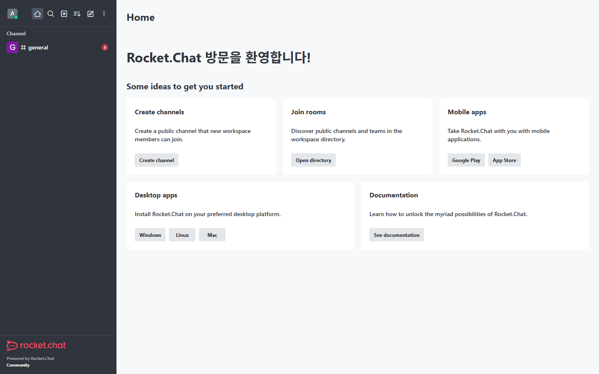

### 2.2 대시보드 (위젯 9종)

첫 로그인 시 기본 6 위젯 자동 시드. 우상단 **편집** 토글로 12-column CSS Grid 위에서 화살표 버튼(← → ↑ ↓ W± H±)으로 위치/크기 조정 + 위젯 추가/제거 [src: scenarios.md §22, PHASE14 §9.4].

위젯 카탈로그 9종 — `ATTENDANCE`(출퇴근) / `LEAVE_BALANCE`(연차 Donut) / `PENDING_APPROVAL`(미결 결재) / `TODAY_EVENTS`(오늘 일정) / `NOTICES`(최근 공지) / `MESSENGER_UNREAD`(메신저 DM) / `MY_ROOMS`(다가오는 회의) / `TEAM_WORKLOG`(팀 업무일지) / `CHART_LEAVE_USAGE`(연차 사용 추이).

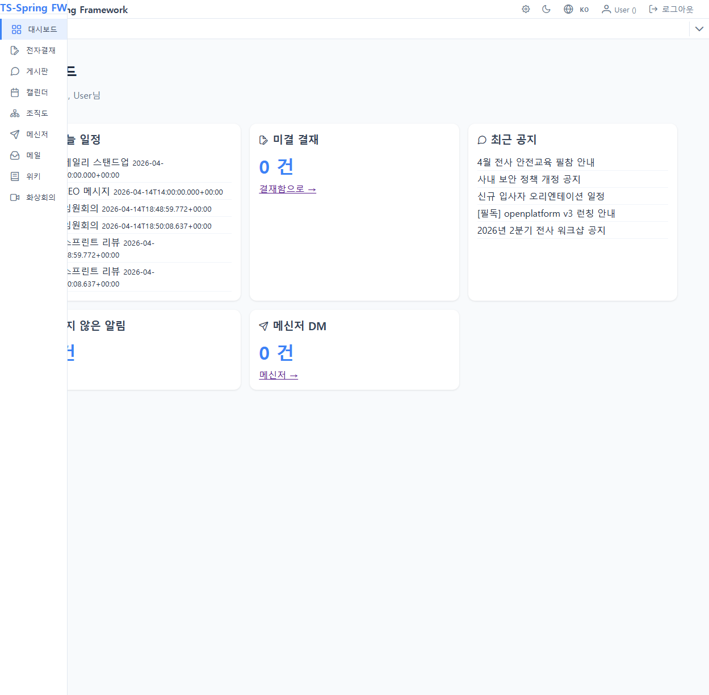
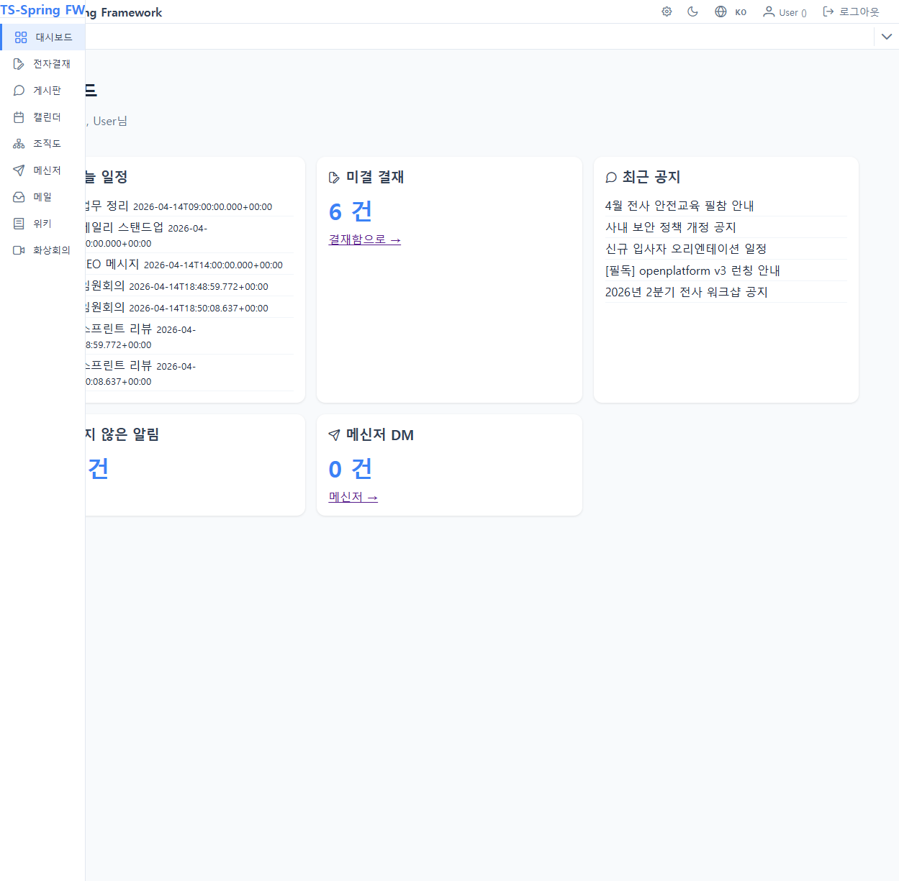

### 2.3 메뉴별 기능 매핑

`/approval` 9종 결재함·5액션·DMN / `/attendance` 출퇴근·월별 hex grid / `/leave` 잔여 Donut·LEAVE 결재 연동 / `/room` FullCalendar·화상회의 자동 / `/datalib` 폴더 트리·presigned / `/worklog` 본인+부서장 팀뷰 / `/calendar` 개인·부서·회사+LEAVE·Room 자동 / `/video` LiveKit + view-only 폴백 / 메신저·메일·위키 = 외부 SSO.

---

## 3. 결재 라이프사이클 (사용자 시점)

`PageApproval.vue` 는 9종 결재함 탭(내 대기함/내 진행함/완료함/반려함/회수함/대결함/공람함/임시저장/전체)을 가지며, 사용자는 한 화면에서 자신의 모든 문서를 확인합니다 [src: scenarios.md §3-4, approval.md].

### 3.1 상신 (Submit)

1. **양식 선택**: 품의/휴가(LEAVE)/지출/출장 중 1종
2. **폼 입력**: WYSIWYG 본문 + 양식별 필드(휴가는 `leave_type`/`from_date`/`to_date`/`days` 자동 계산(주말 제외)/`reason`)
3. **DMN 자동 결재선 도출** — 직책/금액 룰 기반
4. **파일 첨부** — MinIO presigned PUT
5. **상신** 버튼 → `ap_document` INSERT + Flowable 프로세스 시작 + 결재자에게 SSE 알림 발송

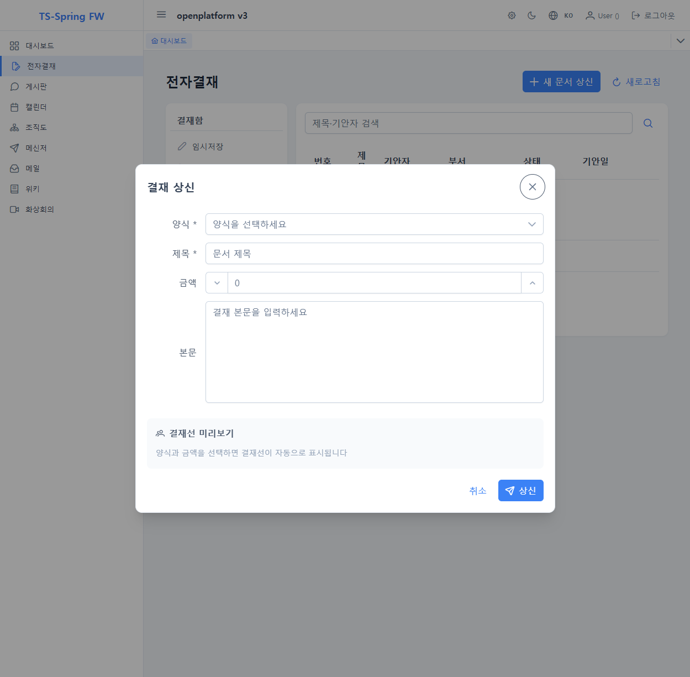

### 3.2 결재 (Approve / Reject)

결재자는 **내 대기함** 탭에서 문서 클릭 → 본문/첨부/결재선 확인 → **승인 / 반려 / 전결 / 대결 / 회수** 5종 중 선택 → `ap_history` 자동 기록.

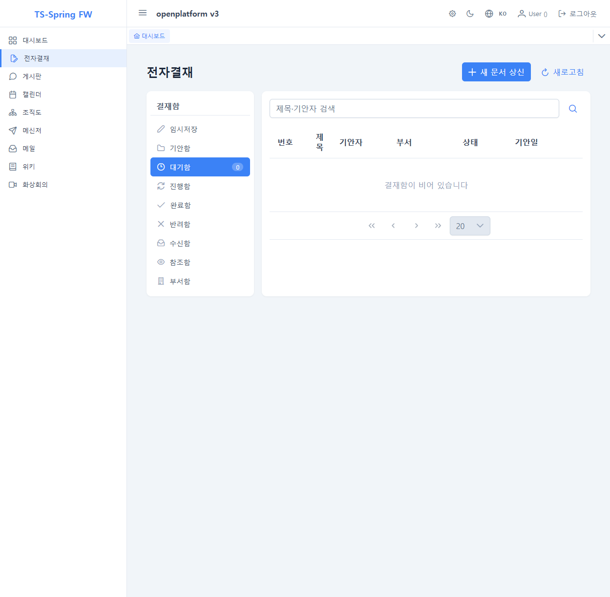
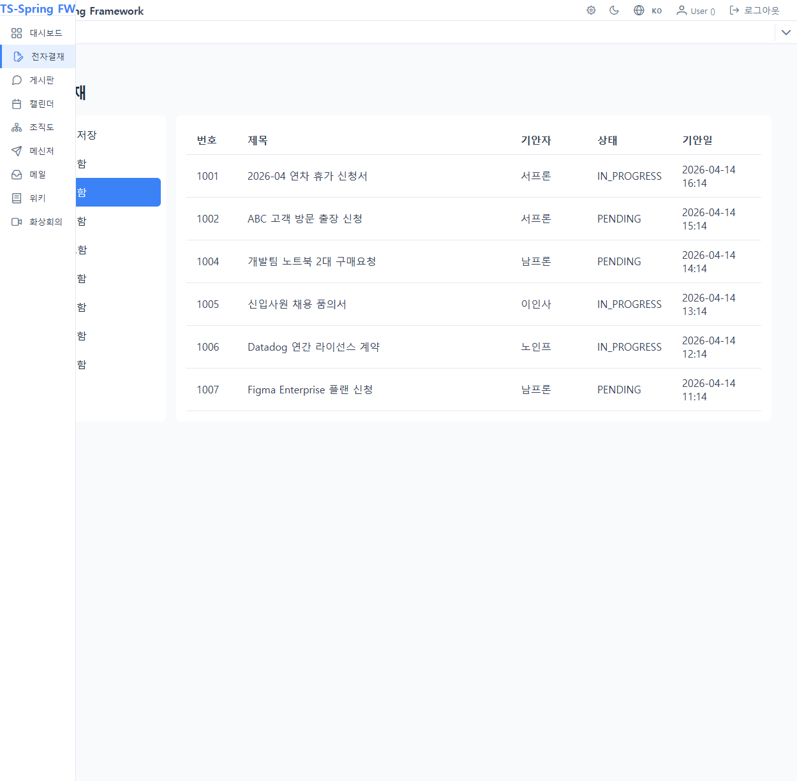

### 3.3 회수 (Recall) → 반려 (Reject) → 재기안 (Resubmit)

- **회수**: 상신자가 첫 결재자 결재 전이라면 회수 가능 → `ap_document.status='RECALLED'` → 임시저장으로 복귀
- **반려**: 결재자가 반려 시 → 상신자에게 SSE 알림 + `ap_history.action='REJECT'` 기록
- **재기안**: 임시저장에서 본문 수정 후 재상신 → 새 doc_id 발급(이력 추적용 `parent_doc_id` 보유 가능)

LEAVE 양식은 결재 승인 완료 시 `ApprovalCompleteDelegate` (Flowable listener) 가 `LeaveService.onDocApproved` 를 호출하여 **잔여 연차 자동 차감 + `at_attendance` 의 해당 일 status='LEAVE' 자동 갱신** 합니다 [src: PHASE14 §3.3].

---

## 4. 근태 / 연차

### 4.1 출/퇴근 체크인·아웃 (`/attendance`)

- 상단 큰 **출근** 버튼 → `attendance/checkIn` → `at_attendance.check_in_at` 기록 → 페이지 갱신 시 **퇴근** 으로 라벨 변경
- 퇴근 시 `work_minutes` 자동 계산 + status (NORMAL/LATE/EARLY) 결정 (회사 표준 출근 9시 기준)
- 월별 출근 시각화: 5×6 hex grid (출근=초록, 지각=노랑, 결근=빨강, 휴가=파랑, 공휴일=회색)
- 영업일 계산은 `cm_holiday` + 주말 제외 [src: scenarios.md §16]

### 4.2 연차 신청 (`/leave`)

- 상단 카드 3종(잔여/사용/총) — `at_leave_balance.remaining` 의 GENERATED 컬럼
- **휴가 신청** 버튼 → `ApprovalSubmitDialog (initialFormCode='LEAVE')` → `leave_type` Dropdown(연차/오전반차/오후반차/병가/경조/무급) + `from-to` DatePicker + `days` 자동(반차=0.5) + `reason`
- 상신 시 `ApprovalService.submitDocument` 가 form_code='LEAVE' 분기에서 `LeaveService.applyFromDoc` 자동 호출 → `at_leave_request` 와 `ap_document` 가 1:1 매핑
- 승인 완료 시 잔여일 차감 + 캘린더에 `L-{requestId}` readonly 이벤트 자동 추가(초록) [src: scenarios.md §23]

---

## 5. 회의실 예약 (`/room`)

좌측 회의실 목록(필터: 인원/장비/화상) + 우측 FullCalendar `timeGridWeek` 빈 슬롯 클릭 → `BookingDialog.vue` [src: scenarios.md §17, PHASE14 §4.4].

- 충돌 검증: `room/checkConflict` 으로 `roomId × [start_at, end_at)` 겹침 사전 검사
- 통과 시 `rm_booking` INSERT (트랜잭션)
- `has_video=true` 회의실은 BFF `LiveKitAdapter.createRoom` 자동 호출 → 룸 이름 `rm-{bookingId}` 자동 생성 (실패 시 view-only 폴백 — Phase 12.1 패턴 [src: PHASE14 §12])
- 참석자 each `NotificationService.notifyByUserNo`(category='ROOM') 호출
- 본인 캘린더에도 `cal_event` INSERT — 통합 캘린더 뷰에 주황 readonly `R-{bookingId}` 로 표시

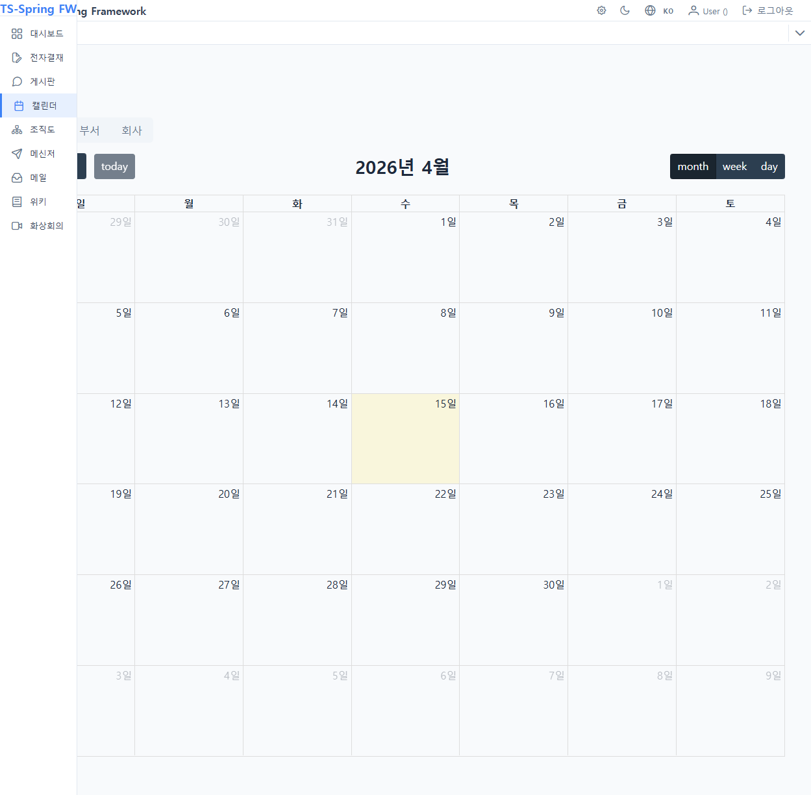
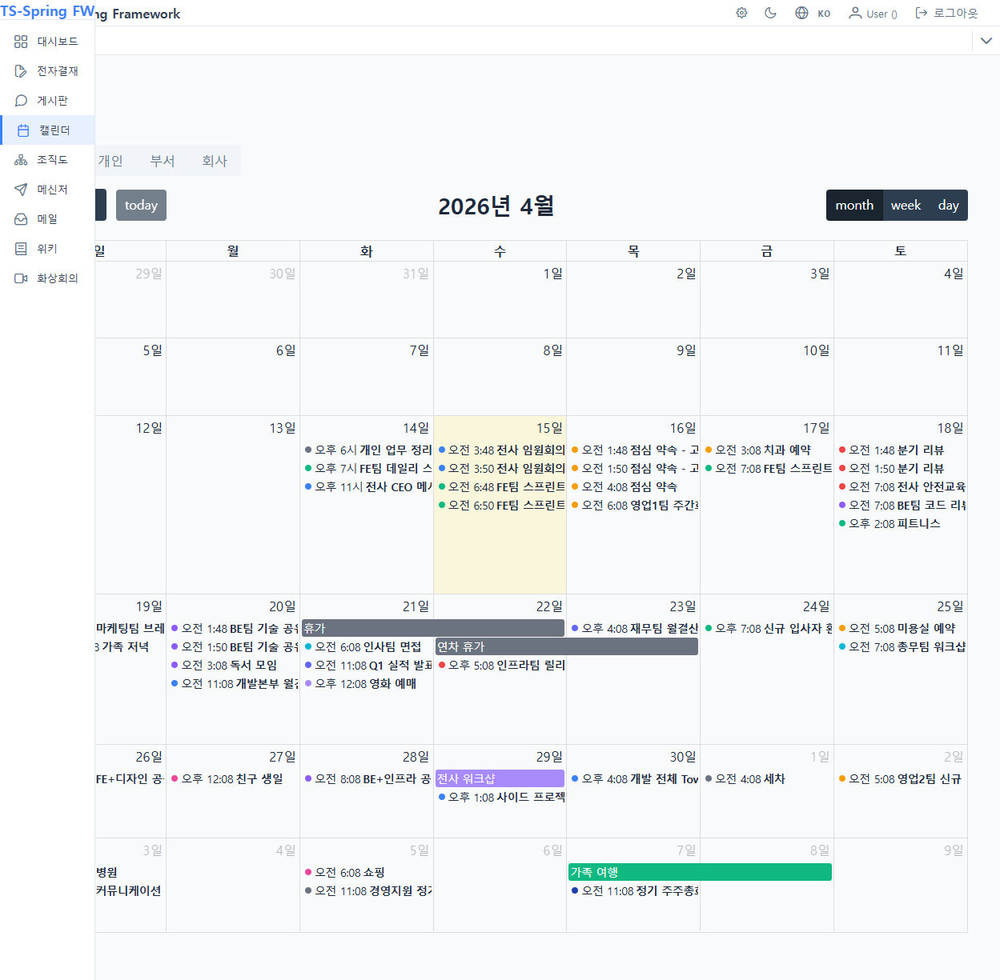

---

## 6. 자료실 (`/datalib`)

좌측 폴더 트리(PrimeVue Tree) + 우측 파일 DataTable [src: scenarios.md §18, PHASE14 §5.4].

- **폴더 scope 3종**: COMPANY(전사) / DEPT(부서) / PERSONAL(개인)
- 부서 폴더는 본인 부서만 RW, 외부 부서는 R 차단(`canAccessFolder` 헬퍼)
- 업로드: `FileUploadPanel.vue` 재사용 → MinIO presigned PUT → `datalib/uploadMeta` 호출하여 `dl_file` 메타 INSERT
- 다운로드: `datalib/getDownloadUrl` → presigned GET 발급 + `download_count++`
- 우클릭 ContextMenu(`FolderActions.vue`): 이름 변경 / 삭제 / 새 폴더 / 새 파일

---

## 7. 메신저 SSO (Rocket.Chat)

Keycloak Custom OAuth Provider 가 Rocket.Chat 의 OAuth Service 로 등록되어, **포탈 로그인 후 메신저 메뉴 클릭 시 추가 입력 없이 자동 로그인** [src: scenarios.md §8, group_ware.md §Rocket.Chat].

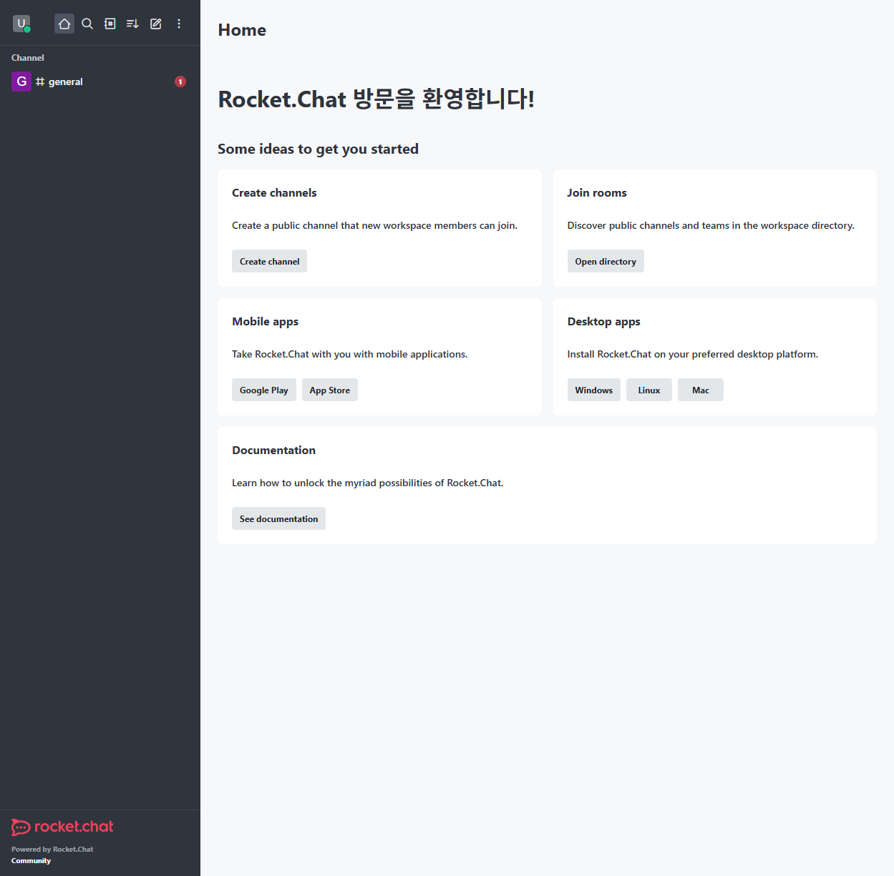
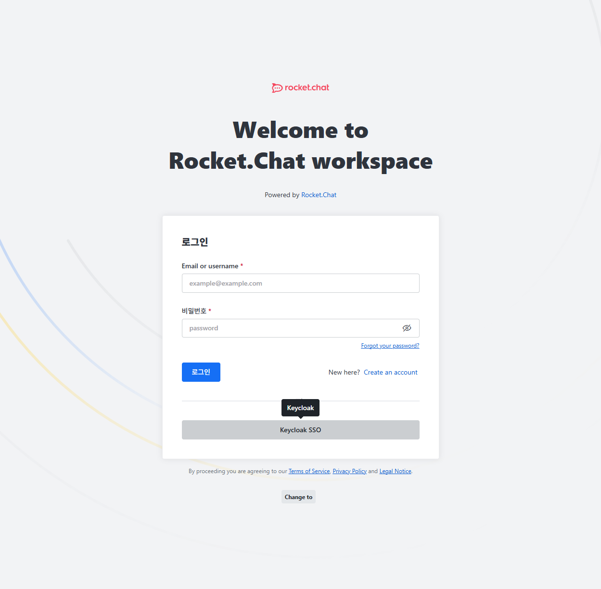

채널 목록 → 메시지 → DM → 파일 전송. 알림 카테고리 `MENTION` 의 `ux_notify_pref` 에서 `MESSENGER` 채널 enabled 시 백엔드가 `BffClient.sendNotificationDm` 으로 DM 발송 시도 (현재는 stub — warn.md 기록) [src: PHASE14 §8.6 T6-3].

---

## 8. 메일 (Stalwart JMAP 3단 레이아웃)

Stalwart 메일 서버는 Keycloak LDAP Federation 으로 인증을 위임받습니다 [src: scenarios.md §9, group_ware.md §Stalwart].

- **3단 레이아웃**: 좌(폴더 트리) + 중(메일 리스트) + 우(스레드 본문)
- 받은편지함 → 스레드 → 작성/임시저장/발송
- 알림용 시스템 메일은 BFF `/api/bff/mail/send` 로 backend-core 가 발송 (NotifyPref 의 EMAIL 채널 enabled 시) [src: PHASE14 §8.3]

---

## 9. 위키 (Wiki.js — 게스트 자동 가입)

Wiki.js 의 OIDC SSO 가 Keycloak 와 연동되어, **첫 로그인 시 사용자 계정이 Wiki.js 에 자동 프로비저닝**됩니다 [src: scenarios.md §10, group_ware.md §Wiki.js].

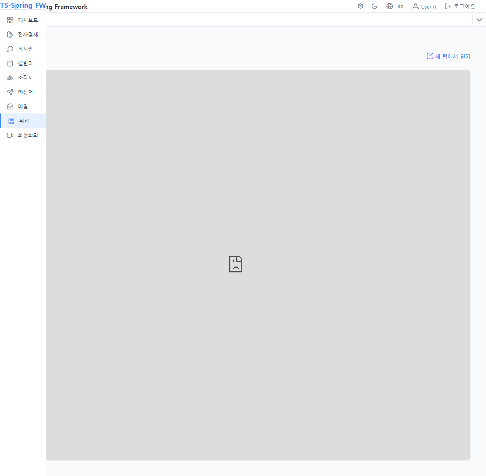

페이지 탐색 → 편집(Markdown/WYSIWYG) → 히스토리 diff. 외부 게스트는 OIDC `roles` claim 에 `wiki-guest` 가 매핑되어 읽기 전용 또는 특정 namespace 한정 편집을 부여받습니다.

---

## 10. 화상회의 (LiveKit + view-only 폴백)

회의 생성 → 참가자 초대 → 룸 입장 → 화면 공유 [src: scenarios.md §11]. BFF `/api/bff/video/token` POST 로 LiveKit JWT 발급 → WebSocket `wss://...:19880` (101 Switching Protocols) → ICE `connected` 도달 시 자기 비디오 + 상대 RemoteTrack 수신.

**헤드리스 Playwright 자동 검증 불가** — 카메라/마이크 디바이스 부재로 Phase 12 F-8 에서 수동 검증 가이드 별도 작성 [src: docs/video-manual-check.md]. LiveKit 룸 자동 생성 실패 시 `view-only` 폴백 (Phase 12.1 패턴) — 예약은 성공, 화상은 입장 시 재시도 [src: PHASE14 §12].

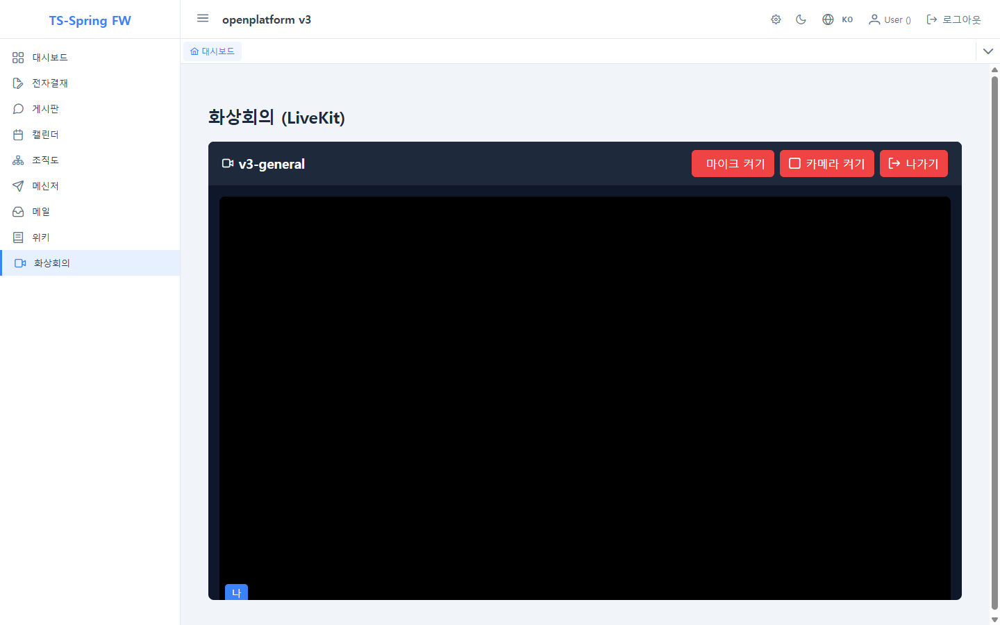
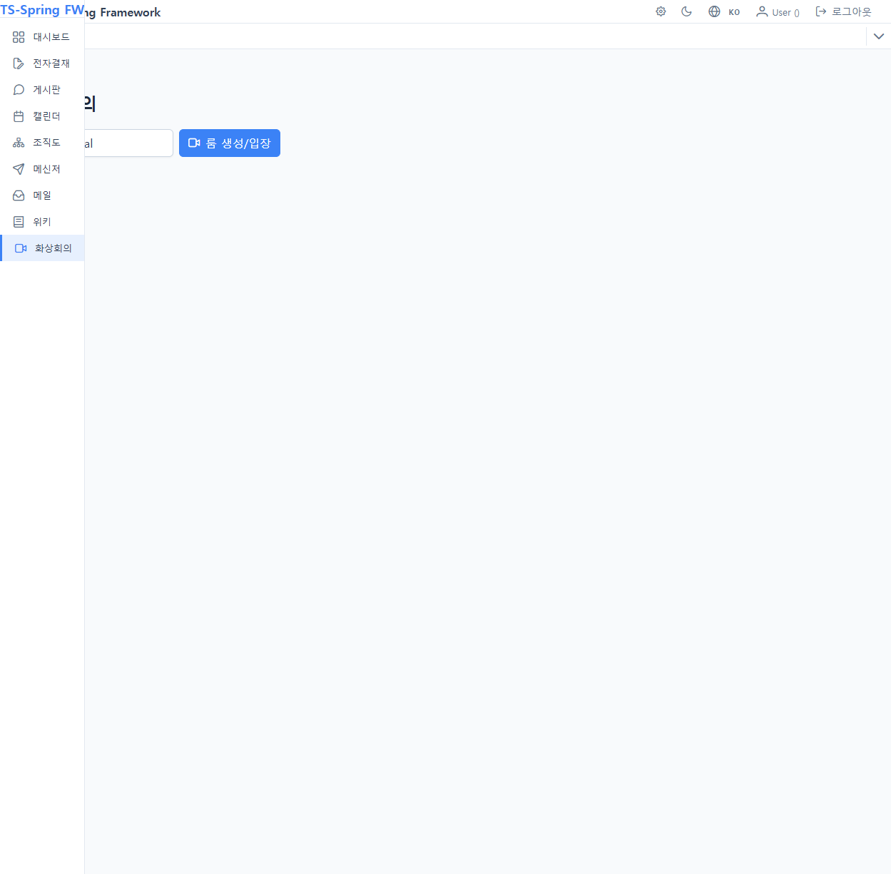

수동 검증 통과 기준 (5종): token 200, WS 101, ICE connected, video readyState≥2, RemoteTrack 수신.

---

## 11. 모바일 호환성 — 미적용 솔직 진술

**현재 Phase 14 시점에서 모바일 전용 반응형 UI 는 적용되지 않았습니다.** 의도적으로 우선순위에서 제외:

- PrimeVue 4 의 일부 컴포넌트(FullCalendar, Tree+DataTable 동시 노출, 결재 9탭)는 데스크탑(≥1280px) 가정 설계
- 위젯 시스템(트랙 7)의 12-column CSS Grid 는 모바일 1-column 자동 스택 미구현
- 메신저/메일/위키/화상회의 외부 서비스는 각각 자체 모바일 앱(Rocket.Chat / IMAP 클라이언트 / Wiki.js PWA / LiveKit Mobile SDK) 으로 우회 가능

**권장 사용 환경**: 데스크탑 Chrome / Edge / Firefox 최신 (해상도 1280×800 이상). 모바일·PWA 는 본 챕터 작성 시점에서 **로드맵에 미반영**.

---

## 12. 참조

- `docs/scenarios.md` — 시나리오 1~23 (Phase 0~13 15종 + Phase 14 8종)
- `docs/PHASE14_PRODUCTION_GROUPWARE.md` — 8 트랙 사용자 기능 명세
- `docs/video-manual-check.md` — LiveKit 수동 검증 5분 가이드 (F-8)
- `docs/group_ware.md` — 외부 5개 서비스 API 매뉴얼
- `docs/approval.md` — 결재 도메인 + PageApproval.vue 덤프
- `docs/comprehensive/inventory/00_existing_artifacts.md` §4 — 32개 스크린샷 분류
- 루트 PNG (32개) — placeholder, PDF 빌드 단계에서 실제 인라인

---

## 13. 이 챕터가 다루지 않은 인접 주제

본 챕터는 **사용자 시점의 화면 흐름** 만 다룹니다. 인접 주제는 별도 챕터:

- 운영자 일상 운영(모니터링/백업/Flyway/시드) → Chapter 1.17 운영 매뉴얼
- 장애·이상 동작 대응(warn.md/fatal.md, 5회 자율 복구) → Chapter 1.18 트러블슈팅
- 신규 메뉴/페이지 추가 절차(cm_menu INSERT, useDataSet, 권한 매트릭스) → Chapter 1.19 개발 가이드
- 백엔드 DataSet 서비스 사양(95개 service I/O) → Chapter 1.5 API & 통신
- Keycloak Federation 5종 SSO 동작 원리(PKCE, OIDC claim, LDAP Federation) → Chapter 1.5 / 1.3
- 컴포넌트 재사용 규칙(vue-spring-fw 정적 복사) → Chapter 1.6
- Playwright MCP 시나리오 14종 자동화 → Chapter 1.14 테스트
- 모바일·PWA 로드맵 — 미수립 (§11 솔직 진술로 갈음)

<div style="page-break-before: always;"></div>

# Chapter 1.17: 운영 매뉴얼 (Operations Manual)

본 챕터는 openplatform_v3 (50명 규모 통합 그룹웨어 — Phase 14 완료) 운영자용 단계별 명령어 카탈로그다. 작업 루트는 `C:/claude/openplatform_v3` 이며, 모든 명령어는 bash (Git Bash / WSL 호환).

> 출처: `scripts/start.sh`, `scripts/backup.sh`, `scripts/restore.sh`, `scripts/security-scan.sh`, `scripts/perf-scan.sh`, `infra/docker-compose.cron.yml`, `infra/docker-compose.healthcheck.yml`, `infra/docker-compose.observability.yml`, `docs/PHASE14_REPORT.md`.

---

## 1. 클린 설치

```bash
git clone <repo-url> openplatform_v3 && cd openplatform_v3
docker version
bash scripts/start.sh full              # base + healthcheck + resources
bash scripts/start.sh status            # 8 서비스 healthy 대기
bash scripts/start.sh init-mongo        # Rocket.Chat 최초 1회
docker exec v3-postgres psql -U platform_v3 -d platform_v3 \
  -c "select version, success from flyway_schema_history order by installed_rank desc limit 5"
# UI: http://localhost:19173/  (admin/admin → 즉시 변경)
```

기동 모드 (출처: `scripts/start.sh`): `dev` (base only) / `full` (+healthcheck+resources, 기본) / `observability` (+Loki/Grafana/Prometheus) / `traefik` (+리버스 프록시) / `production` (전체 + cron).

---

## 2. 업그레이드

```bash
bash scripts/backup.sh                  # 백업 먼저 (필수)
git pull --rebase
ls backend-core/src/main/resources/db/migration/V*.sql | sort   # V18__*.sql 충돌 확인

docker compose -f infra/docker-compose.yml -f infra/docker-compose.healthcheck.yml \
  build backend-core backend-bff ui-frontend
bash scripts/start.sh stop && bash scripts/start.sh full         # Flyway 가 자동 적용

docker exec v3-postgres psql -U platform_v3 -d platform_v3 \
  -c "select version, description, success from flyway_schema_history order by installed_rank desc"
```

마이그레이션 실패 시 Phase 14 V12 사례처럼 `flyway_schema_history` 의 `success=false` row 를 백업 후 삭제하고 SQL 보정 후 재기동 (출처: PHASE14_REPORT.md §4).

---

## 3. 백업·복구

### 3.1 백업 — `scripts/backup.sh`

```bash
bash scripts/backup.sh
# 결과: backups/v3-YYYYMMDD-HHMMSS.tar.gz + backup-*.log
```

6 도메인 (출처: `scripts/backup.sh`):

| # | 컨테이너 | 명령 | 산출물 |
|---|---|---|---|
| 1 | v3-postgres | `pg_dumpall -U platform_v3` | `postgres-dumpall.sql` |
| 2 | v3-minio | `mc mirror` | `minio/` |
| 3 | v3-keycloak | `kc.sh export --realm openplatform-v3 --users realm_file` | `keycloak/` |
| 4 | v3-openldap | `ldapsearch -b dc=v3,dc=local` | `ldap-dump.ldif` |
| 5 | v3-mongo | `mongodump --archive --db=rocketchat` | `rocketchat-mongo.archive` |
| 6 | v3-wikijs | `docker cp /wiki/db.sqlite` | `wikijs-db.sqlite` |

각 단계 실패 시 `warn` 로그 후 계속. 컨테이너 부재 시 자동 스킵.

### 3.2 복구 — `scripts/restore.sh`

```bash
docker stop v3-backend-core v3-backend-bff
bash scripts/restore.sh backups/v3-20260427-030000.tar.gz
docker compose -f infra/docker-compose.yml restart \
  v3-keycloak v3-wikijs v3-backend-core v3-backend-bff
```

복원 순서: tar 해제 → backend 중단 확인(5s) → Postgres `psql -U postgres` → MinIO `mc mirror` 역방향 → Keycloak `kc.sh import --override true` → OpenLDAP `ldapadd -c` → Mongo `mongorestore --archive --drop` → Wiki.js sqlite cp.

> 위험: 기존 데이터 덮어씀. 운영에서는 복원 직전 추가 백업 1회 권장.

---

## 4. 헬스체크 (8 서비스)

`infra/docker-compose.healthcheck.yml` 컨테이너별 명령:

| 서비스 | 명령 (interval × retries, start) |
|---|---|
| keycloak | `cat /proc/1/cmdline \| grep -q keycloak` (30s×5, 60s) |
| mongo | `mongosh --eval "db.adminCommand('ping').ok"` (20s×10, 20s) |
| rocketchat | `node -e "http.get(localhost:3000/api/info)"` (20s×15, 90s) |
| wikijs | `node -e "http.get(localhost:3000/, status<500)"` (20s×15, 60s) |
| stalwart | `cat /proc/1/cmdline \| grep -q stalwart` (30s×5, 60s) |
| openldap / livekit | `pgrep slapd` / `pgrep livekit-server` |
| backend-core/bff | `wget -qO- localhost:8080/actuator/health \| grep UP` (20s×20) |
| ui-frontend | `nginx -t \| grep successful` (30s×5, 15s) |

```bash
bash scripts/start.sh status
for c in $(docker ps --filter name=v3- --format '{{.Names}}'); do
  docker inspect --format '{{.Name}} {{.State.Health.Status}}' "$c"; done
```

Phase 14 검증: postgres / redis / keycloak / core / bff / ui 6 컨테이너 healthy + UI HTTP 200 (출처: PHASE14_REPORT.md §4).

---

## 5. 정기 작업 (Cron)

`infra/docker-compose.cron.yml` — `mcuadros/ofelia` 가 docker socket 으로 컨테이너 명령을 스케줄. 기본 작업 1건:

```yaml
ofelia.job-exec.backup-postgres.schedule: "0 0 3 * * *"   # 매일 03:00
ofelia.job-exec.backup-postgres.container: "v3-postgres"
ofelia.job-exec.backup-postgres.command:
  "sh -c 'pg_dumpall -U platform_v3 > /tmp/backup-$(date +%Y%m%d).sql'"
```

```bash
docker compose -f infra/docker-compose.yml -f infra/docker-compose.cron.yml up -d ofelia
docker compose -f infra/docker-compose.yml -f infra/docker-compose.cron.yml \
  --profile backup run --rm backup-runner       # 단발 백업
```

권장 추가: 일일 full 백업 (host cron `bash scripts/backup.sh` @03:00) / `sa_audit` 180일 보존 (@04:00) / 주간 통계 (Mon 08:00, `/internal/report/weekly`).

---

## 6. 보안 스캔

```bash
bash scripts/security-scan.sh                       # 기본 BASE_URL=http://localhost:19090
bash scripts/security-scan.sh https://api.v3.local  # 운영
# 결과: reports/security-YYYYMMDD-HHMMSS.txt
```

4 단계 (출처: `scripts/security-scan.sh`):

1. **`npm audit --audit-level=moderate`** (ui/) — moderate 이상.
2. **`mvn dependency:analyze`** (backend-core, backend-bff) — 미사용/누락.
3. **이미지 CVE** — `trivy` 우선, 없으면 `docker scout cves`. 대상: minio, keycloak, rocketchat, wiki. severity HIGH·CRITICAL.
4. **인증 우회** — `curl -w "%{http_code}"` 로:
   - 보호 (401 기대): `/api/admin/users`, `/api/admin/codes`, `/api/dataset/private`, `/actuator/env`, `/actuator/loggers`
   - 공개 (200 기대): `/actuator/health`, `/api/i18n/ko`

결과 해석:
- `[FAIL]` 보호 → 401 이외: SecurityConfig 누락. 즉시 차단.
- `[FAIL]` 공개 → 401: permitAll 누락.
- npm `high`/`critical` ≥ 1: `npm audit fix` 후 재실행.

---

## 7. 성능 스캔

```bash
bash scripts/perf-scan.sh
# 결과: reports/perf-YYYYMMDD-HHMMSS.txt — avg/min/max/success/fail (10회 반복)
```

기본 측정 대상:

```
/actuator/health
/api/dataset/search?q=public&size=10
/api/codes
/api/i18n/ko
```

권장 임계:

| 엔드포인트 | avg 목표 | 경고 |
|---|---:|---|
| `/actuator/health` | ≤ 50ms | > 200ms 면 GC/풀 점검 |
| `/api/dataset/search` | ≤ 300ms | > 800ms 면 인덱스 누락 |
| `/api/codes` | ≤ 100ms | > 300ms 면 캐시 미스 |
| `/api/i18n/ko` | ≤ 100ms | > 300ms 면 정적 캐시 점검 |

---

## 8. 장애 대응 시나리오

**(a) PostgreSQL 다운** — backend-core/bff `/actuator/health` DOWN. 우회 없음 (전 시스템 정지).
```bash
docker logs v3-postgres --tail 200
docker compose -f infra/docker-compose.yml restart postgres
# 디스크 손상: docker stop v3-postgres && bash scripts/restore.sh backups/v3-LATEST.tar.gz
```

**(b) Keycloak 다운 → SSO 전부 실패** — `/api/auth/*` 401, 신규 로그인 차단. 기존 JWT 만료 전까지 동작은 유지.
```bash
docker logs v3-keycloak --tail 200
docker compose -f infra/docker-compose.yml restart keycloak
# realm 손상: kc.sh import --dir /tmp/kc-restore --override true → restart
```

**(c) MinIO 다운 → 업/다운로드 실패** — `/api/datalib/*` presigned URL 발급 실패. 첨부파일 차단. 결재 본문은 정상.
```bash
docker logs v3-minio --tail 200
docker compose -f infra/docker-compose.yml restart minio
docker exec v3-minio mc admin info local
```

**(d) Rocket.Chat 다운 → 메신저 실패** — `/messenger` iframe 실패. 알림 MESSENGER 채널만 영향, **PORTAL/EMAIL 정상** (NotificationService 가 sendDm 실패 시 debug 로그 + PORTAL fallback — 출처: PHASE14_REPORT.md §3 트랙 6).
```bash
docker logs v3-rocketchat --tail 200; docker logs v3-mongo --tail 200
docker compose -f infra/docker-compose.yml restart mongo rocketchat
```

---

## 9. 롤링 배포

현재 단일 노드 (`v3-net`) 1 instance 기동. **무중단 배포는 Phase 15+ 권장.**

단기 (짧은 다운타임 허용):
```bash
docker compose build backend-core backend-bff ui-frontend
docker compose -f infra/docker-compose.yml -f infra/docker-compose.healthcheck.yml \
  up -d --no-deps --force-recreate backend-core   # healthy 대기 후 backend-bff, ui 순차
```

중장기 권장 — **Blue-Green** (두 번째 compose 프로젝트 `-p v3b` 동시 기동 → traefik weight 100/0 → 0/100 전환, DB 공유), **Canary** (traefik `service.weighted` 90/10 → 메트릭 보며 단계 상승, Prometheus 연동), **Rolling** (k8s/Swarm 이전 시 native).

---

## 10. 모니터링 대시보드

`bash scripts/start.sh observability` 후 진입:

| 도구 | URL | 초기 계정 |
|---|---|---|
| Grafana | http://localhost:19300 | admin / admin (즉시 변경) |
| Prometheus | http://localhost:19309 | — |
| Loki API | http://localhost:19310 | (Grafana 데이터소스 자동 등록) |

Grafana provisioning (`provisioning/`) 으로 Loki / Prometheus 데이터소스 자동 연결. 주요 LogQL:

```logql
{container_name="v3-backend-core"} | json | level="ERROR"
{job="docker"} | json | level=~"WARN|ERROR" | after_last: "1h"
```

Prometheus 스크레이프: `backend-core:8080/actuator/prometheus`, `backend-bff:8080/actuator/prometheus`, `traefik:8082/metrics`.

---

## 11. 운영 체크리스트

**일일 (09:00)** — `bash scripts/start.sh status` 8 healthy / `sa_audit` 24h count / Grafana "Backend Errors" 0 / 03:00 ofelia 백업 산출물 존재 / `df -h` < 80%.

**주간 (월요일)** — `bash scripts/backup.sh` 수동 + 사본 이동 / `security-scan.sh` FAIL 0 / `perf-scan.sh` baseline 회귀 검토 / `flyway_schema_history` `success=false` 0 / Keycloak Realm Roles 변경 + `sa_audit` 비정상 패턴 점검.

**월간 (1일)** — `npm outdated` + `mvn versions:display-dependency-updates` / `trivy image` 재스캔 / `sa_audit` 180일 초과 row 정리 / 백업 1건 무작위 dry-run 복원 시험 / Phase 14 잔여 항목 (RocketChat sendDm, BFF mail 인증, dept_manager_no, LiveKit Egress) 우선순위 갱신 (출처: PHASE14_REPORT.md §5).

---

## 참조

- `scripts/start.sh`, `scripts/backup.sh`, `scripts/restore.sh`, `scripts/security-scan.sh`, `scripts/perf-scan.sh`
- `infra/docker-compose.yml` / `.healthcheck.yml` / `.cron.yml` / `.observability.yml` / `.traefik.yml`
- `docs/PHASE14_REPORT.md` — 8 트랙 / DoD
- `docs/comprehensive/chapters/11_backend_logging.md` — Loki/LogQL
- `docs/comprehensive/chapters/12_backend_security.md` — Keycloak/RBAC
- 루트 `docker-info.xml` — 19xxx 포트 레지스트리

---

## 이 챕터가 다루지 않은 인접 주제

1. **k8s/Swarm 이행** — 현재 단일 노드 docker compose. 무중단 배포(blue-green/canary) 본격 도입은 별도 챕터.
2. **외부 SMTP 페일오버** — Stalwart 다운 시 SendGrid/SES fallback 라우팅.
3. **AlertManager / OpsGenie / Slack 통합** — Prometheus 알람 라우팅. 현재는 Grafana 알람 채널만.
4. **재해 복구 (DR) 멀티리전** — 현재 백업은 단일 호스트. S3/오프사이트 복제.
5. **Compliance 자동 보고서** — `sa_audit` → 월간 PDF 파이프라인.
6. **k6 / JMeter 부하 테스트** — `perf-scan.sh` 는 응답시간만, 동시성 부하는 별도 도구.
7. **Secrets Management** — application.yml 기본값 → Vault/Doppler/AWS SM 연동.
8. **Keycloak realm-management service-account** — 현재 admin-cli password grant. client_credentials 전환 (출처: PHASE14_REPORT.md §5).

---

**Date:** 2026-04-27  
**Version:** 1.0  
**Status:** Complete

<div style="page-break-before: always;"></div>

# Chapter 1.18 — 개발 가이드 (Developer Guide)

**Project**: openplatform_v3 | **Date**: 2026-04-27
**Scope**: 코드 추가/수정 시 따라야 할 워크스페이스 규칙·자율 모드·재사용 정책·백엔드/프엔 컨벤션·셀프 QA 절차.

---

## 0. CODING_STANDARDS.md 부재에 대한 솔직 진술

본 저장소에는 **`CODING_STANDARDS.md` 가 존재하지 않는다**. (`docs/comprehensive/warn.md` Phase 0.C 갭 분석 — "CLAUDE.md + warn.md 결정 이력 + 컨벤션 grep 결과로 대체") [src: docs/comprehensive/warn.md L18]

본 챕터는 다음 3개 권위 정보원에서 사실상의 규약을 추출한다.

1. `C:/claude/CLAUDE.md` — 워크스페이스 공통
2. `C:/claude/openplatform_v3/CLAUDE.md` — 프로젝트 규칙
3. `warn.md` — 자율 결정 이력 (드래그 라이브러리 미채택, SVG 직접 구현 등)

명시적 표준 문서 부재 상태이며, 별도 `docs/CODING_STANDARDS.md` 작성이 권장된다.

---

## 1. 워크스페이스 공통 규칙

### 1.1 포트 할당 — 19xxx 전용
- 본 프로젝트 호스트 포트 대역은 **19xxx**. UI dev 만 25174 (자율 결정 — `warn.md [2026-04-14 22:15]`).
- 신규 포트 시 **3단계 필수**: ① 루트 `docker-info.xml` `<port-conflicts>` 충돌 확인 → ② 자기 프로젝트 `<service>` 갱신 → ③ `port-change-report.md` 이력 기록. [src: C:/claude/CLAUDE.md "포트 할당 규칙"]
- IANA ephemeral 범위(49152–65535) 회피, **1024–49151 만** 사용.

### 1.2 v1/v2 무복사 + Docker SSoT + 서브모듈
- v1(`openplatform`)/v2(`openplatform_v2`)는 **분석 후 필요 요소만 선택 포팅**. 통째 복사 금지. [src: warn.md L116-119]
- 루트 `docker-compose.yml` + `docker-info.xml` 은 단일 권위 소스. 컨테이너 추가/삭제 시 두 파일 모두 갱신. compose 최상단 `name:` 으로 프로젝트명 고정 (하이재킹 방지). [src: C:/claude/CLAUDE.md]
- **본 프로젝트는 서브모듈 없음.** 모든 코드 직접 관리. [src: openplatform_v3/CLAUDE.md "## 서브모듈"]

---

## 2. 자율 모드 운영

[src: C:/claude/CLAUDE.md "최상위 규칙: 완전 자율 실행"]

| 상황 | 행동 |
|---|---|
| 사용자에게 질문하고 싶을 때 | **금지.** 합리적 기본값 채택 후 `warn.md` 1행 기록 |
| 파일 생성/수정/삭제, 패키지 설치, Docker 실행, git push | 승인 없이 즉시 진행 |
| 외부 서비스 불가 | 로컬 mock 으로 대체 → `warn.md` 기록 |
| 오류 발생 | 원인 분석 → 수정 → 재검증 자동 반복 (최대 5회). 5회 초과 시 `fatal.md` + 사용자 알림 |
| 애매한 요구사항 | 합리적 기본값 결정 → `warn.md` 기록 |

**상태 파일 (1분 단위 갱신)**: `info.md` (현재 태스크) / `warn.md` (결정 이력) / `fatal.md` (치명 중단) / `TODO.md` (Phase 체크리스트).

---

## 3. AI 생성 제약 — vue-spring-fw 재사용 정책

`C:\claude\vue-spring-fw\**` 는 **원본 절대 수정 금지**. 정적 복사 후 `ui/src/**` 에 배치, 복사 이력은 `docs/vue-spring-fw-reuse-map.md` 에 (원본 → v3경로 → 수정사항) 1행씩 기록. [src: openplatform_v3/CLAUDE.md "## vue-spring-fw 취급 규칙"]

| 분류 | 정책 |
|---|---|
| `frontend/src/components/layout/Layout*.vue` | 복사 OK (메뉴 데이터 소스만 v3 교체) |
| `frontend/src/components/common/*.vue` (CrudToolbar/SearchPanel/PopupHost) | 복사 OK |
| `composables/use*.ts` (9개) | 복사 OK (API base URL `/api`, Keycloak roles 매핑) |
| `store/auth.ts` | **keycloak-js 어댑터로 교체** (JWT 자체 발급 → OIDC PKCE) |
| `api/interceptor.ts` | **Bearer 를 Keycloak access token 으로 교체**, 401 → `keycloak.updateToken()` |
| `pages/templates/*.vue` (Chart/Map/Flow/Kanban...) | 레퍼런스 참조, 필요 시 선택 복사 |
| `backend/**`, `docker/**`, `mybatis mapper XML`, `pages/admin/**` | **복사 금지** |
| 원본 어떤 파일도 수정 | **금지** |

---

## 4. 백엔드 규약 (DataSet 패턴)

### 4.1 표준 도메인 디렉토리 (예: `widget`)
[code: backend-core/.../widget/WidgetService.java]

```
backend-core/src/main/java/com/platform/v3/core/{domain}/
├── {Domain}Service.java          ← @Service + @DataSetServiceMapping
└── mapper/{Domain}Mapper.java    ← MyBatis 인터페이스
backend-core/src/main/resources/
├── mapper/{domain}/{Domain}Mapper.xml   ← 동적 SQL
└── db/migration/V{N}__{feature}.sql     ← Flyway 전진-only
```

### 4.2 DataSetService 어노테이션
[code: backend-core/.../widget/WidgetService.java:L63-L186]

```java
@Service
public class WidgetService {
    @DataSetServiceMapping("widget/listAll")
    @Transactional(readOnly = true)
    public Map<String, Object> listAll(Map<String, Object> params) { ... }

    @DataSetServiceMapping("widget/saveLayout")
    @Transactional
    public Map<String, Object> saveLayout(Map<String, Object> params) {
        String rowType = DataSetSupport.toStr(row.get("_rowType"));  // C/U/D 분기
    }
}
```

핵심:
- **단일 진입점**: `POST /api/dataset` → `ServiceRegistry` 가 `service` 키로 `@DataSetServiceMapping` 메서드 라우팅. [code: backend-core/.../dataset/DataSetController.java]
- **시그니처**: `Map<String,Object>` 입출력. snake_case ↔ camelCase 자동 변환 (`map-underscore-to-camel-case: true`).
- **`_rowType`**: UI 그리드 변경분을 `C` (Create) / `U` (Update) / `D` (Delete) 마킹.
- **트랜잭션**: 조회 = `readOnly=true`, 변경 = `@Transactional`. 1메서드 = 1트랜잭션.
- **응답·예외**: `ApiResponse<T>` 봉투 + `BusinessException` → `GlobalExceptionHandler` 매핑. [code: backend-core/.../common/]

### 4.3 MyBatis 동적 SQL · 순환 의존 회피
- `<choose>/<when>/<otherwise>`, `<if test="...">`, `<foreach>`, `useGeneratedKeys="true" keyProperty="docId"` (BIGSERIAL 자동 채움). 챕터 1.10 §1 상세.
- 같은 Wave 의 트랙 미존재 가능성 → `@Autowired(required = false) setter` 주입 [src: warn.md "T1 근태"]:
  ```java
  @Autowired(required = false)
  public void setLeaveService(LeaveService s) { this.leaveService = s; }
  ```

---

## 5. 프론트엔드 규약 (Vue 3 SFC)

### 5.1 `<script setup lang="ts">` 작성 순서 (챕터 1.8 §1)

```
(a) Types & Interfaces
(b) Composables & API 호출  →  const approval = useApproval();
(c) Props & Emits
(d) Reactive State (ref/reactive/computed)
(e) Actions & Handlers
(f) Lifecycle (onMounted/...)
```

### 5.2 useXxx Composable / Pinia / 네이밍
- `ui/src/composables/use{Domain}.ts` (현 23개). 1함수 = 1 DataSet 서비스 호출 → `ApiResponse` unwrap → ref 반환.
- Pinia store: `defineStore('{name}', () => { ... })` Composition API. `auth.ts` (Keycloak), `tab.ts` (탭바).
- 컴포넌트 prefix: `Layout*` / `Widget*` / `Page*` / `App*`. 다이얼로그는 `{Domain}{Action}Dialog.vue` (예: `ApprovalSubmitDialog.vue`).

---

## 6. 커밋·브랜치 규약 (`git log` 기반)

| Prefix | 용도 |
|---|---|
| `feat:` / `feat({domain}):` | 새 기능 (예: `feat(approval): Phase A complete`) |
| `fix:` / `fix({area}):` | 버그 수정 (예: `fix(sso): unify Keycloak host`) |
| `chore:` | 유지보수·문서·gitignore |
| `docs({domain}):` | 도메인별 문서 |
| `test:` | 테스트 추가 (예: `test: Playwright E2E scenarios`) |

브랜치는 단일 `main` 만 사용 (현재 git status). PR/머지 워크플로우는 코드베이스 미명시.

---

## 7. 금지·자제 사항 (warn.md 기반 사실상의 규약)

신규 npm 패키지 추가는 **자제**. 자율 결정 이력이 사실상의 규약 형성:

| 시도 | 채택 결정 | 출처 |
|---|---|---|
| `vuedraggable`/`Sortable.js` (드래그 정렬) | 미채택 → ▲▼ 버튼 + 일괄 호출 | warn.md T6 |
| `vue-grid-layout` (대시보드 드래그) | 미채택 → 화살표 버튼(←→↑↓ + W±/H±) + CSS Grid `order` + `--w/--h` | warn.md T7 |
| `Chart.js` (차트) | 미채택 → SVG `<circle>×2` (donut) / `<rect>×12` (막대) 직접 구현 | warn.md T1 / T7 |
| `md-editor-v3` (마크다운) | 미채택 → PrimeVue `Textarea` + 줄바꿈 처리 | warn.md Phase B |

원칙: 50명 규모 + SVG 직접 구현 가능 범위에서는 자체 구현 우선. 외부 패키지 도입 시 `warn.md` 도입 사유 기록.

---

## 8. 셀프 QA 루프 (CLAUDE.md 정의)

[src: openplatform_v3/CLAUDE.md "## 셀프 QA 루프"]

| 레이어 | 시점 | 도구 |
|---|---|---|
| Layer 0 — 정적 분석 | 개발 단위마다 즉시 | `mvn compile`, `vue-tsc --noEmit`, ESLint |
| Layer 1 — 단위 테스트 | 개발 단위마다 즉시 | (현재 미흡 — JUnit + Testcontainers 권장. 챕터 1.14 참조) |
| Layer 4 — E2E | Phase 종료 시 | **Playwright MCP** (필수) |

**CODING_STANDARDS 11항목 자기검증 체크리스트는 부재**. 본 챕터를 토대로 한 권장 11항목 초안:

1. `@DataSetServiceMapping("{domain}/{action}")` 형식 정확
2. 트랜잭션 경계 적절 (`readOnly=true` / `@Transactional`)
3. `_rowType` C/U/D 분기 처리
4. MyBatis 동적 SQL `<if>/<choose>` 사용
5. `ApiResponse<T>` 봉투 응답
6. `BusinessException` 으로 비즈니스 오류
7. Vue SFC `<script setup>` 순서 (a~f)
8. useXxx 1함수 = 1서비스
9. 신규 npm 패키지 미추가 (도입 시 warn.md 기록)
10. vue-spring-fw 원본 무수정 + 복사 이력 기록
11. 자율 결정은 `warn.md` 1행 기록

---

## 9. 신규 도메인 추가 절차 — 11단계 체크리스트

새 도메인 `Foo` 추가 시:

| # | 작업 | 위치 |
|---|---|---|
| 1 | DDL 작성 | `backend-core/src/main/resources/db/migration/V{N}__foo.sql` |
| 2 | Mapper 인터페이스 | `core/foo/mapper/FooMapper.java` |
| 3 | Mapper XML | `mapper/foo/FooMapper.xml` |
| 4 | Service + `@DataSetServiceMapping` | `core/foo/FooService.java` |
| 5 | (선택) BFF Port-Adapter | `backend-bff/.../port/FooPort.java` + `adapter/FooAdapter.java` |
| 6 | composable | `ui/src/composables/useFoo.ts` |
| 7 | Page 컴포넌트 | `ui/src/pages/PageFoo.vue` |
| 8 | (선택) 다이얼로그 | `ui/src/components/foo/Foo{Action}Dialog.vue` |
| 9 | router 등록 | `ui/src/router/index.ts` |
| 10 | 메뉴 INSERT | `cm_menu` 마이그레이션 SQL |
| 11 | Playwright E2E | smoke 시나리오 1건 |

> **공유 파일 충돌 회피**: 같은 Wave 병렬 작성 시 `router/index.ts`, `LayoutSidebar.vue`, `App.vue` 는 **트랙 8 통합 책임**으로 일괄 처리. 개별 트랙은 자기 도메인 파일만. [src: warn.md "Phase 14 Wave 1 spawn"]

---

## 참조

**1차 정보원**:
- `C:/claude/CLAUDE.md` (워크스페이스 공통)
- `C:/claude/openplatform_v3/CLAUDE.md` (프로젝트 규칙)
- `C:/claude/openplatform_v3/warn.md` (자율 결정 이력)
- `docs/vue-spring-fw-reuse-map.md` (재사용 추적표)
- `developer_manual_codebase_driven_prompt.md` (메타 프롬프트)
- `docs/comprehensive/warn.md` (Phase 0.C 갭 분석)

**코드 출처**:
- `backend-core/.../widget/WidgetService.java` (DataSet 표준 패턴)
- `backend-core/.../dataset/DataSetController.java` (단일 진입점)
- `backend-core/.../common/{ApiResponse,BusinessException,GlobalExceptionHandler,DataSetSupport}.java`
- `git log --oneline -30` (커밋 prefix 규약)

**인접 챕터**: 1.8 (Vue SFC 상세) · 1.10 (MyBatis·트랜잭션·응답 상세) · 1.14 (테스트 인프라 현황) · 1.19 (알려진 미완 항목)

---

## 이 챕터가 다루지 않은 인접 주제

- **CODING_STANDARDS.md 정식 본문** — §0 에서 부재 명시. §8 의 권장 11항목 초안을 출발점으로 후속 작성.
- **PR 코드리뷰 체크포인트** — `developer_manual_codebase_driven_prompt.md` Phase 1.11 산출물로 정의되어 있으나 미작성.
- **Pre-commit hook / lint-staged** — husky/lint-staged 설정 부재. ESLint/vue-tsc 는 IDE 단위.
- **테스트 컨벤션 (JUnit/Vitest)** — 챕터 1.14. 현 상태=E2E only, 권장=JUnit + Testcontainers + Vitest.
- **CI/CD 파이프라인** — GitHub Actions 등 미구성. 챕터 1.13 (단일 노드 docker compose 운영).
- **로깅·추적** — 챕터 1.11 (cid/hint 필드, AOP `AdminAuditAspect`, Loki+Promtail).
- **보안 코딩 (입력 검증/SQLi/XSS/OWASP)** — 챕터 1.12 (RBAC, JWT, OWASP Top 10).
- **i18n 작성 컨벤션** — V9 마이그레이션 98×4 lang 라벨 패턴 (챕터 1.4 / 1.7).
- **신규 외부 서비스 연동 절차** — 챕터 1.3 federation + 챕터 1.12 OIDC 등록 결합 (`recipes/04_add_external_integration.md` 권장).

<div style="page-break-before: always;"></div>

# Chapter 1.19: Troubleshooting & Known Issues

## Overview

Consolidates **frequent issues**, **resolved defects (Phase 12 SSO sweep, Phase H JMAP)**, **known incomplete items**, and **diagnostic patterns**. Sources: `warn.md`, `fatal.md`, `docs/minio-console-oidc-analysis.md`, `docs/video-manual-check.md`, `docs/comprehensive/inventory/08_logging.md`.

Sections: (1) FAQ → (2) SSO Phase 12 fixes → (3) JMAP Phase H fixes → (4) PrimeVue 4 TabPanel → (5) MyBatis camelCase → (6) PostgreSQL DATE cast → (7) MESSENGER stub → (8) Open TODOs → (9) Log-pattern triage → (10) LiveKit manual verification.

---

## 1. Frequency-ranked FAQ

| Symptom | Cause → Resolution |
|---------|--------------------|
| Sidebar width 0, layout collapses | CSS vars `--sidebar-width / --header-height / --page-ground` undefined → defined in `ui/src/styles/global.css` (Phase 12 fix #1) |
| `/api/messages` 500 toast on navigation | BFF stub returns 500 → interceptor `silentEndpoints` allowlist (commit 05275e6) |
| Stale `*.vue.js` build artifacts | vue-tsc emitting JS next to .vue sources → `tsconfig.json` `noEmit:true` + clear vite cache (commit 23571fe) |
| Login redirect loop on `kc.localtest.me` | Browser DNS not resolving 127.0.0.1 → verify `nslookup kc.localtest.me` returns 127.0.0.1 |
| Approval submitted, no SSE notification | `recipientId` null (employee_no→employee_id miss) → check `org_employee.keycloak_user_id`; `notifyByUserNo` early-exits with debug log |
| LiveKit ICE stuck `checking` | Wrong node-ip / firewall → `livekit.yaml` node-ip=127.0.0.1; UDP 19882 / TCP 19880-19881 open |
| MinIO Console SSO button missing | Console build > 2024-07 dropped `redirectRules` → direct Keycloak authorize URL (`minio-console-oidc-analysis.md` §6) |
| Stalwart JMAP 400 on mailbox query | `Object[]` serialised as JSON object → Phase H fix `List.of(...)` (§3) |
| user1/user2 mailboxes empty | accountId requires LDAP-synced user → only `admin` works until LDAP→Stalwart provisioning |
| Wiki.js "user not in any group" | autoEnrollGroups misconfigured → Phase 12.2 E3: `[1] Administrators` → `[2] Guests` |

---

## 2. SSO Integration Defects (Resolved — Phase 12)

Source: `warn.md` 2026-04-15 19:50.

| # | Component | Defect → Fix |
|---|-----------|--------------|
| 1 | Layout CSS | `var(--sidebar-width)` undefined → width 0 → defined in `ui/src/styles/global.css` |
| 2 | Keycloak host | Browser used `localhost`, containers used `keycloak` (mismatched issuer + cookie) → unified on `kc.localtest.me` (RFC public DNS → 127.0.0.1) + `extra_hosts: kc.localtest.me:host-gateway` on all services. Single domain → single SSO cookie |
| 3 | Rocket.Chat OAuth | `mattermost` realm client mis-targeted RC callback → replaced with `rocketchat` (callback `/_oauth/keycloak`) registered via RC `settings.update` REST API (env-var `OVERWRITE_SETTING` does NOT apply to Custom OAuth keys in RC 6.x) |
| 4 | MinIO Console OIDC | client_secret out of sync → added `minio` client + `protocolMapper(policy=consoleAdmin)`; synchronised |
| 5 | Wiki.js OIDC | Re-import overwrote secret; legacy strategy host on old port → `kcadm` set secret to `C45Mb5Fu6kVGwyk9i8cpxrAFi1lm6Nbm`; updated 5 jsonb host fields via `jsonb_set` to `kc.localtest.me:19281` |
| 6 | LiveKit ICE | dev auto-detected wrong node IP → wrote `livekit.yaml` (port=19880, tcp_port=19881, udp_port=19882, node-ip=127.0.0.1); compose now publishes 19881/tcp + 19882/udp |
| 7 | PageVideo | `createLocalTracks` rejection blocked room entry → try-catch → view-only fallback |
| 8 | BFF video config | UI hard-coded ws URL → added `/api/bff/video/config` returning `{ wsUrl }` |
| 9 | PageMessenger | Legacy `/oauth/gitlab/login` → direct Keycloak authorize URL `kc.localtest.me:19281/realms/.../auth?client_id=rocketchat&...` |
| 10 | OpenLDAP seed | osixia chown collision → mount at `/seed-ldif` + `LDAP_SEED_INTERNAL_LDIF_PATH=/seed-ldif` |

**Verification:** All six C-checkpoints (sidebar / Wiki.js / Rocket.Chat / MinIO Console / LiveKit / Mail) passed Playwright MCP 2026-04-15 19:51.

---

## 3. JMAP Serialization Bugs (Phase H, 2026-04-16)

Source: `warn.md` 2026-04-16 22:40.

| Bug | Symptom | Root Cause | Fix |
|-----|---------|------------|-----|
| methodCalls request | Stalwart JMAP 400 on mailbox query | Java `Object[]` serialised by Jackson as JSON object `{}` not array `[]` | `new Object[]{...}` → `List.of(...)` |
| methodResponses parse | ClassCastException | Response is `List<List<Object>>`, code cast to `List<Object[]>` | Generic corrected to `List<List<Object>>` |

After both fixes, 5 mailboxes return correctly for `admin`. Service-account auth uses `admin:admin` Basic; `accountId = preferred_username` requires LDAP→Stalwart sync.

---

## 4. PrimeVue 4 TabPanel API Change

`<TabPanel header="...">` alone fails TS compilation in PrimeVue 4 — `value` prop is now required (panel ID).
```vue
<TabPanel value="basic" header="기본 정보">...</TabPanel>
```
Apply to all Board / Calendar / Room / Admin dialogs. Source: `warn.md` 2026-04-16 05:32.

---

## 5. MyBatis camelCase Resolution

`map-underscore-to-camel-case: true` (default) — DB column `employee_no` becomes Map key `employeeNo`. Always read with camelCase preferred, snake_case fallback:
```java
String employeeNo = (String) (emp.get("employeeNo") != null
    ? emp.get("employeeNo")
    : emp.get("employee_no"));
```
Apply anywhere DataSet handlers read `org_employee` rows. Source: `warn.md` 2026-04-16 00:50.

---

## 6. PostgreSQL DATE Casting

`ApprovalCompleteDelegate` INSERT failed: `column "from_date" is of type date but expression is of type character varying`. PostgreSQL refuses implicit string→DATE in parameterised INSERTs. Use explicit `CAST` (chosen over MyBatis typeHandler — more explicit / easier to debug):
```xml
VALUES (..., CAST(#{fromDate} AS DATE), CAST(#{toDate} AS DATE), ...)
```
Source: `warn.md` 2026-04-16 00:50.

---

## 7. NotificationService MESSENGER — Stub

`RocketChatAdapter` has no `sendDm`; BFF has no `/api/bff/messenger/dm` (Phase 10 stub). `notifyByUserNo(..., category)` evaluates `NotifyPrefService.isChannelEnabled(MESSENGER)`; when enabled, `BffClient.sendNotificationDm()` emits `debug` log only and returns. `warn` log recorded per skip; **no notification loss** — PORTAL (SSE) and EMAIL still fire. To finish: add `POST /api/v1/im.create` → `POST /api/v1/chat.postMessage` in `RocketChatAdapter`, wire `BffClient.sendNotificationDm` → `/api/bff/messenger/dm`. Source: `warn.md` 2026-04-27 (T6).

---

## 8. Known Incomplete Items

| Item | Status / Workaround |
|------|---------------------|
| `ApprovalService.approve()` does not call `recordHistory()` | History tab missing APPROVE actions; submit/reject/withdraw/resubmit already record. One-line fix planned |
| `recordHistory.actorName = employee_no` raw | TODO: lookup `employee_name` via `OrgMapper.findEmployeeByNo` |
| BFF `/api/bff/mail/send` requires JWT, `BffClient.sendNotificationEmail` calls without auth | May 401; warn log only; PORTAL still delivered. Plan: service-account auth or internal-only endpoint |
| MESSENGER stub (§7) | warn log + skip |
| `v3-ui` realm client `directAccessGrantsEnabled=true` (dev) | Re-enabled for E2E smoke (Phase 13). **Phase F-9 must restore false before prod** |
| LiveKit dev in-memory state | Restart wipes rooms — production needs persistent backend |
| `selectApproversForDocFromDmn` HR branch returns 3 instead of 2 | `LIMIT 3` fills always; HR/IT formCode should LIMIT 2 |
| Calendar RRULE recurrence | No recurrence column on `cal_event` — design pending |
| Attachment-download permission check | Anyone with link can presigned-GET — covered in Phase A backlog A4 |

---

## 9. Log-Pattern Diagnostic Table

Patterns from `inventory/08_logging.md` plus operational experience.

| ERROR keyword | Likely Cause → First Action |
|---------------|------------------------------|
| `JWT validation failed: Signature verification failed` | Realm export changed, JWKS cached → restart backend-core or hit `/actuator/refresh` |
| `Connection is not available, request timed out after 30000ms` | HikariPool exhausted → inspect `pg_stat_activity`; raise `spring.datasource.hikari.maximum-pool-size` |
| `Unable to acquire JDBC Connection` | Cascade from above → same |
| `column "..." is of type date but expression is of type character varying` | Missing `CAST(... AS DATE)` → §6 |
| `Failed to send DM via RocketChat` (warn) | MESSENGER stub (§7) → ignore; PORTAL/EMAIL deliver |
| `400 Bad Request from POST /jmap` | Phase H `Object[]` regression → verify `List.of(...)` still in JmapClient |
| `ICE candidate gathering failed` | livekit node-ip mismatch / firewall → `livekit.yaml` node-ip; UDP 19882 |
| `Too many failures, redirecting to login` | Consecutive non-retryable failures ≥ threshold → check backend health; reload to clear `consecutiveFailCount` |
| `Login with SSO button not visible` | MinIO Console build dropped `redirectRules` → direct authorize URL (`minio-console-oidc-analysis.md` §6) |

---

## 10. Playwright / LiveKit Headless Constraint

Headless Playwright has no camera/microphone, so `createLocalTracks()` rejects with `NotFoundError`. **F-8 video verification is therefore manual** per `docs/video-manual-check.md`.

**Procedure summary:**
1. Pre-check `docker compose ps` — `v3-livekit` is `Up (healthy)`.
2. **1-person:** admin/admin → 화상회의 → room `v3-manual-test` → grant camera/mic → toggle controls → leave.
3. **2-person:** Browser A admin joins `v3-multi`; Browser B user1 joins → A sees B's tile + audio → B mutes / leaves → A reflects state.

**Pass criteria (Type A):** `/api/bff/video/token` 200 with `{ token, room, wsUrl }`; `wss://...:19880` 101 upgrade; ICE `connected`; `<video>` `readyState ≥ 2`; `RemoteTrack` event in 2-person test.

**Failure triage:** `docker logs v3-livekit --tail 50` (search `ICE candidate gathering`) → firewall UDP 19882 + TCP 19880,19881 → `docker compose restart livekit` → `curl http://localhost:19880` returning 404 is normal (WS-only signaling).

Record pass with `[YYYY-MM-DD HH:MM] F-8 수동 검증 통과 (테스터명)` line in `warn.md`.

---

## 참조

- `warn.md` — autonomous-decision history (Phase 12 SSO sweep, Phase H JMAP, Phase 13 Identity, Phase 14 tracks)
- `fatal.md` — only `2026-04-27 Docker daemon down` recorded; cleared after Wave 3 hot-fixes
- `docs/minio-console-oidc-analysis.md` — Console SSO button history & downgrade guide (§4 candidate tags, §6 alternative redirect path)
- `docs/video-manual-check.md` — F-8 manual verification procedure
- `docs/comprehensive/inventory/08_logging.md` — Logback / MDC / Loki pipeline
- `docs/comprehensive/chapters/11_backend_logging.md` — backend logging conventions
- `TODO.md` — Phase-level checklist (24 DONE / 4 STUB / 1 MISSING after Phase 12.2 E1 audit)

## 이 챕터가 다루지 않은 인접 주제

- **CI/CD 파이프라인 실패 분석** — Chapter 1.18 (Build & Deploy)
- **퍼포먼스 튜닝 / 캐시 전략** — Chapter 1.17 (Performance & Cache)
- **보안 취약점 sweep / RBAC 설계** — Chapter 1.16 (Security)
- **Flowable BPMN 모델링 가이드** — Chapter 1.13 (Workflow Engine)
- **DB 마이그레이션 충돌 해결** — Chapter 1.05 partial + dedicated migration runbook
- **재해 복구 / 백업 절차** — out of scope; planned as ops runbook

<div style="page-break-before: always;"></div>

# 1.20 부록 (Appendix)

본 챕터는 종합 문서 시리즈의 종결 장으로, **용어집·외부 링크·라이선스·변경 이력·세션 핸드오프·산출물·포트/계정 빠른 참조**를 모아 운영자·차기 세션·신규 합류자가 5~10분 안에 본 프로젝트 좌표를 잡을 수 있도록 합니다.

---

## 1. 용어집 (Glossary)

V9 i18n (ko/en/zh/ja) 중 메뉴·버튼·도메인 핵심 ~40개 KR↔EN 매핑 [src: V9__i18n_labels_and_seed_data.sql §1]. zh/ja 는 V9 SQL 직접 참조.

### 1.1 메뉴 + 버튼

| 메뉴 | KR / EN | 버튼 | KR / EN |
|---|---|---|---|
| MENU_DASHBOARD | 대시보드 / Dashboard | BTN_SAVE / CANCEL | 저장/취소 — Save/Cancel |
| MENU_APPROVAL | 전자결재 / Approval | BTN_DELETE / EDIT | 삭제/수정 — Delete/Edit |
| MENU_BOARD / CALENDAR | 게시판/캘린더 / Board/Calendar | BTN_ADD / SEARCH | 추가/검색 — Add/Search |
| MENU_ORG / MESSENGER | 조직도/메신저 / Organization/Messenger | BTN_CLOSE / CONFIRM | 닫기/확인 — Close/Confirm |
| MENU_MAIL / WIKI / VIDEO | 메일/위키/화상회의 / Mail/Wiki/Video | BTN_LOGOUT / REFRESH / EXPORT | 로그아웃/새로고침/내보내기 — Logout/Refresh/Export |

### 1.2 결재 도메인 + 게시판/캘린더/공통

| 키 | KR / EN | 비고 |
|---|---|---|
| LBL_APPROVAL_INBOX / DRAFT / PENDING / COMPLETED / REJECTED | 결재함/기안함/대기함/완료함/반려함 — Inbox/Drafts/Pending/Completed/Rejected | 9-box |
| LBL_APPROVAL_SUBMIT / APPROVE / REJECT | 상신/승인/반려 — Submit/Approve/Reject | 액션 |
| LBL_APPROVAL_WITHDRAW / DELEGATE / RESUBMIT | 회수/대결/재상신 — Withdraw/Delegate/Resubmit | parent_doc_id 추적 |
| LBL_DOC_TITLE / FORM_CODE / AMOUNT | 문서제목/양식/금액 — Title/Form/Amount | DMN 키 |
| LBL_DRAFTER / APPROVER / APPROVAL_LINE | 기안자/결재자/결재선 — Drafter/Approver/Line | |
| LBL_ATTACHMENT / HISTORY | 첨부파일/이력 — Attachments/History | MinIO + 감사 |
| LBL_BOARD_NOTICE/GENERAL/FREE/DEPT | 공지/일반/자유/부서 — Notice/General/Free/Dept | 게시판 |
| LBL_VIEW_COUNT / PIN | 조회수/상단고정 — Views/Pinned | 게시판 |
| LBL_CAL_PERSONAL/DEPT/COMPANY/ALL_DAY | 개인/부서/회사/종일 — Personal/Department/Company/All Day | 캘린더 |
| LBL_NOTIFICATION / MARK_ALL_READ | 알림/모두읽음 — Notifications/Mark all read | 알림센터 |
| LBL_FORBIDDEN / NO_DATA / LOADING | 권한없음/데이터없음/로딩중 — Access denied/No data/Loading... | 공통 |

---

## 2. 외부 링크 / 참고 자료

### 2.1 핵심 프레임워크 + 인프라

| 영역 | 도구 / 버전 | 공식 URL |
|---|---|---|
| 백엔드 | Spring Boot 3.2.5 | https://docs.spring.io/spring-boot/docs/3.2.5/reference/html/ |
| 보안 | Spring Security 6.x | https://docs.spring.io/spring-security/reference/ |
| 영속화 | MyBatis 3.x · Flyway 9.x | https://mybatis.org/mybatis-3/ · https://documentation.red-gate.com/fd/ |
| BPMN | Flowable 7.x | https://www.flowable.com/open-source/docs/bpmn/ |
| 프론트 | Vue 3.4 · Vite 5.x · PrimeVue 4 | https://vuejs.org · https://vitejs.dev · https://primevue.org/ |
| 상태/라우팅 | Pinia 2.x · Vue Router 4.x | https://pinia.vuejs.org · https://router.vuejs.org |
| 캘린더 | FullCalendar 6.x | https://fullcalendar.io/docs |
| 인증 | keycloak-js 23.x | https://www.keycloak.org/docs/latest/securing_apps/ |
| IDP | Keycloak | https://www.keycloak.org/documentation |
| DB / 캐시 | PostgreSQL 15 · Redis | https://www.postgresql.org/docs/15/ · https://redis.io/docs/ |
| 스토리지 | MinIO | https://min.io/docs/minio/linux/ |
| 메신저 / 메일 | Rocket.Chat · Stalwart (JMAP) | https://docs.rocket.chat/ · https://stalw.art/docs/ |
| 위키 / 화상 | Wiki.js · LiveKit | https://docs.requarks.io/ · https://docs.livekit.io/ |
| 프록시 | Traefik | https://doc.traefik.io/traefik/ |

### 2.2 표준

- OAuth 2.0 / OIDC — https://openid.net/specs/openid-connect-core-1_0.html
- JMAP RFC 8620 / 8621 — https://datatracker.ietf.org/doc/html/rfc8620
- DMN 1.3 / BPMN 2.0 — https://www.omg.org/spec/DMN/1.3/ · https://www.omg.org/spec/BPMN/2.0/
- S3 Presigned URL — https://docs.aws.amazon.com/AmazonS3/latest/userguide/PresignedUrlUploadObject.html

---

## 3. 라이선스

### 3.1 본 프로젝트 — **확인 필요**

루트에 `LICENSE` 파일 부재. 운영 배포 전 다음 결정 필요:

- [ ] 라이선스 종류: MIT / Apache-2.0 / BSL / Proprietary
- [ ] 저작권 표기 (`Copyright (c) 2026 ...`)
- [ ] 외부 OSS 기여 정책 (CONTRIBUTING.md)

> **임시 가정**: 사내 폐쇄형 시스템. 외부 공개 시 본 섹션 갱신 필수.

### 3.2 외부 OSS 라이선스 요약

| 카테고리 | 라이브러리 | 라이선스 | 비고 |
|---|---|---|---|
| 백엔드 | Spring Boot / MyBatis / Flyway / Flowable | Apache-2.0 | 고지 |
| 프론트 | Vue / PrimeVue / Pinia / Router / FullCalendar | MIT | 고지 |
| 인프라 | PostgreSQL / Keycloak / LiveKit | PostgreSQL/Apache-2.0 | 고지 |
| 인프라 | Redis (>=7.4) | RSALv2/SSPLv1 | 재배포 제약 |
| 인프라 | **MinIO / Wiki.js / Stalwart** | **AGPL-3.0** | **상용 SaaS 시 법무 검토** |
| 인프라 | Rocket.Chat | MIT (Community) | 엔터프라이즈 별도 |

> **AGPL-3.0 주의**: MinIO/Wiki.js/Stalwart 는 *서비스로서 제공* 시 소스 공개 의무. 사내 폐쇄 사용은 무관, SaaS 외부 제공 시 법무 검토.

---

## 4. 변경 이력 (Changelog) — Phase 0 ~ 14

`info.md` / `TODO.md` / git log 추출 [src: TODO.md, info.md].

| Phase | 시기 | 핵심 변경 |
|---|---|---|
| **0~1** | 2026-04-14 | 뼈대 + 상태 파일 + docker-compose + Keycloak realm + 16/17 healthy |
| **2~3** | 2026-04-14~15 | backend-core (DataSet+MyBatis+Flowable) + backend-bff Port-Adapter 7종 |
| **4~5** | 2026-04-15 | UI 초기화 + vue-spring-fw 복사 + PKCE 로그인 + Dashboard 위젯 |
| **6~9** | 2026-04-15 | 결재/게시판/캘린더/조직도 UI 1차 |
| **10~11** | 2026-04-15 | Rocket.Chat / Stalwart / Wiki.js / LiveKit 통합 |
| **12 + 12.1** | 2026-04-15 | MinIO presigned + SSE 알림 + i18n + SSO kc.localtest.me 통일 |
| **Final** | 2026-04-15 | C1~C6 시나리오 통과 + LiveKit WebRTC 정상화 |
| **13/0** | 2026-04-16 | V8 결재 + Identity 정규화 (employee_no ↔ keycloak_user_id) |
| **13/A** | 2026-04-16 | ApprovalService 8 메서드 + 5 Vue 컴포넌트 + useApproval |
| **13/B~D** | 2026-04-16 | 게시판/캘린더 풀 CRUD + 조직도 EmployeeDetailDialog |
| **13/E~F** | 2026-04-16 | NotificationBell SSE + V9 i18n 4개 언어 + Page403 |
| **13/H** | 2026-04-16 | Stalwart JMAP 3단 메일 UI |
| **14 W1** | 2026-04-27 | T1 근태/연차 + T2 회의실 + T3 자료실 + T5 어드민 |
| **14 W2** | 2026-04-27 | T4 업무일지 + T6 검색/즐겨찾기 + T7 대시보드 위젯 |
| **14 W3** | 2026-04-27 | V17 메뉴 + Router 13 + Calendar UNION + Flyway V1~V17 clean boot |

> 상세: `docs/PHASE14_REPORT.md`, 시나리오: `docs/scenarios.md` (1~23).

---

## 5. 세션 핸드오프 (5분 컨텍스트 복구)

`SESSION_HANDOFF.md` 의 핵심 절차 압축 [src: SESSION_HANDOFF.md §4].

### 5.1 첫 5분 체크리스트

```bash
cd /c/claude/openplatform_v3
git log --oneline -5
docker ps --format "{{.Names}} {{.Status}}" | grep ^v3-
curl -s -o /dev/null -w "core=%{http_code}\n" http://localhost:19090/actuator/health
curl -s -o /dev/null -w "bff=%{http_code}\n"  http://localhost:19091/actuator/health
```

모두 200 → 정상. 아니면 `docker compose -f infra/docker-compose.yml up -d`.

### 5.2 작업 진입 우선순위

1. `SESSION_HANDOFF.md` → `TODO.md` `[~]`/`[ ]` → `warn.md`/`fatal.md`/`info.md`
2. 변경 후 `docker compose ... build --no-cache <svc> && up -d --force-recreate <svc>`
3. Playwright MCP 시나리오 검증

### 5.3 Keycloak 토큰 발급 (E2E)

```bash
TOKEN=$(curl -s -X POST "http://localhost:19281/realms/openplatform-v3/protocol/openid-connect/token" \
  -d "client_id=v3-ui" -d "username=admin" -d "password=admin" -d "grant_type=password" \
  | python -c "import sys,json; print(json.load(sys.stdin)['access_token'])")
```

> **보안 메모**: Phase Final 에서 `directAccessGrantsEnabled=false` 복구 완료. E2E 시 임시 true 필요.

---

## 6. 빌드 산출물 PDF / HTML

| 파일 | 설명 |
|---|---|
| `doc/access-info.html` (9 KB) | URL·계정·API 엔드포인트 가이드 (인쇄용) |
| `doc/openplatform_v3_access_info.pdf` (159 KB) | access-info.html PDF 변환본 |
| `doc/openplatform_v3_session.pdf` (364 KB) | Phase 0~12 세션 기록 1부 |
| `doc/openplatform_v3_session_part2.pdf` (306 KB) | Phase 13~14 세션 기록 2부 |
| `doc/conversation.html` (28 KB) | 전체 대화 스레드 HTML 아카이브 |
| `doc/session-continuation.html` (30 KB) | 세션 핸드오프 인쇄용 HTML |

> 본 챕터가 가장 최신·정규화된 정보. PDF/HTML 은 시점 스냅샷.

---

## 7. 포트 빠른 참조 (19xxx 단일 표)

[src: docs/port-allocation.md, doc/access-info.html §6].

| 서비스 | 호스트 포트 | 용도 |
|---|---|---|
| PostgreSQL · Redis · Keycloak | 19432 / 19379 / 19281 | DB · 캐시 · IDP |
| MinIO API / Console · OpenLDAP | 19900 / 19901 / 19389 | 스토리지 · LDAP |
| backend-core / backend-bff | 19090 / 19091 | `/api/dataset/*` · `/api/bff/*` |
| Rocket.Chat · Wiki.js · LiveKit | 19065 / 19001 / 19880 | 메신저 · 위키 · 화상 |
| Stalwart SMTP/IMAP/Admin | 19025 / 19143 / 19480 | 메일 · JMAP |
| UI Vite dev / nginx prod | 25174 / 19173 | dev · 빌드 산출물 |
| Grafana / Prometheus / Loki | 19300 / 19309 / 19310 | 관측 |
| Traefik 대시보드 (공유) | 18082 | 라우팅 |

---

## 8. 계정 빠른 참조

> **운영 변경 필요** = 프로덕션 배포 전 비밀번호 회전 / Secret Manager 이관 필수.

### 8.1 인프라 관리자 [src: doc/access-info.html §1~5]

모든 행 **운영 변경 필요** (default 비밀번호 회전 + Secret Manager 이관 필수).

| 시스템 | 계정 / 비밀번호 |
|---|---|
| Keycloak master | `admin` / `admin` |
| PostgreSQL | `platform_v3` / `platform_v3_pass` (DB `platform_v3`) |
| Redis | (없음) / `v3_redis_pass` |
| MinIO root | `v3minio` / `v3minio_pass` |
| OpenLDAP | `cn=admin,dc=v3,dc=local` / `adminpass` |
| Stalwart admin | `admin` / `b3C2k27fWn` (자동 생성) |
| Rocket.Chat 로컬 | `v3admin` / `Admin1234!` (SSO 우선) |
| Wiki.js 로컬 | `admin@v3.local` / `Admin1234!` (SSO 우선) |
| Grafana | `admin` / `admin` |

### 8.2 시드 사용자 (Realm `openplatform-v3`)

| 계정 | 비밀번호 | employee_no | 역할 |
|---|---|---|---|
| `admin` | `admin` | E0001 | 대표이사 (시드 데이터 소유자) |
| `user1` | `user1` | (정규화 fallback) | 일반 사용자 데모 |

> Identity 정규화: JWT `preferred_username` → `OrgMapper.findEmployeeByKeycloakUserId` → `employee_no`. 매핑 실패 시 username fallback [src: SESSION_HANDOFF.md §2.1].

### 8.3 운영 전환 체크리스트

- [ ] 모든 default 비밀번호 회전 (8.1 전체)
- [ ] Keycloak `directAccessGrantsEnabled=false` 유지
- [ ] MinIO root → IAM, Postgres least-privilege 분리, Redis ACL+TLS
- [ ] Secret Manager 이관 (Vault / AWS / Azure)
- [ ] 운영 도메인 인증서 (Traefik Let's Encrypt 또는 사설 CA)

---

## 참조

- `SESSION_HANDOFF.md` — 5분 컨텍스트 복구 (§5 모체)
- `TODO.md` / `info.md` / `warn.md` / `fatal.md` — 진행 상태 4종 파일 (§4 추출 원본)
- `backend-core/src/main/resources/db/migration/V9__i18n_labels_and_seed_data.sql` — i18n 4개 언어 (§1 모체)
- `docs/port-allocation.md` — v3 19xxx 단일 권위 표 (§7 모체)
- `doc/access-info.html` — URL/계정 가이드 HTML (§7·§8 보강)
- `docs/PHASE14_REPORT.md` — Phase 14 산출물 (§4 W1~W3)
- `docs/scenarios.md` — 시나리오 1~23
- `C:\claude\docker-info.xml` — 워크스페이스 전체 포트 단일 권위 레지스트리

---

## 이 챕터가 다루지 않은 인접 주제

1. **운영 절차 매뉴얼** — 백업/복구/DR, on-call 룰북 (별도 RUNBOOK.md)
2. **테스트 전략 상세** — Playwright step 자동화는 `docs/scenarios.md`
3. **API 카탈로그 전체** — 95개+ DataSet 서비스는 `docs/api-catalog.md`
4. **CI/CD 파이프라인** — GitHub/GitLab CI 정의 미수록 (현재 로컬 docker compose)
5. **모니터링 대시보드** — Grafana JSON / 알림 규칙은 `infra/grafana/`
6. **법무 라이선스 의견서** — AGPL-3.0 상용 사용 검토 별도
7. **데이터 마이그레이션** — v1 → v3 ETL (본 챕터는 신규 구축 기준)
8. **국제화 추가 언어** — V9 4개 외 신규 언어 추가 시 cm_i18n_message 확장

---

**작성일**: 2026-04-27  
**버전**: 1.0  
**상태**: 본 종합 문서 시리즈의 종결 챕터 (1.20)
