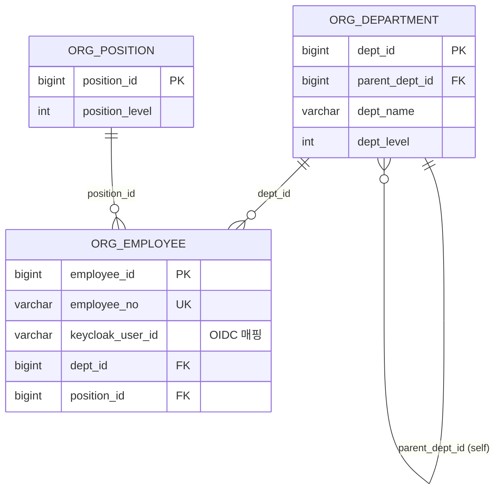
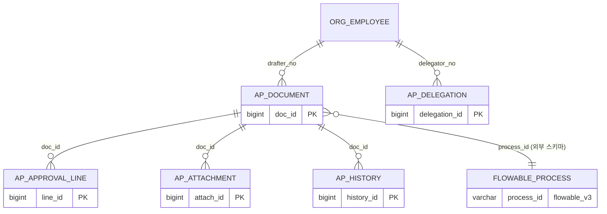
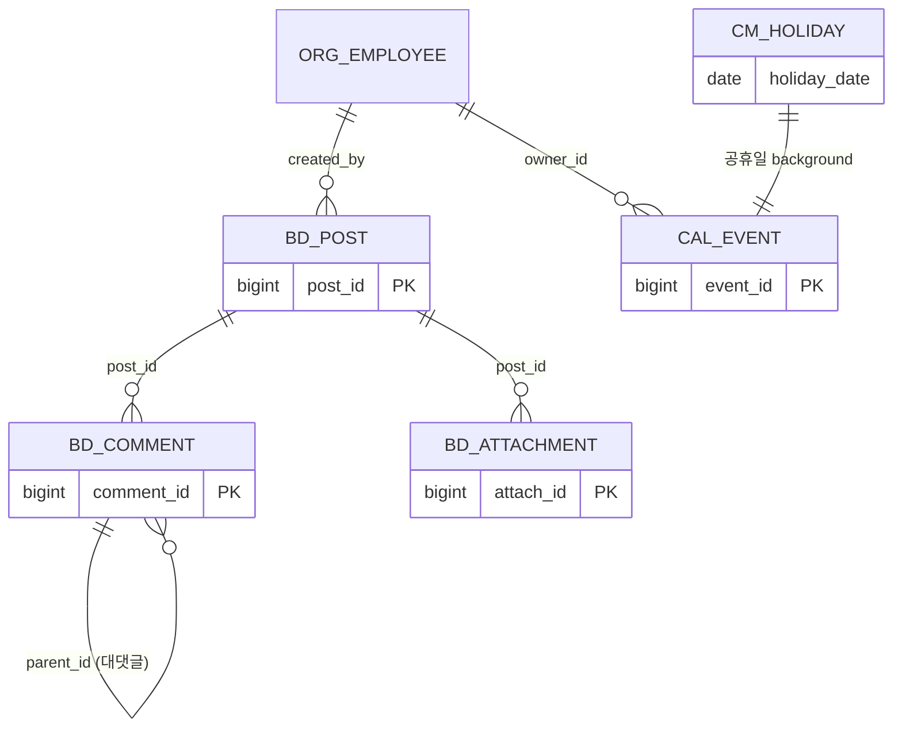
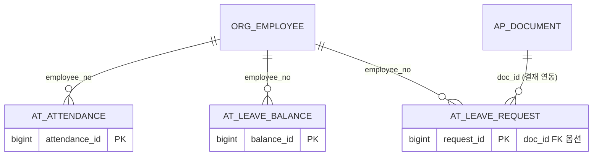
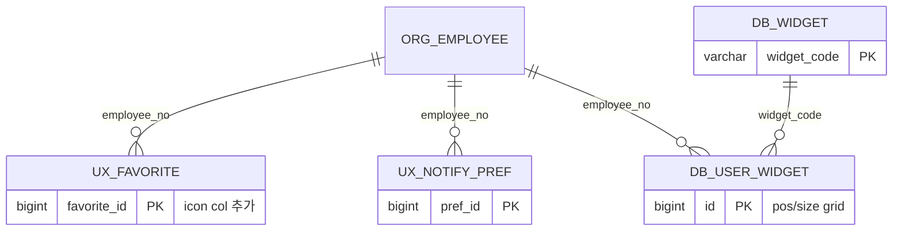

# 04. 데이터 모델

## 1. 스키마 개요

본 프로젝트의 영속 계층은 PostgreSQL 15+ 위에 두 개의 독립 스키마로 구성된다 `[inv: inventory/05_database.md "Database"]`.

| 스키마 | 관리 주체 | 역할 |
|---|---|---|
| `platform_v3` | Flyway (V1~V17) | 애플리케이션 도메인 테이블 (~30개) |
| `flowable_v3` | Flowable Engine | BPMN 프로세스 인스턴스·태스크·이력 (자동 생성) |

Flowable 자체 테이블(`act_re_*`, `act_ru_*`, `act_hi_*`)은 Flyway 가 관리하지 않으며, Flowable Engine 첫 부팅 시 자체 마이그레이션으로 생성된다.

## 2. Flyway 마이그레이션 체인

`backend-core/src/main/resources/db/migration/` 에 V1~V17 의 17개 파일이 위치한다 `[code: backend-core/src/main/resources/db/migration/]`.

| 버전 | 파일 | 주요 엔티티 | 도입 단계 |
|---|---|---|---|
| V1 | `V1__baseline.sql` | (placeholder) | Phase 6~9 도메인 분리 전 빈 baseline `[code: V1__baseline.sql]` |
| V2 | `V2__org_schema.sql` | `org_department`, `org_position`, `org_employee` | 조직 트리 |
| V3 | `V3__common_code_notification.sql` | `cm_code`, `cm_i18n_message`, `cm_notification` | 공통코드/다국어/알림 |
| V4 | `V4__board_calendar.sql` | `bd_post`, `cal_event` | 게시판/캘린더 |
| V5 | `V5__seed_data.sql` | (시드) | 부서·사용자·코드 |
| V6 | `V6__menu_permission.sql` | `cm_menu`, `cm_role`, `cm_role_menu` | 메뉴/RBAC |
| V7 | `V7__seed_data.sql` | (시드 보강) | ON CONFLICT DO NOTHING |
| V8 | `V8__approval_and_extras.sql` | `ap_document`, `ap_approval_line`, `ap_attachment`, `ap_delegation`, `ap_history`, `bd_comment`, `bd_attachment`, `cm_holiday` | 결재 도메인 + 부가 |
| V9 | `V9__i18n_labels_and_seed_data.sql` | `cm_i18n_message` 4개 언어 시드 (ko/en/zh/ja) | i18n |
| V10 | `V10__attendance_leave.sql` | `at_attendance`, `at_leave_balance`, `at_leave_request` | Phase 14 T1 |
| V11 | `V11__room_booking.sql` | `rm_room`, `rm_booking` (+ LiveKit 연계) | Phase 14 T2 |
| V12 | `V12__data_library.sql` | `dl_folder`, `dl_file` | Phase 14 T3 |
| V13 | `V13__work_report.sql` | `wr_daily` (UNIQUE employee_no+report_date) | Phase 14 T4 |
| V14 | `V14__admin_audit.sql` | `sa_audit` (관리자 감사) | Phase 14 T5 |
| V15 | `V15__ux_features.sql` | `ux_favorite`, `ux_notify_pref` | Phase 14 T6 |
| V16 | `V16__dashboard_widget.sql` | `db_widget`, `db_user_widget` | Phase 14 T7 |
| V17 | `V17__phase14_menus.sql` | `cm_menu` INSERT (13 페이지 + 4 그룹) | Phase 14 T8 |

`[src: V*.sql 헤더 주석 직접 인용]`

## 3. 핵심 ERD (5 클러스터)

> 파일이 분할 되어 있어 ERD 도 클러스터 단위로 그린다. 컬럼 이름은 실제 마이그레이션 SQL 의 `CREATE TABLE` 문에서 검증된 것만 표기한다 (추측 제거).

### 3.1 Identity & Org



`[code: V2__org_schema.sql]` — `idx_org_employee_dept`, `idx_org_employee_keycloak` 인덱스 존재.

### 3.2 Approval (Flowable 연계)



`[code: V8__approval_and_extras.sql]` — `idx_ap_document_drafter/status/form`, `idx_ap_line_doc/approver`, `idx_ap_attachment_doc`, `idx_ap_history_doc`, `idx_ap_delegation_delegator` 인덱스. `ap_document.process_id` 가 `flowable_v3.act_ru_execution.id` 와 (수동) 연결.

### 3.3 Board & Calendar



`[code: V4__board_calendar.sql, V8__approval_and_extras.sql]` — 댓글은 1단 대댓글(`parent_id`) 지원, 삭제는 soft delete `[src: warn.md 2026-04-16 21:22]`.

### 3.4 Attendance & Leave



`[code: V10__attendance_leave.sql]` — `idx_at_attendance_emp_date`, `idx_at_leave_emp`, `idx_at_leave_doc` 인덱스. 결재(`form_code='LEAVE'`)와 1:0..1 매핑.

### 3.5 UX & Widget (Phase 14)



`[code: V15__ux_features.sql, V16__dashboard_widget.sql]` — `db_user_widget` 의 `pos_x/pos_y/width/height` 는 12-column 그리드 좌표. `idx_db_user_widget_emp` 인덱스로 사용자별 빠른 조회.

## 4. 정규화 정책

| 영역 | 수준 | 비고 |
|---|---|---|
| Identity/Org | 3NF | 자참조 트리 (department) |
| Approval | 3NF + 이중화 | `ap_history` (감사 보존) + `ap_approval_line` 상태 분리 |
| Board | 3NF | 첨부 별도 테이블 |
| Attendance/Leave | 3NF | `leave_balance.remaining` GENERATED ALWAYS AS `[inv: 05_database.md]` |
| UX/Widget | 비정규화 일부 | `ux_favorite.icon` (메뉴 변경 시에도 유지), `db_user_widget.config_json` JSONB |

비정규화는 모두 **사용자 개인 설정** 영역이라 마스터-소스 일관성 부담이 적다.

## 5. 인덱스 설계

| 인덱스 | 사용처 |
|---|---|
| `idx_ap_document_drafter` | 내가 상신한 결재 목록 |
| `idx_ap_document_status` | 결재함(미결/완결) 필터 |
| `idx_ap_document_form` | 양식별 통계 |
| `idx_ap_line_approver` | 내가 결재할 라인 |
| `idx_at_attendance_emp_date` | 일일 출근부 |
| `idx_at_leave_emp` | 휴가 캘린더 |
| `idx_org_employee_keycloak` | OIDC 토큰 → 직원 매핑 |
| `idx_db_user_widget_emp` | 대시보드 위젯 로딩 |

`[code: V2/V8/V10/V16 의 CREATE INDEX]`

## 6. Flyway 운영 정책

본 프로젝트는 **전진-only(forward-only)** 정책 + **멱등 패턴** 을 채택한다.

```sql
-- V8 발췌
CREATE TABLE IF NOT EXISTS platform_v3.ap_document ( ... );
ALTER TABLE platform_v3.ap_document
  ADD COLUMN IF NOT EXISTS amount BIGINT;  -- 후방 호환
```

`[src: warn.md 2026-04-16 00:50 — Phase 13]` — V8 호환성 결정: 런타임 DB 에 이미 일부 테이블이 있는 상태에서도 클린 부팅과 양립.

## 7. MyBatis vs JPA

본 프로젝트는 **MyBatis 3.0.4** 의 XML 매퍼 위주이고, JPA Entity 는 사용하지 않는다 `[inv: 02_stack_a_backend.md "Mappers"]`. mapper XML 위치:

```
backend-core/src/main/resources/mapper/
├─ approval/  attendance/  board/  calendar/  code/
├─ datalib/   i18n/        leave/  menu/      notification/
├─ org/       room/        ux/     widget/    worklog/
└─ admin/
```

Service 는 `@Mapper` 인터페이스 + XML 의 동적 SQL 을 호출하고 결과는 보통 `Map<String,Object>` 또는 도메인 DTO 로 받는다 (자세한 규약은 챕터 1.10 참고).

## 8. 시드 데이터

- **V5**: 부서 트리(본사 → 본부 → 팀), 직원, 공통코드, 메뉴 기본.
- **V7**: 결재선 템플릿, 사용자 추가, ON CONFLICT DO NOTHING 패턴.
- **V9**: i18n 메시지 4개 언어.
- **런타임 시드**: 대시보드 위젯 기본 6종은 `WidgetService.listMine()` 첫 호출 시 자동 INSERT `[src: warn.md T7 결정]`.

## 참조

- `backend-core/src/main/resources/db/migration/V{1..17}*.sql`
- `docs/comprehensive/inventory/05_database.md`
- `docs/comprehensive/inventory/02_stack_a_backend.md` (MyBatis Mapper 디렉토리)
- `warn.md` (V8 호환성, T1/T6/T7 결정)

## 이 챕터가 다루지 않은 인접 주제

- 결재 BPMN 프로세스 정의 (`backend-core/.../processes/*.bpmn`) → 챕터 1.9 (백엔드 구조).
- MyBatis 동적 SQL 규약 → 챕터 1.10.
- 백업/복구 절차 → 챕터 1.17 (운영 매뉴얼).
- 마이그레이션 시 Flowable 스키마 호환 — Flowable Engine 자체 업그레이드 대응은 별도 운영 가이드 필요.
