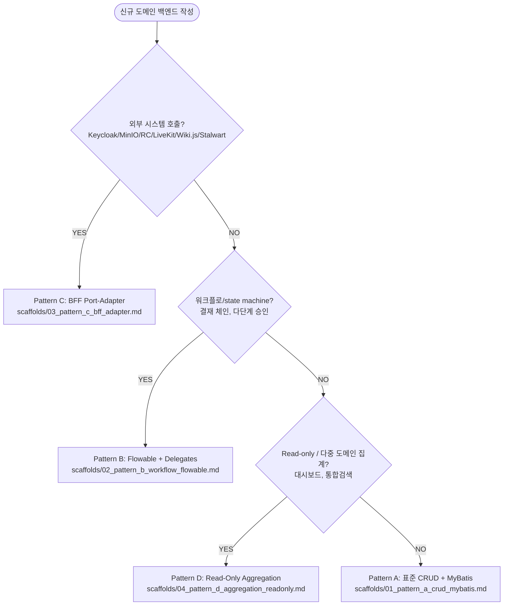

# scaffolds/00_decision_tree.md — 백엔드 패턴 결정 트리

> Phase 2.0 산출물. 모든 분기는 정확히 하나의 패턴 SOP 에 도달, 막다른 분기 0.

## Mermaid Flowchart

## 결정 요인 (Phase 0.C.5 도출)

| 결정 요인 | 적용 분기 |
|---|---|
| 외부 시스템 의존 (Keycloak/MinIO/RC/LiveKit/Wiki.js/Stalwart) | Pattern C |
| 다단계 워크플로 / state machine 필요 (PENDING → IN_PROGRESS → APPROVED 등) | Pattern B |
| 다중 도메인 / 다중 mapper 집계, INSERT/UPDATE/DELETE 없음 | Pattern D |
| 단일 도메인, 단순 CRUD, 위 3개 모두 해당 없음 | Pattern A |

## 분기 검증

- 4개 종착점, 막다른 분기 없음
- 모든 분기는 SOP 파일 1개에 도달
- 패턴 4개 검증 (출처: `[doc: inventory/02_backend_patterns.md §3]`)

## 단일 패턴 적용 안내 (대안)

> 패턴이 1개뿐이라면 결정 트리 불필요. 본 코드베이스는 4개이므로 위 트리 사용.

## 모호 케이스 처리

| 케이스 | 결정 |
|---|---|
| 단순 CRUD + 알림 전송(외부 X, 내부 Notification 호출) | Pattern A — 내부 Java 호출은 외부 시스템 아님 |
| 워크플로 + 외부 시스템 (결재 + Keycloak 자동 사용자 등록) | Pattern B 우선, 내부에서 Pattern C Port 호출 |
| 대시보드 위젯에 쓰기 동작 추가 (위치 저장) | Pattern A — 쓰기 발생 시 D 아님 |
| Public read-only 단일 mapper (i18n) | Pattern A — Pattern D 의 "다중 mapper" 조건 미충족 |
