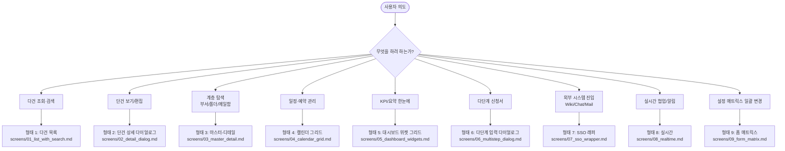

# screens/00_screen_decision.md — 화면 형태 결정 트리

> Phase 3.0 산출물. "사용자가 무엇을 하려 하는가?" 기준 분기 → 정확히 하나의 형태 SOP 도달.

## Mermaid Flowchart

## 분기 검증

- 9개 종착점, 막다른 분기 없음
- 모든 분기는 SOP 파일 1개에 도달
- 형태 9개 검증 (출처: `[doc: inventory/03_screen_types.md]`)

## 화면 조합 안내

여러 형태가 한 화면에 결합되는 경우가 흔하다 (예: PageBoard = 형태 1 + 형태 2; PageRoom = 형태 3 + 형태 4). 이 경우:
1. **주 형태**(라우트 진입의 첫 화면) SOP 부터 따른다.
2. 자식 다이얼로그/패널은 **부속 형태** SOP 의 4표 부분만 별도로 적용.
3. 부모-자식 통신은 각 SOP 의 "부모-자식·라우터 연동" 섹션에 명시.

| 흔한 조합 | 주 형태 | 부속 형태 |
|---|---|---|
| 게시판 (목록 + 상세) | 1 | 2 |
| 결재 (인박스 + 상세 + 신청) | 1 | 2 + 6 |
| 자료실 (Tree + 파일 + 미리보기) | 3 | 1 |
| 회의실 (Room sidebar + 캘린더) | 3 | 4 |
| 캘린더 (Calendar + 이벤트 다이얼로그) | 4 | 2 |
| 휴가 (이력 + 신청) | 1 | 6 |
